# Redis学习笔记

## 1. Redis简介

### 1.1 NoSQL介绍

NoSQL 意为 Not Only SQL，泛指非关系型数据库。随着互联网 web2.0 网站的兴起，传统的关系型数据库暴露了很多问题，如无法满足高效率存储和访问、数据高并发读写的需求等，而非关系型数据库则由于其本身的特点得到了非常迅速的发展。NoSQL 数据库有4种分类：文档数据库、图数据库、键值数据库、列族数据库。

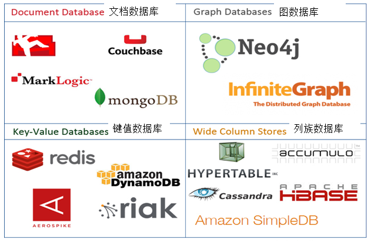

### 1.2 Redis介绍

Redis 是 REmote DIctionary Server（远程数据服务）的缩写，它是一个完全开源免费、使用C语言编写、遵守 BSD 协议、支持网络、亦可持久化、日志型的**内存高速缓存数据库**，并提供多种语言的 API。它支持丰富的数据结构，使用**key-value**数据模型，值（value）可以是字符串（string）、哈希（hash）、列表（list）、集合（set）和有序集合（sorted set）等类型。Redis有如下优势：

1. 性能极高 – Redis能读的速度是110000次/s，写的速度是81000次/s 。
2. 丰富的数据类型 – Redis支持二进制案例的 Strings，Lists，Hashes，Sets 及 Ordered Sets 数据类型操作。
3. 原子 – Redis 的所有操作都是原子性的，意思就是要么成功执行要么失败完全不执行。
4. 丰富的特性 – Redis 还支持 publish/subscribe，通知，key 过期等等特性。

注：缓存有两种形式：数据缓存和页面缓存。在开发网站时，如果数据在短时间之内不会发生变化，而它们还要被频繁访问，为了**提高用户请求速度和降低网站负载**，就把这些数据放到一个读取速度更快的介质上，该介质可以是文件、数据库、内存，这种行为就称为数据缓存。

### 1.3 Redis安装（CentOS）

1. 下载编译

   注：访问官网下载地址https://redis.io/download，获取最新的稳定版本的下载地址。由于Redis使用C语言编写，所以编译时需要先确保安装gcc

   * 下载 redis：``wget http://download.redis.io/releases/redis-5.0.5.tar.gz``
   * 解压缩：``tar -xzvf redis-5.0.5.tar.gz``
   * 安装编译工具：``yum -y install gcc``
   * 切换到redis目录：``cd redis-5.0.5``
   * 编译：``make``

2. 启动 redis 服务

   * 修改 redis 配置文件：``vim redis.conf``

     注：redis 默认是前台启动的，若要后台启动，需要将 daemonize 设置为 yes

   * 切换到src目录：``cd src``

     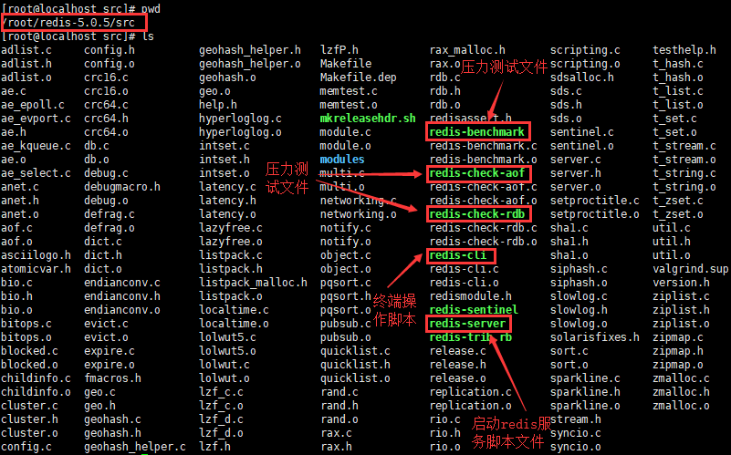

   * 启动 redis 服务端：``./redis-server ../redis.conf``

3. redis 测试

   * 启动 redis 客户端：``./redis-cli``

     注：若修改了 redis 端口并设置了密码，使用``./redis-cli -h IP地址 -p 端口 -a 密码``

   * 设置 key-value 值：``set name tom`` -> ``set age 18``

   * 通过键获取值：``get name`` -> ``get age`` -> ``exit``
   
     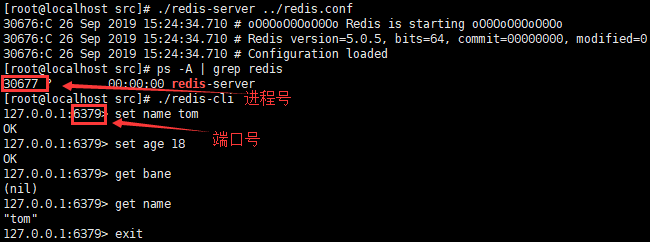

### 1.4 Redis配置文件

| 序号 | 配置                         | 说明                                                         |
| :--: | ---------------------------- | ------------------------------------------------------------ |
|  1   | daemonize no                 | redis默认不是以守护进程的方式运行，使用yes启用守护进程       |
|  2   | port 6379                    | 指定redis监听端口，默认端口为6379                            |
|  3   | bind 127.0.0.1               | 绑定的主机地址                                               |
|  4   | save \<seconds\> \<changes\> | 指定在多长时间内，有多少次更新操作，就将数据同步到持久化文件，可以多个条件配合 |
|  5   | dbfilename dump.rdb          | 指定本地数据库RDB持久化文件名，默认值为dump.rdb              |
|  6   | requirepass foobared         | 设置redis连接密码，如果配置了连接密码，客户端在连接redis时需要通过auth \<password\>命令提供密码，默认关闭 |
|  7   | appendonly no                | 默认不启用AOF持久化，使用yes开启                             |
|  8   | dir ./                       | 指定本地数据库存放目录                                       |

## 2. Redis命令

### 2.1 键key的操作

1. key简介

   在 redis 中，除回车和空格外的所有字符都可以作为key的名字部分，且长度不做要求，但最好使用统一的命名模式，如 user:1:password（不使用下划线是为了避免与关系型数据库中的下划线冲突）。

2. key命令

	| 序号 | 命令               | 描述                                |
	| :--: | :----------------- | :---------------------------------- |
	|  1   | exists key         | 检查指定key是否存在                 |
	|  2   | del key            | 删除指定key                         |
	|  3   | type key           | 返回指定key的value类型              |
	|  4   | keys pattern       | 查找所有符合指定模式的key           |
	|  5   | rename key newkey  | 修改key的名称                       |
	|  6   | dbsize             | 返回当前数据库的key数量             |
	|  7   | expire key seconds | 为指定key设置过期时间，以秒计       |
	|  8   | ttl key            | 返回指定 key 的剩余过期时间，以秒计 |
	|  9   | select dbindex     | 选择数据库，默认共16个（0-15）      |
	|  10  | move key dbindex   | 将key 从当前数据库移动到指定数据库  |
	|  11  | flushdb            | 删除当前数据库中的所有key           |
	|  12  | flushall           | 删除所有数据库中的所有key           |
	
	注：expire命令适用于限时的优惠活动、手机验证码、限制网站访客访问频率等应用场景。
	
	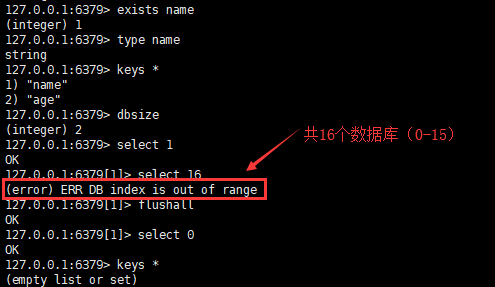

### 2.2 字符串string的操作

1. string 简介

   string 是 redis 最基本的类型，并且是二进制安全的，即它可以包含任何数据，如 jpg 图片或序列化对象，且单个 value 值最大上限是 1G。string 通常用于保存单个字符串或 JSON 字符串数据，适用于**常规计数**的应用场景，如微博数、粉丝数。

   注：二进制安全是指在传输数据时，保证二进制数据的信息安全，也就是不被篡改、破译等，如果被攻击，能够及时检测出来。其特点是编码、解码由客户端完成，执行效率高，不需要频繁编解码，不会出现乱码。

2. string 命令

	| 序号 | 命令                      | 描述                         |
	| :--: | ------------------------- | ---------------------------- |
	|  1   | set/mset key value        | 设置一个或多个key-value对    |
	|  2   | setnx key value           | 只有在key不存在时设置key的值 |
	|  3   | get/mget key              | 获取一个或多个key的值        |
	|  4   | incr/decr key             | 对key的值做加1/减1操作       |
	|  5   | incrby/decrby key integer | 对key的值加上指定值          |
	|  6   | append key value          | 给指定key的字符串值追加value |
	|  7   | substr key start end      | 返回截取过key的字符串值      |
	
	注：setnx 命令是解决分布式锁的方案之一。incr/decr 命令可以针对**新key**或**已有key**进行操作，若新 key，则创建该 key 并加1，值为1；若已有 key，则 key 对应值的类型必须是整型。substr 截取字符串时**包括** start 和 end 标记的内容。
	
	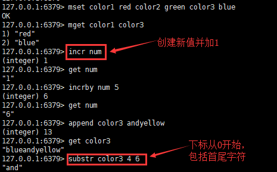

### 2.3 哈希hash的操作

1. hash 简介

   hash 是一个 string 类型的 field 和 value 的映射表，特别适合用于**存储对象**。Redis 中每个 hash 可以存储232 - 1（40多亿）键值对，相比于 JSON，该类型的数据仅占用很少的磁盘空间。

   注：为什么不用 string 存储一个对象？假设用户ID为查找的 key，存储的 value 包括姓名、年龄等信息，如果用普通的 key/value 结构来存储，主要有一下两种方式：

   第一种方式将用户ID作为查找的 key，把其它信息封装成一个对象以序列化的方式存储。这种方式的缺点是，增加了序列化/反序列化的开销，并且在修改其中一项信息时，需要把整个对象取回，同时修改操作需要对并发进行保护。

   第二种方式是将用户ID+对应属性作为 key，来取得对应属性的值。这种方式虽然省去了序列化开销和并发问题，但是用户ID重复存储，当数据量很大时，内存浪费还是非常可观的。

2. hash 命令

   | 序号 | 命令                       | 描述                                   |
   | :--: | -------------------------- | -------------------------------------- |
   |  1   | hset/hmset key field value | 在哈希表中设置field-value(域-值)对     |
   |  2   | hget/hmget key field       | 获取哈希表中指定字段的值               |
   |  3   | hincrby key field integer  | 将指定字段的整数值加上integer          |
   |  4   | hexists key field          | 测试指定field是否存在                  |
   |  5   | hdel key field             | 删除指定field                          |
   |  6   | hlen/hkeys key             | 返回field数量/返回所有field            |
   |  7   | hvals/hgetall key          | 返回所有value/所有field-value(域-值)对 |

   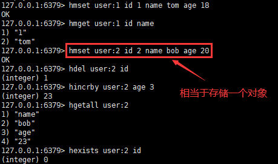

### 2.4 列表list的操作

1. list简介

   Redis 列表是简单的字符串列表，按照插入顺序排序，可以添加一个元素到列表的头部（左边）或者尾部（右边），一个列表最多可以包含 232 - 1个元素。list类型其实是一个双向链表，通过 push、pop 操作可以从链表的头部或尾部添加删除元素，这使得list既可以用作栈，也可以用作队列。适用于**对数据量大的集合数据删减、任务队列**等应用场景，如求最新的3个登录用户。

2. list命令

	| 序号 | 命令                   | 描述                                                   |
	| :--: | ---------------------- | ------------------------------------------------------ |
	|  1   | lpush/rpush key string | 在key对应list的头部/尾部添加字符串元素                 |
	|  2   | rpop/lpop key          | 在key对应list的尾部/头部删除字符串元素，并返回删除元素 |
	|  3   | llen key               | 返回key对应list的长度                                  |
	|  4   | lindex key index       | 通过索引获取列表中的元素                               |
	|  5   | lrange key start end   | 返回指定区间内的元素                                   |
|  6   | ltrim key start end    | 截取list，保留指定区间内的元素                         |
	
	注：lrange 命令可使用-1表示列表的最后一个元素，-2表示列表的倒数第二个元素，依次类推。
	
	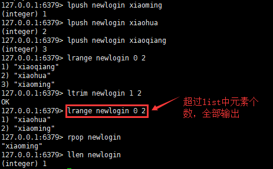
	

### 2.5 集合set的操作

1. set简介

   set 是 string 类型的无序集合，每个集合的各个元素不能重复，最大可以包含232-1个元素。set底层使用 intset 和 hashtable 两种数据结构存储，intset 可以理解为数组，且存储数据时有序，可以通过二分查找来查找数据，hashtable 就是普通的哈希表。适用于**对集合间进行交集、并集、差集运算**，如使用交集求 QQ 好友的推荐功能。

2. set命令

	| 序号 | 命令                                   | 描述                                           |
	| :--: | -------------------------------------- | ---------------------------------------------- |
	|  1   | sadd key member [member]               | 添加一个string元素到key对应的set集合中         |
	|  2   | srem key member [member]               | 从key对应的set集合中移除指定元素，成功返回1    |
	|  3   | smove key1 key2 member                 | 从key1对应的集合中移除member并添加到key2集合中 |
	|  4   | scard key                              | 返回set集合的元素个数                          |
	|  5   | smembers key                           | 返回set集合的所有元素                          |
	|  6   | sismember key member                   | 判断member是否在set集合中                      |
	|  7   | sinter/sunion/sdiff key1 key2 ... keyN | 返回所有指定key的交集/并集/差集                |
	|  8   | srandmember key [count]                | 返回集合中一个或多个随机数                     |
	
	注：srandmember 命令适用于抽奖等应用场景。
	
	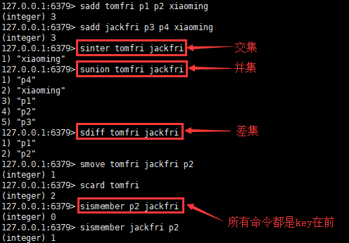
	

### 2.6 有序集合sorted set的操作

1. sorted set 简介

   sorted set 也是 string 类型的集合，且不允许有重复的元素，不同的是每个元素都会关联一个 double类型的权，即有序集合中的每个元素都是**值、权**的组合，通过权可以有序的获取集合中的元素。sorted set 是通过哈希表实现的，所以添加、删除、查找的时间复杂度都是O(1)。适用于排行榜等应用场景，如获取热门帖子信息。

2. sorted set 命令

	| 序号 | 命令                           | 描述                                              |
	| :--: | ------------------------------ | ------------------------------------------------- |
	|  1   | zadd key score member          | 添加元素到集合，元素存在则更新权score             |
	|  2   | zrem key member                | 删除指定元素                                      |
	|  3   | zincrby key incr member        | 给指定元素的权增加incr，返回权值                  |
	|  4   | zrank/zrevrank key member      | 按照权值从小到大/从大到小，返回指定元素的排名     |
	|  5   | zrange/zrevrange key start end | 按照权值从大到小/从大到小，返回指定区间元素的排名 |
	|  6   | zremrangebyrank key min max    | 按照权值从小到大，删除指定区间的元素              |
	|  7   | zcard key                      | 返回集合中元素的个数                              |
	|  8   | zscore key member              | 返回指定元素对应的权                              |

	注：sorted set 命令都是以z开头的。

	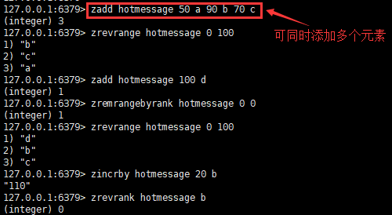

### 2.7 Redis发布订阅

1. 发布订阅简介

   Redis 发布订阅(pub/sub)是一种消息通信模式：发送者(pub)发送消息，订阅者(sub)接收消息。Redis  客户端可以订阅任意数量的频道，它类似于微信公众号的模式。适用于**构建实时消息系统**等应用场景，如即时聊天。

2. 发布订阅命令

   | 序号 | 命令                                    | 描述                                |
   | :--: | --------------------------------------- | ----------------------------------- |
   |  1   | subscribe/unsubscribe channel [channel] | 订阅/退订给定的一个或多个频道的信息 |
   |  2   | psubscribe pattern [pattern]            | 订阅一个或多个符合给定模式的频道    |
   |  3   | punsubscribe [pattern]                  | 退订所有给定模式的频道              |
   |  4   | publish channel message                 | 将信息发送到指定的频道              |

   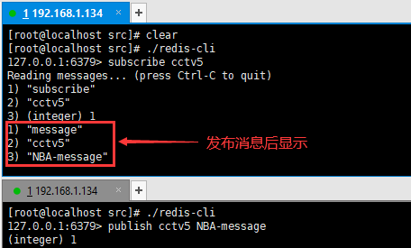

### 2.8 Redis事务

1. 事务简介

   redis 事务可以一次执行多个命令，并且带有以下三个重要的保证：

   - 批量操作在发送 exec 命令前被放入队列缓存。
   - 收到 exec 命令后进入事务执行，事务中任意命令执行失败，其余的命令依然被执行。
   - 在事务执行过程，其他客户端提交的命令请求不会插入到事务执行命令序列中。

   一个事务从开始到执行会经历三个阶段：开始事务、命令入队、执行事务。适用于转账等事务场景。

2. 事务命令

   | 序号 | 命令            | 描述                                                         |
   | :--: | --------------- | ------------------------------------------------------------ |
   |  1   | multi           | 标记一个事务块的开始                                         |
   |  2   | exec            | 执行所有事务块内的命令                                       |
   |  3   | discard         | 取消事务，放弃执行事务块内的所有命令                         |
   |  4   | watch key [key] | 监视一个(或多个) key，如果在事务执行之前这个key被其他命令所改动，那么事务将被打断 |
   |  5   | unwatch         | 取消watch命令对所有 key 的监视                               |

   注：一般情况下，如果队列中某个命令报错，则只有该命令不会被执行，而其它命令都会执行，不会回滚。只有当队列中的某个命令出现报告错误，如不存在的命令，执行时队列中的所有命令才会全部取消。

   

## 3. Redis高级

### 3.1 Redis持久化

1. RDB 持久化

   RDB 是 redis 的默认持久化机制，它将内存中的数据以快照的方式，写入一个经过压缩的二进制文件，默认文件名为 dump.rdb，通过该文件可以还原数据库状态。

   优点：快照保存数据、还原数据极快，适用于灾难备份

   缺点：RDB 机制符合要求就会照快照，小内存机器不适合使用

   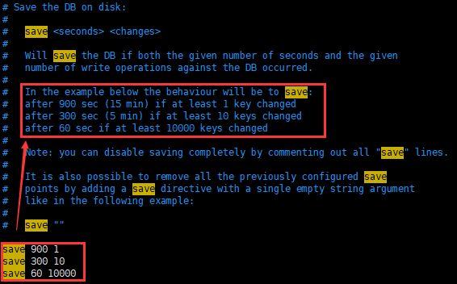

2. AOF 持久化

   AOF（append only file）将每一个写命令都通过write函数追加到文件中，默认文件名为appendonly.aof。当 redis 重启时会通过重新执行文件中保存的写命令，来在内存中重建整个数据库的内容。

   优点：比快照方式有更好的持久化性

   缺点：持久化文件会越来越大

   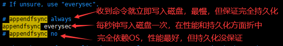

### 3.2 Redis主从复制

1. 主从复制简介

   一个 redis 服务可以有多个该服务的复制品，被复制的服务器称为主服务器（master），对主服务器进行复制的服务器称为从服务器（slave）。其中，master只负责写数据，每次有数据更新都将更新的数据同步到它所有的 slave，而 slave 只负责读数据。适用于**读取量大于写入量**的应用场景。

   优点：读写分离，从服务器出现故障不影响整个系统

   缺点：主服务器发生单点故障影响整个系统

2. 主从复制测试

   启动从服务器时，直接使用 `--slave0f IP地址 端口号` 来指定主服务器

   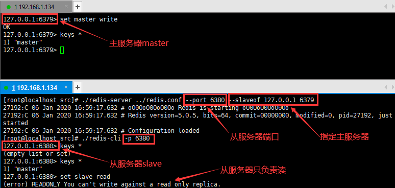

### 3.3 Cluster集群

1. cluster 集群简介

   Redis集群搭建的方式有多种，但从 redis 3. 0之后版本支持 redis-cluster 集群，至少需要3(Master) + 3 (Slave)才能建立集群。redis-cluster 采用无中心结构，每个节点保存数据和整个集群状态，每个节点都和其他所有节点连接。

2. cluster 集群搭建

## 参考

1. [Redis菜鸟教程](https://www.runoob.com/redis/redis-tutorial.html)