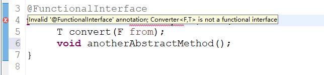

## 1. 接口的默认方法(Default Methods for Interfaces)

Java 8使我们能够通过使用 `default` 关键字向接口添加非抽象方法实现。 此功能也称为虚拟扩展方法。

```java
interface Formula{

    double calculate(int a);

    default double sqrt(int a) {
        return Math.sqrt(a);
    }

}
```

Formula 接口中除了抽象方法计算接口公式还定义了默认方法 `sqrt`。 实现该接口的类只需要实现抽象方法 `calculate`。 默认方法`sqrt` 可以直接使用。当然你也可以直接通过接口创建对象，然后实现接口中的默认方法就可以了，我们通过代码演示一下这种方式。

```java
public class Main {

  public static void main(String[] args) {
    // TODO 通过匿名内部类方式访问接口
    Formula formula = new Formula() {
        @Override
        public double calculate(int a) {
            return sqrt(a * 100);
        }
    };

    System.out.println(formula.calculate(100));     // 100.0
    System.out.println(formula.sqrt(16));           // 4.0
  }
}
```

不管是抽象类还是接口，都可以通过匿名内部类的方式访问。不能通过抽象类或者接口直接创建对象。对于上面通过匿名内部类方式访问接口，我们可以这样理解：一个内部类实现了接口里的抽象方法并且返回一个内部类对象，之后我们让接口的引用来指向这个对象。


## 2. Lambda表达式(Lambda expressions)

首先看看在老版本的Java中是如何排列字符串的：

```java
List<String> names = Arrays.asList("peter", "anna", "mike", "xenia");

Collections.sort(names, new Comparator<String>() {
    @Override
    public int compare(String a, String b) {
        return b.compareTo(a);
    }
});
```

只需要给静态方法` Collections.sort` 传入一个 List 对象以及一个比较器来按指定顺序排列。通常做法都是创建一个匿名的比较器对象然后将其传递给 `sort` 方法。

在Java 8 中你就没必要使用这种传统的匿名对象的方式了，Java 8提供了更简洁的语法，lambda表达式：

```java
Collections.sort(names, (String a, String b) -> {
    return b.compareTo(a);
});
```

可以看出，代码变得更段且更具有可读性，但是实际上还可以写得更短：

```java
Collections.sort(names, (String a, String b) -> b.compareTo(a));
```

对于**函数体只有一行代码的，可以去掉大括号{}以及return关键字**，但是你还可以写得更短点：

```java
names.sort((a, b) -> b.compareTo(a));
```

List 类本身就有一个 `sort` 方法。并且Java编译器可以自动推导出参数类型，所以你可以不用再写一次类型。


## 3. 函数式接口(Functional Interfaces)

Java 语言设计者们投入了大量精力来思考如何使现有的函数友好地支持Lambda。最终采取的方法是：增加函数式接口的概念。**“函数式接口”是指仅仅只包含一个抽象方法，但是可以有多个非抽象方法(也就是上面提到的默认方法)的接口。** 像这样的接口，可以被隐式转换为lambda表达式。`java.lang.Runnable` 与 `java.util.concurrent.Callable` 是函数式接口最典型的两个例子。

Java 8增加了一种特殊的注解`@FunctionalInterface`，但是这个注解通常不是必须的(某些情况建议使用)，只要接口只包含一个抽象方法，虚拟机会自动判断该接口为函数式接口。一般建议在接口上使用`@FunctionalInterface` 注解进行声明，这样的话，编译器如果发现你标注了这个注解的接口有多于一个抽象方法的时候会报错，如下图所示



示例：

```java
@FunctionalInterface
public interface Converter<F, T> {
  T convert(F from);
}
```

```java
// TODO 将数字字符串转换为整数类型
Converter<String, Integer> converter = (from) -> Integer.valueOf(from);
Integer converted = converter.convert("123");
System.out.println(converted.getClass()); //class java.lang.Integer
```


## 4. 方法和构造函数引用(Method and Constructor References)

### 方法引用

Java 8允许通过`::`关键字传递方法或构造函数的引用。若Lambda体中的内容有方法已经实现了，我们就可以使用“方法引用”，要求**Lambda体中调用方法的参数列表和返回值类型，要与函数式接口中抽象方法的参数列表和返回值类型保持一致**。主要有三种情况：

**类::静态方法名**：

```java
Converter<String, Integer> converter = Integer::valueOf;
Integer converted = converter.convert("123");
System.out.println(converted.getClass());   //class java.lang.Integer
```

**对象::实例方法名**：其中Consumer是JDK 1.8 内置的函数式接口

```java
Consumer<String> consumer = System.out::println;
consumer.accept("abcd");	//abcd
```

**类::实例方法名**：要求Lambda参数列表中的**第一参数是实例方法的调用者，而第二参数是实例方法的参数**，下面两种方式是等价的

```java
BiPredicate<String, String> bp1 = (x, y) -> x.equals(y);
BiPredicate<String, String> bp2 = String::equals;
```

### 构造函数引用

构造函数引用的格式是 **类名::new**，需要调用的构造器的参数列表与函数式接口中抽象方法的参数列表保持一致，首先我们定义一个包含多个构造函数的简单类：

```java
class Person {
    String firstName;
    String lastName;

    Person() {}

    Person(String firstName, String lastName) {
        this.firstName = firstName;
        this.lastName = lastName;
    }
}
```

接下来我们指定一个用来创建Person对象的对象工厂接口：

```java
interface PersonFactory<P extends Person> {
    P create(String firstName, String lastName);
}
```

这里我们使用构造函数引用来将他们关联起来，而不是手动实现一个完整的工厂：

```java
PersonFactory<Person> personFactory = Person::new;
Person person = personFactory.create("Peter", "Parker");
```

我们只需要使用 `Person::new` 来获取Person类构造函数的引用，Java编译器会自动根据`PersonFactory.create`方法的参数类型来选择合适的构造函数。


## 5. Lambda 表达式作用域(Lambda Scopes)

### 访问局部变量

我们可以直接在 lambda 表达式中访问外部的局部变量：

```java
final int num = 1;
Converter<Integer, String> stringConverter =
        (from) -> String.valueOf(from + num);

stringConverter.convert(2);     // 3
```

但是和匿名对象不同的是，这里的变量num可以不用声明为final，该代码同样正确：

```java
int num = 1;
Converter<Integer, String> stringConverter =
        (from) -> String.valueOf(from + num);

stringConverter.convert(2);     // 3
```

不过这里的 num 必须不可被后面的代码修改（即隐性的具有final的语义），例如下面的就无法编译：

```java
int num = 1;
Converter<Integer, String> stringConverter =
        (from) -> String.valueOf(from + num);
num = 3;//在lambda表达式中试图修改num同样是不允许的。
```

### 访问字段和静态变量

与局部变量相比，我们对lambda表达式中的实例字段和静态变量都有读写访问权限。 该行为和匿名对象是一致的。

```java
class Lambda4 {
    static int outerStaticNum;
    int outerNum;

    void testScopes() {
        Converter<Integer, String> stringConverter1 = (from) -> {
            outerNum = 23;
            return String.valueOf(from);
        };

        Converter<Integer, String> stringConverter2 = (from) -> {
            outerStaticNum = 72;
            return String.valueOf(from);
        };
    }
}
```

### 访问默认接口方法

还记得第一节中的 formula 示例吗？ `Formula` 接口定义了一个默认方法`sqrt`，可以从包含匿名对象的每个 formula 实例访问该方法。 但这不适用于lambda表达式，无法从 lambda 表达式中访问默认方法，故以下代码无法编译：

```java
Formula formula = (a) -> sqrt(a * 100);	//编译不通过
```


## 6. 内置函数式接口(Built-in Functional Interfaces)

JDK 1.8 API包含许多内置函数式接口，这些接口都在java.util.function包里。 其中一些接口在老版本的 Java 中是比较常见的比如： `Comparator` 或`Runnable`，这些接口都增加了`@FunctionalInterface`注解以便能用在 lambda 表达式上。

但是 Java 8 API 同样还提供了很多全新的函数式接口来让你的编程工作更加方便，有一些接口是来自 [Google Guava](https://code.google.com/p/guava-libraries/) 库里的，即便你对这些很熟悉了，还是有必要看看这些是如何扩展到lambda上使用的。

|   函数式接口   |      抽象方法      |    描述    |
| :------------: | :----------------: | :--------: |
| consumer\<T\>  | void accept(T t);  | 消费型接口 |
| supplier\<T\>  |      T get();      | 供给型接口 |
| Function<T, R> |   R apply(T t);    | 函数型接口 |
| Predicate\<T\> | boolean test(T t); | 断言型接口 |

### Consumer

Consumer 接口表示要对单个输入参数执行的操作。

```java
Consumer<Person> greeter = (p) -> System.out.println("Hello, " + p.firstName);
greeter.accept(new Person("Luke", "Skywalker"));
```

### Supplier

Supplier 接口产生给定泛型类型的结果。 与 Function 接口不同，Supplier 接口不接受参数。

```java
Supplier<Person> personSupplier = Person::new;
personSupplier.get();   // new Person
```

### Function

Function 接口接受一个参数并生成结果。默认方法可用于将多个函数链接在一起（compose, andThen）。

```java
Function<String, Integer> toInteger = Integer::valueOf;
Function<String, String> backToString = toInteger.andThen(String::valueOf);
backToString.apply("123");     // "123"
```

### Predicate

Predicate 接口接受一个参数并返回布尔类型值。该接口包含多种默认方法来将 Predicate 组合成其他复杂的逻辑（与and，或or，非negate）。

```java
Predicate<String> predicate = (s) -> s.length() > 0;

predicate.test("foo");              // true
predicate.negate().test("foo");     // false

Predicate<Boolean> nonNull = Objects::nonNull;
Predicate<Boolean> isNull = Objects::isNull;

Predicate<String> isEmpty = String::isEmpty;
Predicate<String> isNotEmpty = isEmpty.negate();
```

### Comparator

Comparator 是老Java中的经典接口， Java 8在此之上添加了多种默认方法：

```java
Comparator<Person> comparator = (p1, p2) -> p1.firstName.compareTo(p2.firstName);

Person p1 = new Person("John", "Doe");
Person p2 = new Person("Alice", "Wonderland");

comparator.compare(p1, p2);             // > 0
comparator.reversed().compare(p1, p2);  // < 0
```


## 7. Optional

Optionals不是函数式接口，而是用于防止 NullPointerException 的漂亮工具。Optional 是一个简单的容器，其值可能是null或者不是null。在Java 8之前一般某个函数应该返回非空对象但是有时却什么也没有返回，而在Java 8中，你应该返回 Optional 而不是 null。

```java
//of（）：为非null的值创建一个Optional
Optional<String> optional = Optional.of("bam");
// isPresent（）： 如果值存在返回true，否则返回false
optional.isPresent();           // true
//get()：如果Optional有值则将其返回，否则抛出NoSuchElementException
optional.get();                 // "bam"
//orElse（）：如果有值则将其返回，否则返回指定的其它值
optional.orElse("fallback");    // "bam"
//ifPresent（）：如果Optional实例有值则为其调用consumer，否则不做处理
optional.ifPresent((s) -> System.out.println(s.charAt(0)));     // "b"
```

推荐阅读：[[Java8]如何正确使用Optional](https://blog.kaaass.net/archives/764)


## 8. Stream(流)

`java.util.Stream` 表示能应用在一组元素上一次执行的操作序列。Stream 的三个操作步骤依次为：创建Stream、中间操作、终止操作。Stream 的创建需要指定一个数据源，比如` java.util.Collection` 的子类，List 或者 Set， Map 不支持。中间操作返回Stream本身，因此可以将多个操作依次串起来形成一个流水线，除非流水线上触发终止操作，否则中间操作不会执行任何的处理，而在终止操作时一次性全部处理，称为“惰性求值”。终止操作返回一特定类型的计算结果。Stream 的操作可以串行执行或者并行执行。

### 创建Stream

创建Stream有四种方式：

```java
//1.通过Collection系列集合提供的stream()或parallelStream()创建
List<String> list = new ArrayList<>();
Stream<String> stream1 = list.stream();

//2.通过Arrays中的静态方法stream()获取数组流
Integer[] integers = new Integer[5];
Stream<Integer> stream2 = Arrays.stream(integers);

//3.通过Stream接口中的静态方法of()创建
Stream<String> stream3 = Stream.of("aa", "bb", "cc");

//4.通过Stream接口中的静态方法iterate()或generate()创建无限流
Stream<Integer> stream4 = Stream.iterate(0, (x) -> x + 2);
Stream<Double> stream5 = Stream.generate(() -> Math.random());
```

### 中间操作

**1. 筛选与切片：**

```java
// filter(Predicate)：接收Lambda，从流中排除某些元素
// limit(n)：截断流，使其元素不超过给定数量
// skip(n)：跳过前n个元素，若流中元素不足n个，则返回一个空流，与limit(n)互补
// distinct()：筛选，通过流所生成元素的hashCode()和equals()去掉重复元素
List<String> list = Arrays.asList("aa", "bb", "cc", "cc");

list.stream().limit(3).filter(e -> e.equals("cc"))
    .forEach(System.out::println);	// "cc"
list.stream().skip(2).distinct()
    .forEach(System.out::println);	// "cc"
```

forEach()是一个终止操作，在Java 8中它被定义在Iterable 接口中，而Collection 接口继承了Iterable 接口，因此我们可以迭代一个列表、集合、队列，并对每个元素执行给定的操作，就像任何其他迭代器一样。

```java
void forEach(Consumer<? super T> action)// 对Iterable的每个元素执行给定的操作，直到所有元素都被处理或动作引发异常。
```

**2. 映射：**

```java
// map(Function)：接收一个函数作为参数，该函数会被应用到每个元素上，并将其映射为新的元素
// flatMap(Function)：接收一个函数作为参数，将流中的每个值都换成另一个流，然后把所有流连接成一个流
// 两者区别类似于集合的add()和addAll()方法
list.stream().map(StreamTest::fun)	// {{a,a}, {b,b}}
	.forEach((sm) -> sm.forEach(System.out::println));
list.stream().flatMap(StreamTest::fun)	// {a,a, b,b}
    .forEach(System.out::println);

public static Stream<Character> fun(String str){
	List<Character> list = new ArrayList<>();
	for(Character ch : str.toCharArray()){
		list.add(ch);
	}
	return list.stream();
}
```

**3. 排序:**

```java
// sorted()：自然排序
// sorted(Comparator)：定制排序
list.stream().sorted()
    .forEach(System.out::println);	// "aa", "bb", "cc", "cc" 
list.stream().sorted((s1, s2) -> -s1.compareTo(s2))
    .forEach(System.out::println);	// "cc", "cc", "bb", "aa"
```

### 终止操作

**1. 查找与匹配：**

```java
// allMatch(Predicate)：检查是否匹配所有元素
// anyMatch(Predicate)：检查是否至少匹配一个元素
// findFirst()：返回当前流中的第一个元素
// findAny()：返回当前流中的任意元素
// count()：返回流中元素的总个数
// max(Comparator)：返回流中最大值
// min(Comparator)：返回流中最小值
List<Integer> list = Arrays.asList(2, 4, 6, 8, 8);

boolean b1 = list.stream().allMatch(n -> n == 4);
System.out.println(b1);	// false
boolean b2 = list.stream().anyMatch(n -> n == 4);
System.out.println(b2);	// true
Optional<Integer> op1 = list.stream().sorted().findFirst();
System.out.println(op1.get());	// 2
Optional<Integer> op2 = list.stream().max(Integer::compareTo);
System.out.println(op2.get());	// 8
```

**2. 规约：**

```java
// reduce(T, BinaryOperator) 或 reduce(BinaryOperator)：可以将流中元素反复结合起来，得到一个值
Integer sum = list.stream().reduce(1, (x, y) -> x + y);
System.out.println(sum);	// 29，有起始值返回具体的对象
Optional<Integer> op = list.stream().map(n -> n.intValue()).reduce(Integer::sum);
System.out.println(op.get());	// 28，没有起始值返回Optional
```

**3. 收集：**

```java
// collect(Collector)：将流转换为其他形式，用于给流中元素做汇总的方法
Set<Integer> set = list.stream().collect(Collectors.toSet());
set.forEach(System.out::println);	// 2 4 6 8

IntSummaryStatistics dss = list.stream().collect(Collectors.summarizingInt(n -> n.intValue()));
System.out.println(dss.getMax());	// 8
System.out.println(dss.getAverage());	// 5.6
System.out.println(dss.getSum());	// 28
```


### Parallel Streams(并行流)

前面提到过Stream有串行和并行两种，串行Stream上的操作是在一个线程中依次完成，而并行Stream则是在多个线程上同时执行。

下面的例子展示了是如何通过并行Stream来提升性能，首先我们创建一个没有重复元素的大表：

```java
int max = 1000000;
List<String> values = new ArrayList<>(max);
for (int i = 0; i < max; i++) {
    UUID uuid = UUID.randomUUID();
    values.add(uuid.toString());
}
```

我们分别用串行和并行两种方式对其进行排序，最后看看所用时间的对比。

```java
// Sequential Sort（串行排序）
long t0 = System.nanoTime();
long count = values.stream().sorted().count();
System.out.println(count);	// 1000000
long t1 = System.nanoTime();

long millis = TimeUnit.NANOSECONDS.toMillis(t1 - t0);
System.out.println(String.format("sequential sort took: %d ms", millis));	// sequential sort took: 709 ms
```

```java
// Parallel Sort（并行排序）
long t0 = System.nanoTime();
long count = values.parallelStream().sorted().count();
System.out.println(count);	// 1000000
long t1 = System.nanoTime();

long millis = TimeUnit.NANOSECONDS.toMillis(t1 - t0);
System.out.println(String.format("parallel sort took: %d ms", millis));	// parallel sort took: 475 ms

```

上面两个代码几乎是一样的，但是并行版的快了 50% 左右，唯一需要做的改动就是将 `stream()` 改为`parallelStream()`。

### Map

前面提到过，Map 类型不支持 streams，不过Map提供了一些新的有用的方法来处理一些日常任务。Map接口本身没有可用的 `stream()`方法，但是你可以在键，值上创建专门的流或者通过 `map.keySet().stream()`，`map.values().stream()`和`map.entrySet().stream()`。

此外,Maps 支持各种新的和有用的方法来执行常见任务。

```java
Map<Integer, String> map = new HashMap<>();

for (int i = 0; i < 10; i++) {
    map.putIfAbsent(i, "val" + i);
}

map.forEach((id, val) -> System.out.println(val));// forEach()接收BiConsumer，结果为val0 val1 val2 val3 val4 val5 val6 val7 val8 val9
```

`putIfAbsent` 阻止我们在null检查时写入额外的代码；`forEach`接受一个 consumer 来对 map 中的每个元素操作。

此示例显示如何使用函数在 map 上计算代码：

```java
map.computeIfPresent(3, (num, val) -> val + num);
map.get(3);             // val33

map.computeIfPresent(9, (num, val) -> null);
map.containsKey(9);     // false

map.computeIfAbsent(23, num -> "val" + num);
map.containsKey(23);    // true

map.computeIfAbsent(3, num -> "bam");
map.get(3);             // val33
```

接下来展示如何在Map里删除一个键值全都匹配的项：

```java
map.remove(3, "val3");
map.get(3);             // val33
map.remove(3, "val33");
map.get(3);             // null
```

另外一个有用的方法：

```java
map.getOrDefault(42, "not found");  // not found
```

对Map的元素做合并也变得很容易了：

```java
map.merge(9, "val9", (value, newValue) -> value.concat(newValue));
map.get(9);             // val9
map.merge(9, "concat", (value, newValue) -> value.concat(newValue));
map.get(9);             // val9concat
```

Merge 做的事情是如果键名不存在则插入，否则则对原键对应的值做合并操作并重新插入到map中。


## 9. Date API(日期相关API)

Java 8在 `java.time` 包下包含一个全新的日期和时间API。新的Date API与Joda-Time库相似，但它们不一样。以下示例涵盖了此新 API 的最重要部分。

### Clock

Clock 类提供了访问当前日期和时间的方法，Clock 是时区敏感的，可以用来取代 `System.currentTimeMillis()` 来获取当前的微秒数。某一个特定的时间点也可以使用时间戳 `Instant` 类来表示，`Instant` 类也可以用来创建旧版本的`java.util.Date` 对象。

```java
Clock clock = Clock.systemDefaultZone();
long millis = clock.millis();
System.out.println(millis);	//1581910084313
Instant instant = clock.instant();
System.out.println(instant);	//2020-02-17T03:28:04.313053400Z
Date legacyDate = Date.from(instant); 
System.out.println(legacyDate);	//Mon Feb 17 11:28:04 CST 2020
```

### Timezones(时区)

在新API中时区使用 ZoneId 来表示。时区可以很方便的使用静态方法of来获取到。 抽象类`ZoneId`表示一个区域标识符。 它有一个名为`getAvailableZoneIds`的静态方法，它返回所有区域标识符。

```java
// 输出所有区域标识符
System.out.println(ZoneId.getAvailableZoneIds());

ZoneId zone1 = ZoneId.of("Europe/Berlin");
ZoneId zone2 = ZoneId.of("Brazil/East");
System.out.println(zone1.getRules());// ZoneRules[currentStandardOffset=+01:00]
System.out.println(zone2.getRules());// ZoneRules[currentStandardOffset=-03:00]
```

### LocalDateTime(本地日期时间)

LocalDateTime 同时表示了时间和日期，相当于将LocalTime和 LocalDate内容合并到了一个对象上，这三类对象都是不可变的，因此是线程安全的。jdk1.8中同时引入了一个新的类DateTimeFormatter 来解决日期格式化问题。可以使用Instant代替 Date，LocalDateTime代替 Calendar，DateTimeFormatter 代替 SimpleDateFormat。

```java
LocalDateTime sylvester = LocalDateTime.of(2014, Month.DECEMBER, 31, 23, 59, 59);

DayOfWeek dayOfWeek = sylvester.getDayOfWeek();
System.out.println(dayOfWeek);      // WEDNESDAY

Month month = sylvester.getMonth();
System.out.println(month);          // DECEMBER

long minuteOfDay = sylvester.getLong(ChronoField.MINUTE_OF_DAY);
System.out.println(minuteOfDay);    // 1439
```

只要附加上时区信息，就可以将其转换为一个时间点Instant对象，Instant时间点对象可以很容易的转换为老式的`java.util.Date`。

```java
Instant instant = sylvester
        .atZone(ZoneId.systemDefault())
        .toInstant();

Date legacyDate = Date.from(instant);
System.out.println(legacyDate);     // Wed Dec 31 23:59:59 CET 2014
```

格式化LocalDateTime和格式化时间和日期一样的，除了使用预定义好的格式外，我们也可以自己定义格式：

```java
DateTimeFormatter formatter =
    DateTimeFormatter
        .ofPattern("MMM dd, yyyy - HH:mm");
LocalDateTime parsed = LocalDateTime.parse("Nov 03, 2014 - 07:13", formatter);
String string = formatter.format(parsed);
System.out.println(string);     // Nov 03, 2014 - 07:13
```

和java.text.NumberFormat不一样的是新版的DateTimeFormatter是不可变的，所以它是线程安全的。


## 10. Annotation(注解)

在Java 8中支持多重注解了，先看个例子来理解一下是什么意思。
首先定义一个包装类Hints注解用来放置一组具体的Hint注解：

```java
@interface Hints {
    Hint[] value();
}

@Repeatable(Hints.class)
@interface Hint {
    String value();
}
```

Java 8允许我们把同一个类型的注解使用多次，只需要给该注解标注一下`@Repeatable`即可。

例 1: 使用包装类当容器来存多个注解（老方法）

```java
@Hints({@Hint("hint1"), @Hint("hint2")})
class Person {}
```

例 2：使用多重注解（新方法）

```java
@Hint("hint1")
@Hint("hint2")
class Person {}
```

第二个例子里java编译器会隐性的帮你定义好@Hints注解，了解这一点有助于你用反射来获取这些信息：

```java
Hint hint = Person.class.getAnnotation(Hint.class);
System.out.println(hint);                   // null
Hints hints1 = Person.class.getAnnotation(Hints.class);
System.out.println(hints1.value().length);  // 2

Hint[] hints2 = Person.class.getAnnotationsByType(Hint.class);
System.out.println(hints2.length);          // 2
```

即便我们没有在 `Person`类上定义 `@Hints`注解，我们还是可以通过 `getAnnotation(Hints.class) `来获取 `@Hints`注解，更加方便的方法是使用 `getAnnotationsByType` 可以直接获取到所有的`@Hint`注解。
另外Java 8的注解还增加到两种新的target上了：

```java
@Target({ElementType.TYPE_PARAMETER, ElementType.TYPE_USE})
@interface MyAnnotation {}
```

