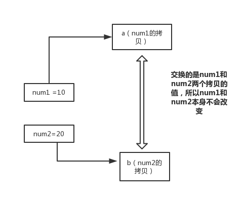

# Java基础知识

## 1. 面向对象和面向过程的区别

**面向过程** ：**面向过程性能比面向对象高。** 因为类调用时需要实例化，开销比较大，比较消耗资源，所以当性能是最重要的考量因素的时候，比如单片机、嵌入式开发、Linux/Unix等一般采用面向过程开发。但是，**面向过程没有面向对象易维护、易复用、易扩展。** 

**面向对象** ：**面向对象易维护、易复用、易扩展。** 因为面向对象有封装、继承、多态性的特性，所以可以设计出低耦合的系统，使系统更加灵活、更加易于维护。但是，**面向对象性能比面向过程低**。

> 这个并不是根本原因，面向过程也需要分配内存，计算内存偏移量，Java性能差的主要原因并不是因为它是面向对象语言，而是Java是半编译语言，最终的执行代码并不是可以直接被CPU执行的二进制机械码。
>
> 而面向过程语言大多都是直接编译成机械码在电脑上执行，并且其它一些面向过程的脚本语言性能也并不一定比Java好。


##  2. Java 语言的特点

1. 简单易学；
2. 面向对象（封装，继承，多态）；
3. 平台无关性（ Java 虚拟机实现平台无关性）；
4. 可靠性；
5. 安全性；
6. 支持多线程；
7. 支持网络编程并且很方便（ Java 语言诞生本身就是为简化网络编程设计的）；
8. 编译与解释并存；


## 3. Java 和 C++ 的区别

1. 都是面向对象的语言，都支持封装、继承和多态

2. Java 不提供指针来直接访问内存，程序内存更加安全

3. Java 的类是单继承的，C++ 支持多重继承；虽然 Java 的类不可以多继承，但是接口可以多继承。

4. Java 有自动内存管理机制，不需要程序员手动释放无用内存

5. **在 C 语言中，字符串或字符数组最后都会有一个额外的字符‘\0’来表示结束。但是，Java 语言中没有结束符这一概念，数组或字符串长度完全可以由length属性或length()方法来确定，就没有必要浪费一个空间标识结束了。**因此，当java收到C发来的字符串时，后面往往会有若干空字符，如果不做处理的话，java会对其一并输出，为了将空字符处理掉不输出，可以调用java字符串的trim()方法。


## 4. JVM、JRE 和 JDK

**JVM（Java Virtual Machine）**

Java虚拟机是运行 Java 字节码的虚拟机。JVM有针对不同系统的特定实现（Windows，Linux，macOS），目的是使用相同的字节码，它们都会给出相同的结果。Java是跨平台的，真正执行的不是二进制代码，而是字节码；JVM不是跨平台的，它由C语言编写，Java之所以能够做到跨平台，本质原因在于JVM不是跨平台的。Java 程序从源代码到运行一般有下面3步：


我们需要格外注意的是 .class -> 机器码 这一步。在这一步 JVM 类加载器首先加载字节码文件，然后通过解释器逐行解释执行，这种方式的执行速度会相对比较慢。而且，有些方法和代码块是经常需要被调用的(也就是所谓的热点代码)，所以后面引进了 JIT 编译器，而JIT 属于运行时编译。当 JIT 编译器完成第一次编译后，其会将字节码对应的机器码保存下来，下次可以直接使用。而我们知道，机器码的运行效率肯定是高于 Java 解释器的。这也解释了我们为什么经常会说 Java 是编译与解释共存的语言。

**JRE（Java Runtime Environment）**

Java运行时环境**包括 JVM**、Java类库、java命令和其他的一些基础构件，只能够**运行**程序。

**JDK（Java Development Kit）**

Java开发包是功能齐全的Java SDK，**包括JRE**、编译器（javac）和工具（如javadoc和jdb），能够**编译和运行**程序。


## 5. Oracle JDK 和 OpenJDK 的对比

可能在看这个问题之前很多人和我一样并没有接触和使用过  OpenJDK 。那么Oracle和OpenJDK之间是否存在重大差异？下面我通过收集到的一些资料，为你解答这个被很多人忽视的问题。

对于Java 7，没什么关键的地方。OpenJDK项目主要基于Sun捐赠的HotSpot源代码。此外，OpenJDK被选为Java 7的参考实现，由Oracle工程师维护。关于JVM，JDK，JRE和OpenJDK之间的区别，Oracle博客帖子在2012年有一个更详细的答案：

> 问：OpenJDK存储库中的源代码与用于构建Oracle JDK的代码之间有什么区别？
>
> 答：非常接近 - 我们的Oracle JDK版本构建过程基于OpenJDK 7构建，只添加了几个部分，例如部署代码，其中包括Oracle的Java插件和Java WebStart的实现，以及一些封闭的源代码派对组件，如图形光栅化器，一些开源的第三方组件，如Rhino，以及一些零碎的东西，如附加文档或第三方字体。展望未来，我们的目的是开源Oracle JDK的所有部分，除了我们考虑商业功能的部分。

**总结：**

1. Oracle JDK大概每6个月发一次主要版本，而OpenJDK版本大概每三个月发布一次。但这不是固定的，我觉得了解这个没啥用处。详情参见：https://blogs.oracle.com/java-platform-group/update-and-faq-on-the-java-se-release-cadence。
2. OpenJDK 是一个参考模型并且是完全开源的，而Oracle JDK是OpenJDK的一个实现，并不是完全开源的；
3. Oracle JDK 比 OpenJDK 更稳定。OpenJDK和Oracle JDK的代码几乎相同，但Oracle JDK有更多的类和一些错误修复。因此，如果您想开发企业/商业软件，我建议您选择Oracle JDK，因为它经过了彻底的测试和稳定。某些情况下，有些人提到在使用OpenJDK 可能会遇到了许多应用程序崩溃的问题，但是，只需切换到Oracle JDK就可以解决问题；
4. 在响应性和JVM性能方面，Oracle JDK与OpenJDK相比提供了更好的性能；
5. Oracle JDK不会为即将发布的版本提供长期支持，用户每次都必须通过更新到最新版本获得支持来获取最新版本；
6. Oracle JDK根据二进制代码许可协议获得许可，而OpenJDK根据GPL v2许可获得许可。


## 6. Java 应用程序与小程序的主类区别

一个程序中可以有多个类，但只能有一个类是主类。在 Java 应用程序中，这个主类是指包含 main（）方法的类。而在 Java 小程序中，这个主类是一个继承自系统类 JApplet 或 Applet 的子类。应用程序的主类不一定要求是 public 类，但小程序的主类要求必须是 public 类。主类是 Java 程序执行的入口点。

简单说应用程序是从主线程启动(也就是 `main()` 方法)。applet 小程序没有 `main()` 方法，主要是嵌在浏览器页面上运行(调用`init()`或者`run()`来启动)，嵌入浏览器这点跟 flash 的小游戏类似。


## 7. import java 和 javax

刚开始的时候 JavaAPI 所必需的包是 java 开头的包，javax 当时只是扩展 API 包来使用。然而随着时间的推移，javax 逐渐地扩展成为 Java API 的组成部分。但是，将扩展从 javax 包移动到 java 包确实太麻烦了，最终会破坏一堆现有的代码。因此，最终决定 javax 包将成为标准API的一部分。

所以，实际上java和javax没有区别，这都是一个名字。


## 8. 字符型常量和字符串常量

1. 形式上: 字符常量是单引号引起的一个字符; 字符串常量是双引号引起的若干个字符
2. 含义上: 字符常量相当于一个整型值（ASCII 值）,可以参加表达式运算; 字符串常量代表一个地址值（该字符串在内存中存放位置）
3. 占内存大小：字符常量只占2个字节; 字符串常量占若干个字节 (**注意： char在Java中占两个字节**)


## 9. 成员变量与局部变量的区别

1. 从语法形式上看：成员变量是属于类的，而局部变量是在方法中定义的变量或是方法的参数；成员变量可以被 public,private,static 等修饰符所修饰，而局部变量不能被访问控制修饰符及 static 所修饰；但是，成员变量和局部变量都能被 final 所修饰。
2. 从变量在内存中的存储方式来看：如果成员变量是使用`static`修饰的，那么这个成员变量是属于类的，如果没有使用`static`修饰，这个成员变量是属于实例的。而对象存在于堆内存，局部变量则存在于栈内存。
3. 从变量在内存中的生存时间上看：成员变量是对象的一部分，它随着对象的创建而存在，而局部变量随着方法的调用而自动消失。
4. 成员变量（包括类变量和实例变量）如果没有被赋初值，则会自动以类型的默认值而赋值（一种情况例外，被 final 修饰的成员变量也必须显式地赋值），而局部变量则不会自动赋值。


## 10. 关键字总结

### final

final 修饰修饰属性时，表示这个变量不能被改写。如果变量是基本数据类型，则变量的值不能改变（比如不能从10变到20）；如果变量是引用数据类型，则该变量不能再指向其它引用（比如指向新的对象或数组），但是**对象和数组的内容是可以改变的**。对于 final 修饰的成员变量，一般有两种赋值方式：在声明 final 时直接赋初值；或声明时不赋值，但在类的**所有**构造方法中都为其赋上初值。

final 修饰修饰方法时，表示这个方法是一个终态方法，即不能被重写。类中所有的 private 方法都隐式地指定为final。

final 修饰类时，表示这个类是一个终态类，即**不能被继承**，final 类中的所有方法都会被隐式地指定为 final 方法。

### static

static 修饰属性时，表示**静态变量**只属于类，并被所有实例共享，所以非线程安全的。即无论一个类生成了多少个对象，所有这些对象共同使用唯一的一份静态变量，如果一个对象对该静态变量进行了修改，其他对象的该静态变量的值也会随之改变。我们可以通过 ``类名.静态变量名`` 的方式使用它，static 还可以与 final 一起使用来修饰**静态常量**，如 ``public static final double PI = 3.1415926``。

static 修饰方法时叫做**静态方法**，它是一种不能向对象实施操作的方法，因此不能在静态方法中使用this关键字，我们同样可以使用 ``类名.方法名`` 的方式来访问。静态方法**只能继承，不能重写**。可以在静态方法中访问访问静态变量或调用静态方法，但不能访问非静态变量或调用非静态方法，而非静态方法可以访问静态变量或调用静态方法，即**“静态的只能访问静态的，非静态的可以访问一切”**。

static 代码块也叫**静态代码块**，用于完成一些初始化工作（比如项目中最常用的变量或对象必须在项目启动的时候就执行），它只会在类被加载时执行，因为每个类只会被加载一次，所以静态代码块**只会执行一次**。静态代码块**总是在构造方法前面执行**，即使是在继承体系中，也是首先执行最顶层到最底层的静态代码块，然后执行最顶层到最底层的构造方法。这是因为在调用类生成对象时，首先需要将类加载到 JVM 虚拟机上，然后由 JVM 加载这个类来生成对象。如果静态代码块有多个，JVM 将按照它们在类中出现的先后顺序依次执行。静态代码块对于定义在它之后的静态变量，可以赋值，但是不能访问。

> 静态代码块与非静态代码块的异同：
>
> 相同点： 都是在 JVM 加载类时且在构造方法执行之前执行，在类中都可以定义多个，定义多个时按定义的顺序执行，一般在代码块中对一些 static 变量进行赋值。 
>
> 不同点： 静态代码块在非静态代码块之前执行（**静态代码块—非静态代码块—构造方法**）。静态代码块只在类加载的时候执行一次，之后不再执行，而非静态代码块每创建一次对象就执行一次。 非静态代码块可在普通方法中定义（不过作用不大）；而静态代码块不行。 

```java
public class StaticTest {
    public StaticTest() {
        System.out.println("默认构造方法");
    }

    {
        System.out.println("非静态代码块");
    }

    static {
        System.out.println("静态代码块");
    }

    public static void test() {
        System.out.println("静态方法中的内容");
        {
            System.out.println("静态方法中的代码块");
        }
    }

    public static void main(String[] args) {
        new StaticTest();   // 静态代码块 非静态代码块 默认构造方法
        StaticTest.test();  // 静态方法中的内容 静态方法中的代码块
    }
}
```

static 修饰类时只能修饰内部类，叫做**静态内部类**，静态内部类与非静态内部类之间存在一个最大的区别: 非静态内部类在编译完成之后会**隐含地保存着一个引用**，该引用是指向创建它的外围类，但是静态内部类却没有。没有这个引用就意味着：它的创建是不需要依赖外围类的创建，且不能使用任何外围类的非 static 成员变量和方法。

**静态导入**使用 ``import static``这两个关键字来导入某个类中的指定静态资源，需要一直导入到类中的静态成员变量和方法。在使用时不需要指定类名，可以直接使用。

### private、protected、public

有4个修饰属性和方法的访问修饰符：private（私有的）仅对本类可见；public（公有的）对所有类可见；protected（受保护的）对本包和所有子类可见；默认不加修饰符仅对本包可见。

### this、super

this有两种用法，一是表示**当前对象的引用**，二是调用该类的其它构造方法，此时this()必须要作为构造方法的**第一条语句**。

```java
public class Person {
	public int age;
	public String name;
    public int year = 2020;

	public Person(int age) {
		this.age = age; // 表示当前对象的引用
	}
	public Person(int age, String name) {
		this(age); // 调用该类的其它构造方法
		this.name = name;
	}
}
```

super也有两种用法，一是表示**父类对象的引用**，使用父类的属性和方法，二是调用父类的构造方法，此时super()必须要作为构造方法的**第一条语句**。

```java
public class Student extends Person{
	public Student(int age, String name) {
		super(age, name);	// 调用父类的构造方法
		System.out.println(super.year);	// 表示父类对象的引用
	}
}
```

注意，this、super不能用在static方法中。被 static 修饰的成员属于类，不属于这个类的某个对象，被类中所有对象共享。而 this 代表对本类对象的引用，指向本类对象；super 代表对父类对象的引用，指向父类对象。所以， **this和super是属于对象范畴的东西，而静态方法是属于类范畴的东西**。


## 11. 重载和重写的区别

重载发生在同一个类内部的多个方法之间，重写发生在父类与子类之间。

**重载（overload）**表示多个方法的名字相同，但方法的参数不同，参数不同包括参数类型不同、个数不同、顺序不同。方法返回值和访问修饰符对重载没有任何影响。

**重写（override）**也叫覆写，子类与父类的方法名一样、参数一样，**返回类型小于等于父类，访问修饰符大于等于父类**，子类与父类的方法就构成了重写关系。


## 12. 构造方法特性

构造方法（constructor）用于完成对象属性的初始化功能，它有如下特点：

1. 名字与类名完全相同。
2. 没有返回值，也不能使用void声明。
3. 不能显式调用，构造方法通常通过new关键字隐式调用。
4. 如果在定义一个类时，没有为类声明构造方法，那么编译器会**自动为类添加一个没有参数且方法体为空的构造方法（默认的构造方法）**。如果类声明了构造方法，那么编译器就不会再为类添加默认的构造方法。
5. 构造方法不能为重写，因为它不能被子类继承，但是可以重载


## 13. 为什么 Java 只有值传递

首先回顾一下在程序设计语言中有关将参数传递给方法（或函数）的一些专业术语。**按值调用(call by value)表示方法接收的是调用者提供的值，而按引用调用（call by reference)表示方法接收的是调用者提供的变量地址。一个方法可以修改传递引用所对应的变量值，而不能修改传递值调用所对应的变量值。** 它用来描述各种程序设计语言（不只是 Java)中方法参数传递方式。

**Java 程序设计语言总是采用按值调用。也就是说，方法得到的是所有参数值的一个拷贝，方法不能修改传递给它的任何参数变量的内容。**下面通过 3 个例子来给大家说明：

```java
public static void main(String[] args) {
    int num1 = 10;
    int num2 = 20;

    swap(num1, num2);

    System.out.println("num1 = " + num1);	// 10
    System.out.println("num2 = " + num2);	// 20
}

public static void swap(int a, int b) {
    int temp = a;
    a = b;
    b = temp;

    System.out.println("a = " + a);	// 20
    System.out.println("b = " + b);	// 10
}
```



在 swap 方法中，a、b 的值进行交换，并不会影响到 num1、num2。因为，a、b 中的值，只是从 num1、num2 的复制过来的。也就是说，a、b 相当于 num1、num2 的副本，副本的内容无论怎么修改，都不会影响到原件本身。通过上面例子，我们已经知道了一个方法不能修改一个基本数据类型的参数，而对象引用作为参数就不一样，请看第2个例子。

```java
public class Test {
    public static void main(String[] args) {
        int[] arr = {1, 2, 3, 4, 5};
        String str = "hello";
        System.out.println(arr[0] + "+" + str);    // 1+hello
        change(arr, str);
        System.out.println(arr[0] + "+" + str);    // 0+hello
    }

    public static void change(int[] array, String string) {
        array[0] = 0;	// 修改数组
        string = "world";	// String具有不可变性 
    }
}
```


array 被初始化 arr 的拷贝，即一个对象的引用，也就是说 array 和 arr 指向的是同一个数组对象。 因此，外部对引用对象的改变会反映到所对应的对象上。通过例2，我们已经看到，实现一个改变对象参数状态的方法并不是一件难事。理由很简单，方法得到的是对象引用的拷贝，对象引用及其他的拷贝同时引用同一个对象。

**很多程序设计语言（特别是，C++和 Pascal)提供了两种参数传递的方式：值调用和引用调用。有些程序员认为 Java 程序设计语言对对象采用的是引用调用，实际上，这种理解是不对的。由于这种误解具有一定的普遍性，所以下面给出一个反例来详细地阐述一下这个问题。**

```java
public class Test {
	public static void main(String[] args) {
		Student s1 = new Student("小张");
		Student s2 = new Student("小李");
		Test.swap(s1, s2);
		System.out.println("s1:" + s1.getName());	// s1:小张
		System.out.println("s2:" + s2.getName());	// s2:小李
	}

	public static void swap(Student x, Student y) {
		Student temp = x;
		x = y;
		y = temp;
		System.out.println("x:" + x.getName());	// x:小李
		System.out.println("y:" + y.getName());	// y:小张
	}
}
```

交换之前：


交换之后：


通过上面两张图可以很清晰的看出： 方法并没有改变存储在变量 s1 和 s2 中的对象引用，swap 方法的参数 x 和 y 被初始化为两个对象引用的拷贝，这个方法交换的是这两个拷贝。

**总结**

Java 程序设计语言对对象采用的不是引用调用，实际上，**对象引用是按值传递的**。

- 一个方法不能修改一个基本数据类型的参数（即数值型或布尔型）。
- 一个方法可以改变一个对象参数的状态（String 类对象除外，由于 String 的不可变性，当它作为方法参数被修改时，其内容也不会改变）。
- 一个方法不能让对象参数引用一个新的对象。


## 14. 抽象类和接口

**抽象类（abstract class）**

abstract修饰修饰方法时叫做**抽象方法**，抽象方法有声明、无实现；具体方法有声明、有实现。

abstract修饰修饰类时叫做**抽象类**，抽象类无法实例化，即不能使用new来生成抽象类的对象。**抽象方法需要定义在抽象类中，也可以说包含抽象方法的类一定是抽象类**，但抽象类既可以包含抽象方法，也可以包含具体方法。在子类继承父类（父类是抽象类）的情况下，该子类必须实现父类中定义的**所有**抽象方法，否则该子类需要声明为抽象类。

**接口（interface）**

可以将接口看作是特殊的抽象类，区别在于**Java是单继承多接口的**。接口中定义的变量默认是 ``public static final ``的；定义的方法是默认是 ``public abstract`` 的，因此这些关键字都可以省略，但类在实现接口中的方法时必须声明为public，否则编译器会默认为包可见性。

在Java 8之前，接口中的所有方法都必须是抽象方法，但**在Java 8中，可以将静态方法定义在接口中**，而不是接口的伴随类中（比如将工具类Paths的静态方法定义在接口Path中）。如果一个类实现了某个接口，那么该类必须要实现接口中声明的**所有**方法，否则该类需要声明为抽象类。

在Java 8中，还可以为接口方法提供一个**默认实现**，必须用default修饰。解决默认方法冲突的规则：**超类优先，接口覆盖**。即如果超类提供了一个具体方法，则接口中同名且参数类型相同的默认方法会被忽略；如果两个接口冲突，则实现这两个接口的类必须覆盖这个方法，来解决二义性冲突。

**接口、抽象类、实体类的关系**

|        | 继承(extends)接口 | 实现(implements)接口 | 继承抽象类 | 继承实体类 |
| ------ | :---------------: | :------------------: | :--------: | :--------: |
| 接口   |       可以        |        不可以        |   不可以   |   不可以   |
| 抽象类 |      不可以       |         可以         |    可以    |    可以    |
| 实体类 |      不可以       |         可以         |    可以    |    可以    |


## 15. 封装、继承、多态

**封装**

封装把一个对象的属性私有化，同时提供一些可以被外界访问属性的方法，如果属性不想被外界访问，我们大可不必提供方法给外界访问。但是如果一个类没有提供给外界访问的方法，那么这个类也没有什么意义了。

**继承**

Java是单继承的，意味着一个类只能从**另一个**类继承。当生成子类对象时，**Java默认首先隐式调用父类的不带参数的构造方法**，生成父类的对象，然后再去调用子类的构造方法，生成子类的对象。如果父类没有不带参数的构造方法，子类必须使用**super来显示调用**父类的构造方法。即要想生成子类的对象，首先需要生成父类的对象，没有父类对象就没有子类对象。

如果子类使用super()显示调用父类的某个构造方法，那么在执行时就只会寻找与super()对应的构造方法，而不会再去寻找父类不带参数的构造方法。关于继承的3点：

1. 子类拥有父类对象所有的属性和方法（包括私有属性和私有方法，不包括构造方法），但是父类中的私有属性和方法子类是**无法访问，只是拥有**。（父类有的，子类也有）
2. 子类可以拥有自己属性和方法，即子类可以对父类进行扩展。（父类没有的，子类可以增加）
3. 子类可以用自己的方式实现父类的方法。（父类有的，子类可以改变）

**多态**

所谓多态，就是父类型的引用可以指向子类型的对象，或接口类型的引用可以指向实现该接口的类的实例。即在Java中有两种形式可以实现多态：继承（多个子类对同一方法的重写）和接口（实现接口并覆盖接口中同一方法）。


## 16. String、StringBuffer 和 StringBuilder 

**可变性**

简单的来说：String 类中使用 final 关键字修饰字符数组来保存字符串，`private　final char value[]`，所以 **String 对象是不可变的**。而 StringBuilder 与 StringBuffer 都继承自 AbstractStringBuilder 类，它们都是调用父类的构造方法也就是 AbstractStringBuilder 实现的。在 AbstractStringBuilder 中也是使用字符数组保存字符串`char[] value` ，但是没有用 final 关键字修饰，所以**这两种对象都是可变的**。

> 在 JDK 9 中，字符串相关的类，如上面提到的4个，底层实现修改为`byte[] value`。原因是每个 char 字符需要使用两个字节（16位）存储，但是大多数 String 对象仅包含Latin-1（ISO-8859-1）字符，这些字符仅需要一个字节的存储空间，因此String对象的内部数组由一半空间未使用。于是，将String类的内部表示形式从UTF-16 `char`数组更改为`byte`带有编码标记字段的数组。详见[官方文档](https://openjdk.java.net/jeps/254)。

通过查看 StringBuilder 的源码（StringBuffer类似）可知：当调用空参构造器 ``new StringBuilder()`` 时，底层实际上生成了一个**长度为 16** 的字符数组；当调用 ``new StringBuilder(String str)`` 时，底层生成了一个**长度为 str.length() + 16** 的字符数组；当添加元素超过容量时，会扩容为**原来容量的2倍 + 2**。由此可见， StringBuilder 和 StringBuffer 是可变的，且效率更高。同时建议使用 ``new StringBuilder(int capacity)`` 构造器，避免添加元素时频繁的扩容操作。

```java
abstract class AbstractStringBuilder implements Appendable, CharSequence {
    char[] value;	// 没有使用final关键字修饰
    
    AbstractStringBuilder() {
    }
    
    // 生成指定容量的字符数组
    AbstractStringBuilder(int capacity) {
        value = new char[capacity];
    }
    
    // 生成长度为str.length() + 16的字符数组
    AbstractStringBuilder(String str) {
        int length = str.length();
        int capacity = (length < Integer.MAX_VALUE - 16)
                ? length + 16 : Integer.MAX_VALUE;
    }
}
```

**线程安全性**

String 中的对象是不可变的，也就可以理解为常量，线程安全。AbstractStringBuilder 是 StringBuilder 与 StringBuffer 的公共父类，定义了一些字符串的基本操作，如 expandCapacity、append、insert、indexOf 等公共方法。StringBuffer 对方法加了同步锁或者对调用的方法加了同步锁，所以是线程安全的。StringBuilder 并没有对方法进行加同步锁，所以是非线程安全的。　

**性能**

每次对 String 类型进行改变的时候，都会生成一个新的 String 对象，然后将指针指向新的 String 对象。StringBuffer 每次都会对 StringBuffer 对象本身进行操作，而不是生成新的对象并改变对象引用。相同情况下使用 StringBuilder 相比使用 StringBuffer 仅能获得 10%~15% 左右的性能提升，但却要冒多线程不安全的风险。

**对于三者使用的总结：** 

1. 操作少量的数据: 适用 String
2. 单线程操作字符串缓冲区下操作大量数据: 适用 StringBuilder
3. 多线程操作字符串缓冲区下操作大量数据: 适用 StringBuffer


## 17. == 和 equals

**==**

它的作用是判断两个对象的地址是不是相等。即判断两个对象是不是同一个对象（基本数据类型==比较的是值，引用数据类型==比较的是内存地址）。

**equals()**

该方法定义在Object类中，因此Java中的每个类都具有该方法，它的作用也是判断两个对象是否相等。但它一般有两种使用情况：

* 情况1：类**没有覆盖** equals() 方法。则通过 equals() 比较该类的两个对象时，等价于通过“==”比较这两个对象。Object.java 源码如下：

```java
public boolean equals(Object obj) {
    return (this == obj);
}
```

* 情况2：类**覆盖**了 equals() 方法。一般我们都覆盖 equals() 方法来比较两个对象的内容是否相等；若它们的内容相等，则返回 true (即认为这两个对象相等)。

```java
public class Test {
    public static void main(String[] args) {
        String str1 = new String("abc");
        String str2 = new String("abc");
        System.out.println(str1 == str2);       // false
        System.out.println(str1.equals(str2));  // true，String类重写过equals()方法
        
        Integer i1 = new Integer(2);
        Integer i2 = new Integer(2);
        System.out.println(i1 == i2);       // false
        System.out.println(i1.equals(i2));  // true，8个基本数据类型的包装类重写过equals()方法
    }
}
```


## 18. hashCode() 和 equals()

**hashCode() 介绍**

hashCode() 的作用是**获取哈希码**，也称为散列码，它实际上是返回一个 int 整数，用来**确定该对象在哈希表中的索引位置**。hashCode() 定义在Object类中，这就意味着Java中的任何类都包含有hashCode() 方法。虽然，每个Java类都包含该方法，但是**hashCode()只有在散列表中才有用，在其它情况没用**，这里的散列表指的是：Java集合中本质是散列表的类，如**HashMap，Hashtable，HashSet**。

以 HashSet 为例，当向 HashSet 中添加元素 A 时，**首先调用元素 A 所在类的 hashCode() 方法**，计算元素 A 的哈希值，然后此哈希值通过某种算法计算出在 HashSet 底层数组中的存放位置（即索引位置），判断此位置是否已经有元素：

1. 如果此位置上没有其他元素，则元素 A 添加成功；
2. 如果此位置上有其他元素 B（或以链表形式存在的多个元素），则比较元素 A 与元素 B 的哈希值：如果哈希值不同，则添加元素 A 成功；
3. 如果哈希值相同，则**进一步调用元素 A 所在类的 equals() 方法**：如果返回 false，则添加元素 A 成功；如果返回 true，则添加元素 A 失败。这样我们就大大减少了 equals 的次数，相应就大大提高了执行速度。

**equals() 介绍**


1. **自反性**：x.equals(x)必须返回是"true"。
2. **对称性**：如果x.equals(y)返回是"true"，那么y.equals(x)也应该返回是"true"。
3. **传递性**：如果x.equals(y)返回是"true"，而且y.equals(z)返回是"true"，那么x.equals(z)也应该返回是"true"。
4. **一致性**：如果x.equals(y)返回是"true"，只要x和y内容一直不变，不管你重复x.equals(y)多少次，返回都是"true"。
5. **非空性**：x.equals(null)，永远返回是"false"；x.equals(和x不同类型的对象)永远返回是"false"。

**hashCode() 和 equals() 关系**

* 情况1：不会创建“类对应的散列表”。此时两者没有任何关系，hashCode() 没有任何作用。
* 情况2：会创建“类对应的散列表”。在集合中添加元素时，为了**保证不可重复性**，会首先调用 hashCode() 方法进行判断，当哈希值相同时才会进一步调用 equals() 方法。此时两者有如下关系：
  1. 对于两个对象，如果它们的 hashCode 值相同，那么使用 equals() 比较不一定返回true（可以true，可以false）。
  2. 对于两个对象，如果使用 equals() 比较返回 true，那么这两个对象的 hashCode 值一定是相同的。
  3. **如果重写了equals()方法，那么也要重写hashCode()方法。**因为如果没有重写 hashCode()，那么该类的两个对象无论如何都不会相等（除非它们引用的是同一个对象），此时 equals() 方法也就失去了意义。
  4. 对于 Object 类来说，hashCode 值表示的是对象的地址，因此不同的 Object 对象的 hashCode 值是不同的。

**如何重写 equals() 方法**

1. **使用 == 操作符检查“参数是否为这个对象的引用”**。这是一种性能优化，因为比较操作有可能很昂贵。
2. **使用 instanceof 操作符检查“参数是否为正确的类型”**。
3. **把参数转换为正确的类型**。因为前面已经进行过 instanceof 测试，所以确保会成功。
4. **对于该类中的每个“关键域”，检查参数中的域是否与该对象中对应的域匹配**。对于 float 域，可以使用 Float.compare 方法；对于 double 域，则使用 Double.compare 方法；对于其它基本数据类型，可以直接使用 == 操作符；对于对象引用，可以递归调用 equals 方法；对于数组，则要把以上原则应用到每个元素上，还可以使用 Arrays.equals 方法。
5. **重写后，检查它是否是对称的、传递的、一致的**。自反性和飞空性一般会自动满足。

下面是 String 类中的 equals 方法源码，就符合上述原则。重写时还有以下告诫：

* **覆盖 equals 时总要覆盖 hashCode**。否则导致该类无法与基于散列表的集合一起正常使用。
* **不要将 equals 形参中的 Object 对象替换为其它类型**。这不是覆盖（重写），而是重载。

```java
	public boolean equals(Object anObject) {
        if (this == anObject) {
            return true;
        }
        if (anObject instanceof String) {
            String aString = (String)anObject;
            if (!COMPACT_STRINGS || this.coder == aString.coder) {
                return StringLatin1.equals(value, aString.value);
            }
        }
        return false;
    }
```

**如何重写 hashCode() 方法**

1. 把某个非 0 的常数值，如17，保存在int 类型的 result 变量中。
2. 对于对象中每个关键域 f（指 equals 方法中涉及的每个域）：
   * 为该域计算 int 类型的散列码 c：
     * 如果是 boolean 类型，则计算 f ? 1 : 0
     * 如果是 byte、char、short、int 类型，则计算 (int) f
     * 如果是 long 类型，则计算(int) (f ^ f >>> 32)
     * 如果是 float 类型，则计算 Float.floatToIntBits(f)
     * 如果是 double 类型，则计算 Double.doubleToLongBits(f)，然后再为得到的 long 类型计算散列值
     * 如果是对象引用，且该类的 equals 方法通过递归调用 equals 方式来比较这个域，则同样为这个域递归调用 hashCode。
     * 如果是数组，则对每个元素递归使用上述规则，还可以使用 Arrays.hashCode 方法
   * 按照下面的公式，把上面计算得到的散列码 c 合并到 result 中：`result = 31 * result + c;`。使用 31 是因为可用移位和减法代替乘法，31 * i = (32 - 1) * i = (i << 5) - i，虚拟机可以自动完成这种优化。
3. 返回 result。
4. 重写后，检查它是否“相等的实例都具有相等的散列码”。

下面是 Arrays 类中的 hashCode 方法源码，就符合上述原则。

```java
	public static int hashCode(double a[]) {
        if (a == null)
            return 0;

        int result = 1;
        for (double element : a) {
            long bits = Double.doubleToLongBits(element);
            result = 31 * result + (int)(bits ^ (bits >>> 32));
        }
        return result;
    }
```


## 19. 浅拷贝和深拷贝

**浅拷贝（shallow copy）**：对基本数据类型进行值传递，对引用数据类型进行引用（地址）传递的拷贝，此为浅拷贝。

**深拷贝（deep copy）**：对基本数据类型进行值传递，对引用数据类型，创建一个新的对象，并复制其内容，此为深拷贝。


**如何实现浅拷贝和深拷贝**：实现对象拷贝的类，需要实现 `Cloneable` 接口，并覆写 `clone()` 方法（该方法位于Object类中，而不是Cloneable接口中，Cloneable只是个标识性接口，表明可以调用clone()方法）。如果是深拷贝，需要**对每层对象**的类都进行上述操作。数组进行深拷贝，可以直接调用 ``Arrays.copyof(arr, arr.length)`` 。

**浅拷贝和对象克隆的区别**：无论浅拷贝还是深拷贝，都会生成新的对象，而类似 ``Student stu2 = stu`` 的对象克隆并没有生成新的对象，二者的对象地址是一样的。


## 20. 内部类

内部类（inner class）是定义在另一个类或方法中的类，可分为静态内部类和非静态内部类（成员内部类、局部内部类、匿名内部类）。

**静态内部类（static inner class）**

非静态内部类的对象总有一个隐式引用，它指向了创建它的外部类对象，而静态内部类使用static关键字，取消了产生的引用。静态内部类只能访问外部类的静态成员变量和静态方法，它的生成方式为 ``OuterClass.InnerClass inner = new OuterClass.InnerClass();`` 。

**成员内部类（member inner class）**

成员内部类定义在另一个类中，且没有static修饰。它的生成方式为 ``OuterClass.InnerClass inner = new OuterClass().new InnerClass();`` 。成员内部类可以访问外部类的静态和非静态的成员变量和方法，语法为``OuterClass.this.变量或方法`` 。

**局部内部类（local inner class）**

局部内部类定义在**方法**中，是最少使用的一种内部类。它和局部变量一样，**不能**使用public、protected、private、static等访问修饰符，且只能访问方法中声明为final的局部变量。

**匿名内部类（anonymous inner class）**

匿名内部类是**没有类名的局部内部类**，因此它没有class、extends等关键字，也没有构造方法，但是会**隐式地继承一个父类或实现一个接口**。


## 21. 异常处理

**1. 异常类层次结构**


在 Java 中，所有的异常都有一个共同的祖先java.lang包中的 **Throwable类**。Throwable 有两个重要的子类：**Exception（异常）**和 **Error（错误）**，二者都是 Java 异常处理的重要子类，各自都包含大量子类。**异常和错误的区别：异常能被程序本身处理，错误是无法处理。**

**Error(错误)：是程序无法处理的错误**，表示运行应用程序中较严重问题。大多数错误与代码编写者执行的操作无关，而表示代码运行时 JVM（Java 虚拟机）出现的问题。例如，Java虚拟机运行错误（Virtual MachineError），当 JVM 不再有继续执行操作所需的内存资源时，将出现 OutOfMemoryError。这些异常发生时，Java虚拟机（JVM）一般会选择线程终止。

这些错误表示故障发生于虚拟机自身、或者发生在虚拟机试图执行应用时，如Java虚拟机运行错误（Virtual MachineError）、类定义错误（NoClassDefFoundError）等。这些错误是不可查的，因为它们在应用程序的控制和处理能力之外，而且绝大多数是程序运行时不允许出现的状况。对于设计合理的应用程序来说，即使确实发生了错误，本质上也不应该试图去处理它所引起的异常状况。在 Java中，错误通过Error的子类描述。

**Exception(异常)：是程序本身可以处理的异常**。Exception 类有一个重要的子类 **RuntimeException(运行时异常)**。RuntimeException 异常由Java虚拟机抛出。**NullPointerException**（要访问的变量没有引用任何对象时，抛出该异常）、**ArithmeticException**（算术运算异常，一个整数除以0时，抛出该异常）和 **ArrayIndexOutOfBoundsException** （下标越界异常）。

对于运行时异常，我们可以处理，也可以不处理，推荐不对其进行处理。而对于非运行时异常，必须要进行处理，处理方式有两种：第一种是使用try-catch-finally进行捕获，第二种是方法声明throws Exception。

**2. Throwable类常用方法**

- public string getMessage()：返回异常发生时的简要描述
- public string toString()：返回异常发生时的详细信息
- public string getLocalizedMessage()：返回异常对象的本地化信息。使用Throwable的子类覆盖这个方法，可以生成本地化信息。如果子类没有覆盖该方法，则该方法返回的信息与getMessage() 返回的结果相同
- public void printStackTrace()：在控制台上打印Throwable对象封装的异常信息

**3. 异常处理总结**

- **try 块：** 用于捕获异常。其后可接零个或多个catch块，如果没有catch块，则必须跟一个finally块。
- **catch 块：** 用于处理try捕获到的异常。如果使用多个catch块，需要将父类型的catch块放到子类型catch块之后，否则子类型catch块无法执行。
- **finally 块：** 无论是否捕获或处理异常，finally块里的语句都会被执行。当在try块或catch块中遇到return语句时，finally语句块将在**方法返回之前被执行**，并且finally语句的返回值将会覆盖原始的返回值。

```java
public static int f(int value) {
	try {
		return value * value;
	} finally {
		if (value == 2) {
			return 0;
		}
	}
}
```

如果调用 `f(2)`，返回值将是0，因为finally语句的返回值覆盖了try语句块的返回值。

**在以下4种特殊情况下，finally块不会被执行：**

1. 在finally语句块第一行发生了异常。 因为在其他行，finally块还是会得到执行。
2. 在前面的代码中用了System.exit(int)已退出程序。 exit是带参函数，若该语句在异常语句之后，finally会执行。
3. 程序所在的线程死亡。
4. 关闭CPU。


## 22. 枚举类

在jdk1.5中，允许我们使用 enum 关键字来定义枚举类，它默认继承于 java.lang.Enum 类，且枚举中的每个成员默认都是`public static final` 的。

```java
public enum Season{
    SPRING, SUMMER, AUTUMN, WINNER;
}
```

实际上，这个声明定义的类型是一个类，每个枚举的成员其实就是一个实例。当定义了一个枚举类型后，在编译时就能确定该枚举类型有几个实例，分别是什么，在运行期间我们无法再去创建新的实例，这些实例在编译期间就已经完全确定下来了。因此，在比较枚举类型的值时，可以直接使用==（Enum类重写了equals()方法，底层仍然是调用==）。

枚举类中可以添加私有构造器、方法和属性，还可以实现接口。

```java
interface info{
    void show();
}

public enum Seasons implements info {
    //1.提供当前枚举类的对象，多个对象之间用“,”隔开，末尾对象“;”结束
    SPRING("春天") {
        @Override
        public void show() {
            System.out.println("春暖花开");
        }
    },
    SUMMER("夏天") {
        @Override
        public void show() {
            System.out.println("夏日炎炎");
        }
    },
    AUTUMN("秋天") {
        @Override
        public void show() {
            System.out.println("秋高气爽");
        }
    },
    WINNER("冬天") {
        @Override
        public void show() {
            System.out.println("冰天雪地");
        }
    };

    private String seasonName;

    Seasons(String seasonName) {
        this.seasonName = seasonName;
    }

    public String getSeasonName() {
        return seasonName;
    }
}
```


## 23. 注解

Java 定义了一套注解，共有 7 个，3 个在 java.lang 中，剩下 4 个在 java.lang.annotation 中。

**作用在代码的注解是：**

- @Override - 检查该方法是否是重载方法。如果发现其父类，或者是引用的接口中并没有该方法时，会报编译错误。
- @Deprecated - 标记过时方法。如果使用该方法，会报编译警告。
- @SuppressWarnings - 指示编译器去忽略注解中声明的警告。

**作用在其他注解的注解(元注解)是：**

- @Retention - 标识这个注解怎么保存，是只在代码中，还是编入class文件中(默认)，或者是**在运行时可以通过反射访问**。
- @Target - 标记这个注解应该是哪种 Java 成员。
- @Documented - 标记这些注解是否包含在用户文档中。
- @Inherited - 标记这个注解是继承于哪个注解类(默认注解并没有继承于任何子类)

从 Java 7 开始，额外添加了 3 个注解：

- @SafeVarargs - Java 7 开始支持，忽略任何使用参数为泛型变量的方法或构造函数调用产生的警告。
- @FunctionalInterface - Java 8 开始支持，标识一个匿名函数或函数式接口。
- @Repeatable - Java 8 开始支持，标识某注解可以在同一个声明上使用多次

我们还可以使用``@interface``关键字来自定义注解，该注解会隐式继承于 java.lang.annotation.Annotation 接口，注解不允许显式继承于其他的接口。

```java
@Retention(RetentionPolicy.RUNTIME)	// RUNTIME表示在运行时可以通过反射访问
@Target({TYPE, FIELD, METHOD, PARAMETER, CONSTRUCTOR, LOCAL_VARIABLE, ANNOTATION_TYPE, PACKAGE, TYPE_PARAMETER, TYPE_USE})
public @interface MyAnnotation {
    // 可以使用default指定成员的默认值
    String value() default "hello";
}
```


## 24. 反射

**1. 什么是反射**

Java反射说的是在**运行状态**中，对于任何一个类，我们都能够知道这个类有哪些方法和属性；对于任何一个对象，我们都能够对它的方法和属性进行调用。我们把这种动态获取对象信息和调用对象方法的功能称之为反射机制。

**2. 获取Class对象常用的方式**

类的加载过程：程序经过javac.exe命令以后，会生成一个或多个字节码文件（.class）。接着我们使用java.exe命令对某个字节码文件进行解释运行，相当于将某个字节码文件加载到内存中，此过程就称为类的加载。

**加载到内存中的类，我们就称为运行时类**，此运行时类就作为Class类的一个实例。换句话说，**Class的实例就对应着一个运行时类**。加载到内存中的运行时类，会缓存一定的时间，无论生成这个类的多少个对象，这些对象都只会对应于同一个Class对象。

```java
// 方式一：调用运行时类的属性.class
Class clazz1 = String.class;

// 方式二：通过运行时类的对象，调用getClass()
String str = new String();
Class clazz2 = str.getClass();

// 方式三：调用CLass类的静态方法：forName(String className)
Class clazz3 = Class.forName("java.lang.String");

// 方式四(了解)：使用类的加载器ClassLoader
ClassLoader classLoader = ReflectionTest.class.getClassLoader();
Class clazz4 = classLoader.loadClass("java.lang.String");

System.out.println(clazz1 == clazz2);	// true
System.out.println(clazz1 == clazz3);	// true
```

接下来我们通过代码来演示一下反射的动态性：

```java
public class ReflectionTest {
    public static void main(String[] args) throws Exception {
        int num = new Random().nextInt(3);
        String classPath = "";
        switch (num) {
            case 0:
                classPath = "java.util.Date";
                break;
            case 1:
                classPath = "java.lang.Object";
                break;
            case 2:
                classPath = "java.lang.String";
                break;
        }
        // 只有在运行时才能确定所要生成的对象
        Object obj = getInstance(classPath);
        System.out.println("obj = " + obj);
    }

    private static Object getInstance(String classPath) throws Exception {
        Class<?> clazz = Class.forName(classPath);
        // newInstance()创建对应运行时类的对象，内部调用了运行时类的"空参构造器"
        // 因此要求该类必须有空参的构造器，且访问修饰符的权限要合适，通常设为public
        // Java9中实际上已经废弃了直接调用newInstance()，取而代之的是下面这种方式
        return clazz.getDeclaredConstructor().newInstance();
    }
}
```

**3. 通过反射获取类的属性、方法、构造方法**

* Field[] getFields()：获取当前运行时类**及其父类**声明为**public**的属性
* Field[] getDeclaredFields()：获取当前运行时类(不包含父类)声明的**所有属性**
* Method[] getMethods()：获取当前运行时类**及其父类**声明为**public**的方法
* Method[] getDeclaredMethods()：获取当前运行时类(不包含父类)声明的**所有方法**
* Constructor[] getConstructors()：获取当前运行时类**及其父类**声明为**public**的构造方法
* Constructor[] getDeclaredConstructors()：获取当前运行时类(不包含父类)声明的**所有构造方法**

**4. 通过反射调用类的属性、方法、构造方法**

获取当前运行时类**指定名称**的属性、方法、构造方法，前者包含父类且为public的，后者不包含父类且任意权限的。权限一般很少声明为public的，因此常用后者的方法。

- Field getField / getDeclaredField(String name)
- Method getMethod / getDeclaredMethod(String name, Class<?>... parameterTypes)
- Constructor\<T\> getConstructor / getDeclaredConstructor(Class<?>... parameterTypes)

我们首先自定义一个Student类：

```java
public class Student {
    private String name;
    public int age;

    private Student(String name, int age) {
        this.name = name;
        this.age = age;
    }

    @Override
    public String toString() {
        return "Student{" +
                "name='" + name + '\'' +
                ", age=" + age +
                '}';
    }
}
```

接下来通过反射类来调用类的属性、方法、构造方法：

```java
public class ReflectionInvoke {
    public static void main(String[] args) throws Exception {
        Class<Student> clazz = Student.class;

        // 通过反射调用类的构造方法
        Constructor<Student> con = clazz.getDeclaredConstructor(String.class, int.class);
        con.setAccessible(true);    // 保证当前构造方法是可访问的
        Student stu = con.newInstance("Peter", 24);
        System.out.println(stu);	// Student{name='Peter', age=24}

        // 通过反射调用类的属性
        Field field = clazz.getDeclaredField("name");
        field.setAccessible(true);
        field.set(stu, "Parker");
        System.out.println(field.get(stu));	// Parker

        // 通过反射调用类的方法
        Method method = clazz.getDeclaredMethod("toString");
        method.setAccessible(true);
        String result = (String) method.invoke(stu);
        System.out.println(result);	// Student{name='Parker', age=24}
    }
}
```


