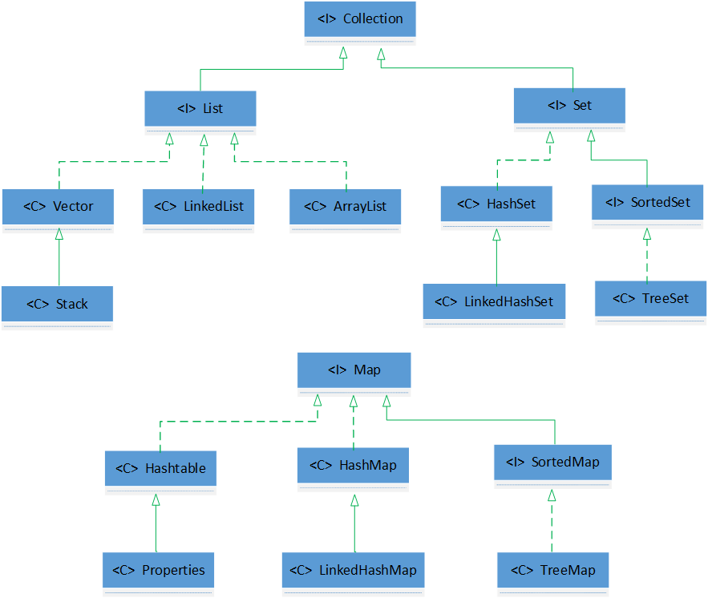

## 1. 集合框架体系总结



**List(有序、可重复)**： 主要包括 `ArrayList` 和 `LinkedList`（`Vector` 是 `ArrayList` 的古老版本）

**Set(无序、不可重复)**：主要包括 `HashSet`、`LinkedHashSet` 和 `TreeSet`

1. 无序性不等于随机性，存储的数据在底层数组中并非按照数组索引的顺序添加，而是根据数据计算的哈希值。
2. 为了保证不可重复性，要求向 Set 中添加的元素，**其所在的类一定要重写 hashCode() 和 equals() 方法（如果是 TreeSet，需要重写 compare() 或 compareTo() 方法）**，重写时应该尽可能保证一致，即相等的对象必须具有相等的散列码。
3. LinkedHashSet 能保证按照添加元素的顺序实现遍历（并非真正有序），是因为它在添加元素的同时，还维护了两个引用，记录此元素的前一个元素和后一个元素。因此，对于频繁的遍历操作，LinkedHashSet 效率高于 HashSet（LinkedHashMap 类似）。

**Map(key-value键值对)**： 主要包括 `HashMap`、`LinkedHashMap` 和 `TreeMap`（`Hashtable` 是 `HashMap` 的古老版本）

1. key 是无序、不可重复的，所以使用 Set 存储所有的 key，**且 key 所在的类要重写equals() 和 hashCode() 方法（如果是TreeMap，需要重写compare() 或 compareTo() 方法）**。

2. value 是无序、可重复的，所以使用 Collection 存储所有的 value，且 value 所在的类要重写 equals() 方法，以保证 containsValue() 方法能正确返回。

3. 一个键值对 key-value 构成了一个 Entry 对象，Entry是无序、不可重复的，所有使用 Set 存储所有的 Entry。


## 2. 集合框架底层数据结构总结

**Collection**

**1. List**

- **ArrayList：** Object 数组
- **Vector：** Object 数组
- **LinkedList：** 双向链表(JDK1.6之前为循环链表，JDK1.7取消了循环)

**2. Set**

- **HashSet（无序，唯一）:** 基于 HashMap 实现的，底层采用 HashMap 来保存元素
- **LinkedHashSet：** LinkedHashSet 继承于 HashSet，并且其内部是通过 LinkedHashMap 来实现的。有点类似于 LinkedHashMap 其内部是基于 HashMap 实现一样，不过还是有一点区别的
- **TreeSet（有序，唯一）：** 红黑树（自平衡的排序二叉树）

**Map**

- **HashMap：** JDK 8之前 HashMap 由数组 + 链表组成的，数组是 HashMap 的主体，链表则是主要为了解决哈希冲突而存在的（“拉链法”解决冲突）。JDK 8以后在解决哈希冲突时有了较大的变化，当链表长度大于阈值（默认为8）时，将链表转化为红黑树，以减少搜索时间
- **LinkedHashMap：** LinkedHashMap 继承自 HashMap，所以它的底层仍然是基于拉链式散列结构，即由数组 + 链表或红黑树组成。另外，LinkedHashMap 在上面结构的基础上，增加了一条双向链表，从而可以保证按照添加元素的顺序实现遍历。
- **Hashtable：** 数组 + 链表组成的，数组是 Hashtable 的主体，链表则是主要为了解决哈希冲突而存在的
- **TreeMap：** 红黑树（自平衡的排序二叉树）


## 3. ArrayList 与 LinkedList 区别

1. **是否保证线程安全：** `ArrayList` 和 `LinkedList` 都是不同步的，也就是不保证线程安全。

2. **底层数据结构：** `Arraylist` 底层使用的是 **Object 数组**；`LinkedList` 底层使用的是 **双向链表** 。

3. **插入和删除是否受元素位置的影响：** ① **`ArrayList` 采用数组存储，所以插入和删除元素的时间复杂度受元素位置的影响。** 比如：执行`add(E e) `方法的时候， `ArrayList` 会默认在将指定的元素追加到此列表的末尾，这种情况时间复杂度就是O(1)。但是如果要在指定位置 i 插入和删除元素的话`add(int index, E element) `时间复杂度就为 O(n-i)。因为在进行上述操作的时候集合中第 i 和第 i 个元素之后的(n-i)个元素都要执行向后位/向前移一位的操作。 ② **`LinkedList` 采用链表存储，所以对于`add(E e)`方法的插入，删除元素时间复杂度不受元素位置的影响，近似 O(1)，如果是要在指定位置`i`插入和删除元素的话`add(int index, E element)`时间复杂度近似为O(n)，因为需要先移动到指定位置再插入。**

4. **是否支持快速随机访问：**`LinkedList` 不支持高效的随机元素访问，而 `ArrayList` 支持。快速随机访问就是通过元素的序号快速获取元素对象(对应于`get(int index) `方法)。

5. **内存空间占用：** ``ArrayList`` 的空间浪费主要体现在 list 列表的结尾会预留一定的容量空间，而 ``LinkedList`` 的空间花费则体现在它的每一个元素都需要消耗比 ``ArrayList`` 更多的空间（因为要存放直接后继和直接前驱以及数据）。

### 补充内容: RandomAccess 接口

```java
public interface RandomAccess {
}
```

查看源码我们发现，`RandomAccess` 接口中什么都没有定义，所以 `RandomAccess` 接口是一个标识性接口。标识什么？ 标识实现这个接口的类具有随机访问功能。

在 Collections 工具类的 `binarySearch()`方法中，它要判断传入的 list 是否为 `RamdomAccess` 的实例，如果是，调用`indexedBinarySearch()`方法，如果不是，那么调用`iteratorBinarySearch()`方法。

```java
public static <T> int binarySearch(List<? extends Comparable<? super T>> list, T key) {
        if (list instanceof RandomAccess || list.size()<BINARYSEARCH_THRESHOLD)
            return Collections.indexedBinarySearch(list, key);
        else
            return Collections.iteratorBinarySearch(list, key);
    }
```

这也是为什么`ArrayList` 实现了 `RandomAccess` 接口， 而 `LinkedList` 没有实现。`ArrayList` 底层是数组，而 `LinkedList` 底层是链表。数组天然支持随机访问，时间复杂度为 O(1)，所以称为快速随机访问。链表需要遍历到特定位置才能访问特定位置的元素，时间复杂度为 O(n)，所以不支持快速随机访问。 `RandomAccess` 接口只是标识，并不是说 `ArrayList` 实现 `RandomAccess` 接口才具有快速随机访问功能的！

**下面再总结一下 list 的遍历方式选择：**

- 实现了 `RandomAccess` 接口的 list，优先选择普通 for 循环 ，其次 foreach
- 未实现 `RandomAccess`接口的 list，优先选择 iterator 遍历（foreach 遍历底层也是通过 iterator 实现的），大size的数据，千万不要使用普通for循环


## 4. ArrayList 与 Vector 区别

1. **是否保证线程安全：**`Vector`类的所有方法都是同步的，可以由多个线程安全地访问一个`Vector`对象，但是单线程访问`Vector`的话，代码要在同步操作上耗费大量的时间。`Arraylist`不是同步的，所以在不需要保证线程安全时建议使用 `ArrayList` 取代 `Vector`。

2. **扩容机制：**当存储空间不足时，`Vector`默认增加为原来的 2 倍；`ArrayList`默认增加为原来的 1.5倍。


## 5. HashSet 添加元素过程

HashSet 是基于 HashMap 实现的，所以添加元素时，也是直接调用 HashMap 中的方法。

```java
private transient HashMap<E,Object> map;

// 使用同一个value值，即一个Object对象，不使用null，是为了避免空指针异常
private static final Object PRESENT = new Object();

public boolean add(E e) {
    // 直接调用 HashMap 中的方法
    return map.put(e, PRESENT)==null;
}
```

当向 HashSet 中添加元素 A 时，**首先调用 hash() 方法计算元素 A 的哈希值，其中 hash() 又调用元素 A 所在类的 hashCode() 方法**，然后此哈希值通过某种算法计算出在 HashSet 底层数组中的存放位置（即索引位置），判断此位置是否已经有元素：

1. 如果此位置上没有其他元素，则元素 A 添加成功；
2. 如果此位置上有其他元素 B（或以链表或红黑树形式存在的多个元素），则比较元素 A 与元素 B 的哈希值：如果哈希值不同，则添加元素 A 成功；
3. 如果哈希值相同，则**进一步调用元素 A 所在类的 equals() 方法**：如果返回 false，则添加元素 A 成功；如果返回 true，则添加元素 A 失败。

对于添加成功的情况 2 和情况 3 而言，当采用“拉链法”解决冲突时，在 JDK 7中，元素 A 放到数组中，指向原来的元素（头插法）；而在 JDK 8中，原来的元素在数组中（尾插法），指向元素 A，即“七上八下”。


## 6. comparable 和 Comparator的区别

- comparable 接口出自 java.lang 包 ，它有一个 `compareTo(T o)`方法自然排序
- comparator 接口出自 java.util 包，它有一个`compare(T o1, T o2)`方法定制排序

```java
public interface Comparable<T> {
    // 当前对象小于、等于、大于指定对象o时，分别返回负整数、零、正整数
    public int compareTo(T o);
}

@FunctionalInterface
public interface Comparator<T> {
    // 若o1>o2，返回正整数；若o1=o2，返回0；若o1<o2，返回负整数
    int compare(T o1, T o2);
    // ...
}
```

一般我们需要对一个集合使用自定义排序时，就要重写`compareTo()`方法或`compare()`方法，值得注意的是，String 类和包装类默认已经实现了`Comparable`接口，事实上，Java 中所有的值类都实现了`Comparable`接口。

当我们需要对某一个集合实现两种排序方式，比如一个 song 对象中的歌名和歌手名分别采用一种排序方法的话，我们可以重写`compareTo()`方法和使用自制的Comparator方法，或者以两个Comparator来实现歌名排序和歌手名排序。

### Comparator 定制排序

```java
List<Integer> list = Arrays.asList(-1, 3, 3, -5, 7, 4, -9, -7);

Collections.sort(list);
System.out.println("自然排序：" + list);	// 自然排序：[-9, -7, -5, -1, 3, 3, 4, 7]

Collections.sort(list, new Comparator<Integer>() {
    @Override
    public int compare(Integer o1, Integer o2) {
        // 也可以调用Integer类实现的compareTo()方法：o2.compareTo(o1)
        return o2 - o1;
    }
});
System.out.println("定制排序：" + list);	// 定制排序：[7, 4, 3, 3, -1, -5, -7, -9]
```

### comparable 自然排序

compareTo 方法的通用约定与 equals 方法类似，其中符号 sgn 根据表达式的值为负值、零、正值，分别返回 -1、0、1。

1. **类似自反性**：若 x.compareTo(y) == 0，则对所有 z 都满足 sgn(x.compareTo(z)) == sgn(y.compareTo(z))
2. **类似对称性**：对所有 x、y 都满足 sgn(x.compareTo(y)) == -sgn(y.compareTo(x))
3. **类似传递性**：如果（x.compareTo(y) > 0 && y.compareTo(z) > 0），则 x.compareTo(z) > 0 
4. **建议**：(x.compareTo(y) == 0)  == (x.equals(y))

违反 hashCode 和 equals 约定，会导致该类无法与**散列表集合类（HashSet、HashMap、Hashtable）**一起正常使用；类似的，违反 compareTo 约定，会导致该类无法与**有序集合类（TreeSet、TreeMap），以及工具类 Collections 和 Arrays** 一起正常使用，它们内部包含了搜索和排序算法。

```java
// Person对象需要实现Comparable接口，才可以使TreeSet中的数据按顺序排列
public class Person implements Comparable<Person> {
    private String name;
    private int age;

    public Person(String name, int age) {
        this.name = name;
        this.age = age;
    }

    public String getName() {
        return name;
    }

    public void setName(String name) {
        this.name = name;
    }

    public int getAge() {
        return age;
    }

    public void setAge(int age) {
        this.age = age;
    }

    // 重写compareTo()方法实现先按姓名排序，姓名相同再按年龄排序
    @Override
    public int compareTo(Person o) {
        if(!this.name.equals(o.name)){
            return this.name.compareTo(o.name);
        }else {
            return this.age - o.age;
        }
    }
}
```

```java
public class Test {
    public static void main(String[] args) {
        TreeSet<Person> treeSet = new TreeSet<>();
        treeSet.add(new Person("peter", 20));
        treeSet.add(new Person("peter", 30));
        treeSet.add(new Person("paker", 20));
        treeSet.add(new Person("paker", 20));

        treeSet.stream().forEach(System.out::println);
        // Person{name='paker', age=20}
        // Person{name='peter', age=20}
        // Person{name='peter', age=30}
        // 从结果可以看出，有一个重复元素没有成功加入treeSet，因为它们姓名和年龄都相同 
    }
}
```


## 7. HashMap 和 HashSet 区别

HashSet 底层就是基于 HashMap 实现的，它的源码非常少，除了 `clone() `、`writeObject()`、`readObject()`是 HashSet 自己不得不实现之外，其他方法都是直接调用 HashMap 中的方法。

|             HashMap              |               HashSet               |
| :------------------------------: | :---------------------------------: |
|         实现了 Map 接口          |            实现 Set 接口            |
|            存储键值对            |             仅存储对象              |
|  调用 `put()`向 map 中添加元素   |  调用 `add()`方法向 Set 中添加元素  |
| HashMap 使用键 key 计算 hashcode | HashSet 使用成员对象来计算 hashcode |


## 8. HashMap 和 Hashtable 的区别

1. **线程是否安全：** HashMap 是非线程安全的，Hashtable 是线程安全的；HashTable 内部的方法基本都经过`synchronized` 修饰（如果要保证线程安全的话推荐使用 ConcurrentHashMap ）。
2. **效率：** 因为线程安全的问题，HashMap 要比 Hashtable 效率高一点。另外，Hashtable 基本被淘汰，不要在代码中使用它。
3. **对null key 和null value的支持：** HashMap 中，null 可以作为键，这样的键只有一个，可以有一个或多个键所对应的值为 null。但是在 Hashtable 中 put 进的键值只要有一个 null，直接抛出 NullPointerException。
4. **初始容量大小和每次扩充容量大小的不同 ：** ①创建时如果不指定容量初始值，Hashtable 默认的初始大小为11，之后每次扩充，容量变为原来的 2n+1。HashMap 默认的初始化大小为16。之后每次扩充，容量变为原来的 2 倍。②创建时如果给定了容量初始值，那么 Hashtable 会直接使用你给定的大小，而 HashMap 会将其扩充为2的幂次方大小，也就是说 HashMap 总是使用2的幂作为哈希表的大小。
5. **底层数据结构：** JDK 8 以后的 HashMap 在解决哈希冲突时有了较大的变化，当链表长度大于阈值（默认为8）时，将链表转化为红黑树，以减少搜索时间。Hashtable 没有这样的机制。


## 9. HashMap底层实现

### JDK 8之前

JDK1.8 之前 HashMap 底层是 **数组和链表** 结合在一起使用也就是 **链表散列**。**HashMap 通过 key 的 hashCode 经过扰动函数处理过后得到 hash 值，然后通过 (n - 1) & hash 判断当前元素存放的位置（ n 指的是数组的长度），如果当前位置存在元素的话，就判断该元素与要存入的元素的 hash 值以及 key 是否相同，如果相同的话，直接覆盖，不相同就通过拉链法解决冲突。**

**所谓扰动函数指的就是 HashMap 的 hash 方法。使用 hash 方法也就是扰动函数是为了防止一些实现比较差的 hashCode() 方法 换句话说使用扰动函数之后可以减少碰撞。**

**JDK 1.8 HashMap 的 hash 方法源码:**

JDK 1.8 的 hash方法 相比于 JDK 1.7 hash 方法更加简化，但是原理不变。

```java
static final int hash(Object key) {
      int h;
      // key.hashCode()：返回散列值也就是hashcode
      // ^ ：按位异或
      // >>>:无符号右移，忽略符号位，空位都以0补齐
      return (key == null) ? 0 : (h = key.hashCode()) ^ (h >>> 16);
  }
```

对比一下 JDK1.7的 HashMap 的 hash 方法源码.

```java
static int hash(int h) {
    h ^= (h >>> 20) ^ (h >>> 12);
    return h ^ (h >>> 7) ^ (h >>> 4);
}
```

相比于 JDK1.8 的 hash 方法 ，JDK 1.7 的 hash 方法的性能会稍差一点点，因为毕竟扰动了 4 次。

所谓 **“拉链法”** 就是：将链表和数组相结合。也就是说创建一个链表数组，数组中每一格就是一个链表。若遇到哈希冲突，则将冲突的值加到链表中即可。


### JDK 8之后

相比于之前的版本， JDK1.8之后在解决哈希冲突时有了较大的变化，当链表长度大于阈值（默认为8）时，将链表转化为红黑树，以减少搜索时间。

> TreeMap、TreeSet以及JDK1.8之后的HashMap底层都用到了红黑树。红黑树就是为了解决二叉查找树的缺陷，因为二叉查找树在某些情况下会退化成一个线性结构。


## 10. HashMap 多线程操作问题

HashMap 没有做并发控制，如果想在多线程高并发环境下使用，请用 ConcurrentHashMap。同一时刻如果有多个线程同时执行 put 操作，如果计算出来的索引（桶）位置是相同的，那会造成前一个 key 被后一个 key 覆盖，即**数据丢失**。

比如线程 A 和线程 B 同时执行 put 操作，很巧的是计算出的索引都是 2，而此时，线程 A 和线程 B 都判断出索引为 2 的桶是空的，然后就是插入值了，线程 A 先 put 进去了 key1 = 1的键值对，但是，紧接着线程 B 又 put 进去了 key2 = 2，线程 A 表示痛哭流涕，白忙活一场。最后索引为 2 的桶内的值是 key2=2，也就是线程 A 的存进去的值被覆盖了。

在 JDK 8 之前，并发下的 Rehash 会造成元素之间会形成一个循环链表。不过，JDK 8 后解决了这个问题，详情请查看：[JAVA HASHMAP的死循环](https://coolshell.cn/articles/9606.html)


## 11. ConcurrentHashMap 和 Hashtable 的区别

ConcurrentHashMap 和 Hashtable 的区别主要体现在实现线程安全的方式上不同。

- **底层数据结构：** JDK1.7的 ConcurrentHashMap 底层采用 **分段的数组+链表** 实现，JDK1.8 采用的数据结构跟HashMap1.8的结构一样，数组+链表/红黑二叉树。Hashtable 和 JDK1.8 之前的 HashMap 的底层数据结构类似都是采用 **数组+链表** 的形式，数组是 HashMap 的主体，链表则是主要为了解决哈希冲突而存在的；
- **实现线程安全的方式（重要）：** ① **在JDK1.7的时候，ConcurrentHashMap（分段锁）** 对整个桶数组进行了分割分段(Segment)，每一把锁只锁容器其中一部分数据，多线程访问容器里不同数据段的数据，就不会存在锁竞争，提高并发访问率。 **到了 JDK1.8 的时候已经摒弃了Segment的概念，而是直接用 Node 数组+链表+红黑树的数据结构来实现，并发控制使用 synchronized 和 CAS 来操作。（JDK1.6以后 对 synchronized锁做了很多优化）** 整个看起来就像是优化过且线程安全的 HashMap，虽然在JDK1.8中还能看到 Segment 的数据结构，但是已经简化了属性，只是为了兼容旧版本；② **Hashtable(同一把锁)** :使用 synchronized 来保证线程安全，效率非常低下。当一个线程访问同步方法时，其他线程也访问同步方法，可能会进入阻塞或轮询状态，如使用 put 添加元素，另一个线程不能使用 put 添加元素，也不能使用 get，竞争会越来越激烈效率越低。

**两者的对比图：**

**Hashtable:**


**JDK1.7的ConcurrentHashMap：**


**JDK1.8的ConcurrentHashMap（TreeBin: 红黑二叉树节点 Node: 链表节点）：**


## 12. ConcurrentHashMap 线程安全的具体实现方式/底层具体实现

### JDK 7

首先将数据分为一段一段的存储，然后给每一段数据配一把锁，当一个线程占用锁访问其中一个段数据时，其他段的数据也能被其他线程访问。

**ConcurrentHashMap 是由 Segment 数组结构和 HashEntry 数组结构组成**。

Segment 实现了 ReentrantLock,所以 Segment 是一种可重入锁，扮演锁的角色。HashEntry 用于存储键值对数据。

```java
static class Segment<K,V> extends ReentrantLock implements Serializable {
}
```

一个 ConcurrentHashMap 里包含一个 Segment 数组。Segment 的结构和HashMap类似，是一种数组和链表结构，一个 Segment 包含一个 HashEntry 数组，每个 HashEntry 是一个链表结构的元素，每个 Segment 守护着一个HashEntry数组里的元素，当对 HashEntry 数组的数据进行修改时，必须首先获得对应的 Segment的锁。

### JDK 8 

ConcurrentHashMap取消了Segment分段锁，采用CAS和synchronized来保证并发安全。数据结构跟HashMap1.8的结构类似，数组+链表/红黑二叉树。Java 8在链表长度超过一定阈值（8）时将链表（寻址时间复杂度为O(N)）转换为红黑树（寻址时间复杂度为O(log(N))）

synchronized只锁定当前链表或红黑二叉树的首节点，这样只要hash不冲突，就不会产生并发，效率又提升N倍。


