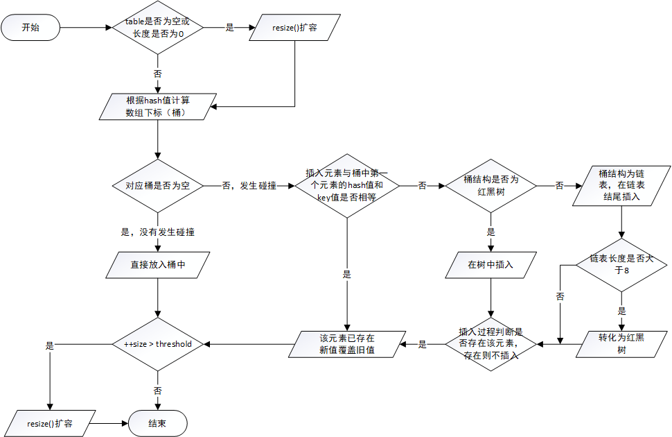
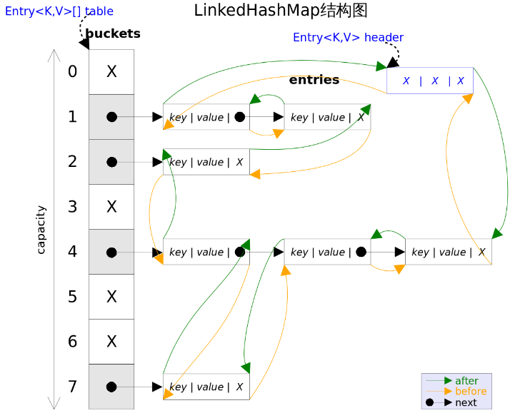

1. ArrayList

### 1.1 ArrayList 简介

ArrayList 的底层是数组队列，相当于动态数组。与数组相比，它的容量能动态增长，在添加大量元素前，应用程序可以使用`ensureCapacity`操作来增加容量，这可以减少递增式再分配的数量。和 Vector 不同，ArrayList 中的操作不是线程安全的，所以建议在单线程中才使用 ArrayList，而在多线程中可以选择 Vector 或者  CopyOnWriteArrayList。

* ArrayList 继承了AbstractList，实现了 **List 接口**，提供了相关的添加、删除、修改、遍历等功能。
* ArrayList 实现了 **RandomAccess 接口**， RandomAccess 是一个标识性接口，表明实现这个接口的 List 集合是支持**快速随机访问**的，即在 ArrayList 中，我们可以通过元素的序号快速获取元素对象。
* ArrayList 实现了 **Cloneable 接口**，即覆盖了函数 clone()，**能被克隆（浅拷贝）**。
* ArrayList 实现 **java.io.Serializable 接口**，这意味着它 **支持序列化**，**能通过序列化去传输**。

```java
public class ArrayList<E> extends AbstractList<E>
        implements List<E>, RandomAccess, Cloneable, java.io.Serializable
```


### 1.2 ArrayList 核心源码

#### 1.2.1 属性

```java
	private static final long serialVersionUID = 8683452581122892189L;

    // 默认初始容量：10
    private static final int DEFAULT_CAPACITY = 10;

    // 空数组，用于空实例
    private static final Object[] EMPTY_ELEMENTDATA = {};

    // 空数组，用于默认大小的空实例
    // 将其与上面的 EMPTY_ELEMENTDATA 区分开，以便知道在添加第一个元素时需要增加多大容量
    private static final Object[] DEFAULTCAPACITY_EMPTY_ELEMENTDATA = {};

    // 保存真实数据的 Object[] 数组
    transient Object[] elementData; 

    // ArrayList 包含元素的个数
    private int size;
```

#### 1.2.2 构造器

```java
	// 构造具有指定初始容量的空数组
    public ArrayList(int initialCapacity) {
        if (initialCapacity > 0) {
        	// 创建initialCapacity大小的空数组
            this.elementData = new Object[initialCapacity];
        } else if (initialCapacity == 0) {
        	// 指定容量为0，创建空数组，区别于默认的空数组
            this.elementData = EMPTY_ELEMENTDATA;
        } else {
            throw new IllegalArgumentException("Illegal Capacity: "+
                                               initialCapacity);
        }
    }

    // 空参构造器：在JDK7中，构造一个容量为10的空数组；
    // 在JDK8以后，初始其实是空数组，当添加第一个元素时，数组容量才变成10
    public ArrayList() {
        this.elementData = DEFAULTCAPACITY_EMPTY_ELEMENTDATA;
    }

    // 按照集合迭代器返回的顺序，构造一个包含指定集合的元素的数组 
    public ArrayList(Collection<? extends E> c) {
        elementData = c.toArray();
        if ((size = elementData.length) != 0) {
            // c.toArray() 可能返回的不是Object类型的数组，所以加上下面的语句用于判断，
            // 这里用到了反射里面的getClass()方法
            if (elementData.getClass() != Object[].class)
                elementData = Arrays.copyOf(elementData, size, Object[].class);
        } else {
            // 指定集合元素个数为0，用空数组代替
            this.elementData = EMPTY_ELEMENTDATA;
        }
    }
```


#### 1.2.3 内部类

```java
	(1) private class Itr implements Iterator<E>  
    (2) private class ListItr extends Itr implements ListIterator<E>  
    (3) private class SubList extends AbstractList<E> implements RandomAccess  
    (4) static final class ArrayListSpliterator<E> implements Spliterator<E>  
```

ArrayList 有四个内部类，其中的 Itr 实现了 Iterator 接口，同时重写了里面的 hasNext()，next()，remove() 等方法；其中的 ListItr 继承 Itr，实现了 ListIterator 接口，同时重写了 hasPrevious()，previous()，nextIndex()， previousIndex()，set(E e)，add(E e) 等方法。可以看出了 Iterator和 ListIterator 的区别: **ListIterator在Iterator 的基础上增加了添加对象，修改对象，逆向遍历等方法，这些是 Iterator 不能实现的**。


#### 1.2.4 方法

##### (1) 增（4个）

```java
    // 1.将指定元素追加到此列表的末尾
    public boolean add(E e) {
		// modCount是AbstractList中的属性，记录列表的修改次数
		// 主要在迭代器方法中使用，若该值发生意外改变，迭代器将会抛出并发修改异常
        modCount++;
        add(e, elementData, size);
        return true;
    }

	// 私有，该方法在JDK8中从add(E e)中分离出来，目的是将方法字节码大小保持在35以下
    private void add(E e, Object[] elementData, int s) {
        if (s == elementData.length)
            elementData = grow();	// 扩容
        // ArrayList添加元素实质就是为数组赋值
        elementData[s] = e;
        size = s + 1;
    }

    private Object[] grow() {
        return grow(size + 1);
    }
    
    // 扩容的核心方法：确保最小可以容纳 minCapacity 个元素
    private Object[] grow(int minCapacity) {
		// oldCapacity为旧容量，newCapacity为新容量
        int oldCapacity = elementData.length;
        // 如果旧容量大于0，或数组不是默认为空
        if (oldCapacity > 0 || elementData != DEFAULTCAPACITY_EMPTY_ELEMENTDATA) {
            // 如果优先增长值 < 最小增长值，则选择最小增长值用于增长数组
            // 即数组扩容为“原来数组的1.5倍”和minCapacity二者间的较大值
            int newCapacity = ArraysSupport.newLength(oldCapacity,
                    minCapacity - oldCapacity, /* 最小增长值 */
                    oldCapacity >> 1           /* 优先增长值 */);
            return elementData = Arrays.copyOf(elementData, newCapacity);
        } else {
			// 若旧容量等于0，且数组默认为空，则扩容为10和minCapacity二者间的较大值
            return elementData = new Object[Math.max(DEFAULT_CAPACITY, minCapacity)];
        }
    }

	// 2.在此列表中的指定位置插入指定的元素
    public void add(int index, E element) {
        rangeCheckForAdd(index);	// 先进行数组越界检查
        modCount++;
        final int s;
        Object[] elementData;
        if ((s = size) == (elementData = this.elementData).length)
            elementData = grow();	// 数组已满则扩容
        // arraycopy()是一个native方法，用于实现数组自己复制自己
        // 参数依次是:源数组、源数组的起始位置、目标数组、目标数组的起始位置、要复制的数量
        // 即从index开始之后的所有元素后移一个位置，然后将element插入index位置
        System.arraycopy(elementData, index,
                         elementData, index + 1,
                         s - index);
        elementData[index] = element;
        size = s + 1;
    }

	// 越界检查：主要用于 add() 和 addAll() 方法
    private void rangeCheckForAdd(int index) {
        if (index > size || index < 0)
            throw new IndexOutOfBoundsException(outOfBoundsMsg(index));
    }

	// 3.按Iterator返回的顺序将指定集合中的所有元素追加到此列表的末尾
    public boolean addAll(Collection<? extends E> c) {
        Object[] a = c.toArray();
        modCount++;
        int numNew = a.length;
        // 集合参数为空，直接返回false
        if (numNew == 0)
            return false;
        Object[] elementData;
        final int s;
        if (numNew > (elementData = this.elementData).length - (s = size))
            elementData = grow(s + numNew);	// 容量不够则扩容
        System.arraycopy(a, 0, elementData, s, numNew);
        size = s + numNew;
        return true;
    }

    // 4.从指定的位置开始，将指定集合中的所有元素插入到此列表中
    public boolean addAll(int index, Collection<? extends E> c) {
        rangeCheckForAdd(index);

        Object[] a = c.toArray();
        modCount++;
        int numNew = a.length;
        if (numNew == 0)
            return false;
        Object[] elementData;
        final int s;
        if (numNew > (elementData = this.elementData).length - (s = size))
            elementData = grow(s + numNew);

        int numMoved = s - index;
        if (numMoved > 0)	// index后的所有元素后移numNew个位置，空出的位置插入
            System.arraycopy(elementData, index,
                             elementData, index + numNew,
                             numMoved);
        System.arraycopy(a, 0, elementData, index, numNew);
        size = s + numNew;
        return true;
    }
```

##### (2) 删（6个）

```java
	// 1.从列表中删除所有元素
    public void clear() {
        modCount++;
        final Object[] es = elementData;
        // 将数组中所有的元素设为null，且size大小设为0
        for (int to = size, i = size = 0; i < to; i++)
            es[i] = null;
    }

	// 2.删除列表中指定位置的元素，并将后续元素左移 
    public E remove(int index) {
        Objects.checkIndex(index, size);	// 越界检查
        final Object[] es = elementData;

        @SuppressWarnings("unchecked") E oldValue = (E) es[index];
        fastRemove(es, index);	// 后续元素左移

        return oldValue;
    }

	// 私有删除方法：跳过边界检查且不返回已删除元素，
    private void fastRemove(Object[] es, int i) {
        modCount++;
        final int newSize;
        if ((newSize = size - 1) > i)
			// 主要操作：将数组第i个位置之后的所有元素左移一位
            System.arraycopy(es, i + 1, es, i, newSize - i);
        es[size = newSize] = null;	// 数组最后一个位置设为null
    }

    // 3.从列表中删除第一次出现的指定元素，如果不存在该元素，返回false 
    public boolean remove(Object o) {
        final Object[] es = elementData;
        final int size = this.size;
        int i = 0;
        found: {	// 查找指定元素第一次出现的位置
            if (o == null) {
                for (; i < size; i++)
                    if (es[i] == null)
                        break found;
            } else {
                for (; i < size; i++)
                    if (o.equals(es[i]))
                        break found;
            }
            return false;	// 未找到
        }
        fastRemove(es, i);	// 后续元素左移，覆盖原有元素
        return true;
    }

    // 4.从列表中删除指定集合中包含的所有元素
    public boolean removeAll(Collection<?> c) {
        return batchRemove(c, false, 0, size);
    }

    // 5.仅保留列表中包含在指定集合中的元素
    public boolean retainAll(Collection<?> c) {
        return batchRemove(c, true, 0, size);
    }

	// 批量删除：主要用于 removeAll() 和 retainAll() 方法
    boolean batchRemove(Collection<?> c, boolean complement,
                        final int from, final int end) {
        Objects.requireNonNull(c);	// 检查指定对象引用是否为null，是null抛出异常
        final Object[] es = elementData;
        int r;
        // 优化起始位置，排除数组的前r个元素（下标为r第一次符合删除条件）
        for (r = from;; r++) {
            if (r == end)
                return false;
            if (c.contains(es[r]) != complement)
                break;
        }
        int w = r++;	// w记录r位置，然后r加1
        try {
			// 关键：从r开始，依次将不符合删除条件的元素左移，替换需要删除的元素
            for (Object e; r < end; r++)
                if (c.contains(e = es[r]) == complement)
                    es[w++] = e;
        } catch (Throwable ex) {
            System.arraycopy(es, r, es, w, end - r);
            w += end - r;
            throw ex;
        } finally {
            modCount += end - w;
            shiftTailOverGap(es, w, end);	// 最后删除[w, end)间的多余元素
        }
        return true;
    }

    // 6.从列表中删除所有索引在 [fromIndex, toIndex) 之间的元素
    protected void removeRange(int fromIndex, int toIndex) {
        if (fromIndex > toIndex) {
            throw new IndexOutOfBoundsException(
                    outOfBoundsMsg(fromIndex, toIndex));
        }
        modCount++;
        shiftTailOverGap(elementData, fromIndex, toIndex);
    }

	// 通过向左移动元素，删除 [low, hi) 间的元素
    private void shiftTailOverGap(Object[] es, int lo, int hi) {
        System.arraycopy(es, hi, es, lo, size - hi);
        for (int to = size, i = (size -= hi - lo); i < to; i++)
            es[i] = null;	// 将最后 hi-lo 个元素全部设为null
    }
```

##### (3) 改（1个）

```java
    // 1.用指定元素替换列表中指定位置的元素，并返回原来的元素
    public E set(int index, E element) {
        Objects.checkIndex(index, size);
        E oldValue = elementData(index);
        elementData[index] = element;
        return oldValue;
    }
```

##### (4) 查（4个）

```java
	// 1.判断此列表是否包含指定的元素
    public boolean contains(Object o) {
        return indexOf(o) >= 0;	// 直接调用indexOf()方法判断
    }

	// 2.返回列表中指定位置的元素
    public E get(int index) {
        Objects.checkIndex(index, size);	// 越界检查
        return elementData(index);
    }

    // 位置访问操作
    @SuppressWarnings("unchecked")
    E elementData(int index) {
        return (E) elementData[index];
    }

    // 3.返回此列表中指定元素的第一次出现的索引，如果列表不包含此元素，则返回-1
    public int indexOf(Object o) {
        return indexOfRange(o, 0, size);
    }

    int indexOfRange(Object o, int start, int end) {
        Object[] es = elementData;
        if (o == null) {	// 查找null单独处理
            for (int i = start; i < end; i++) {
                if (es[i] == null) {
                    return i;
                }
            }
        } else {	// 调用equals()判断，因此自定义类有必要重写equals()方法
            for (int i = start; i < end; i++) {
                if (o.equals(es[i])) {
                    return i;
                }
            }
        }
        return -1;
    }

    // 4.返回此列表中指定元素的最后一次出现的索引，如果列表不包含此元素，则返回-1
    public int lastIndexOf(Object o) {
        return lastIndexOfRange(o, 0, size);
    }

    int lastIndexOfRange(Object o, int start, int end) {
        Object[] es = elementData;
        if (o == null) {
            for (int i = end - 1; i >= start; i--) {
                if (es[i] == null) {
                    return i;
                }
            }
        } else {
            for (int i = end - 1; i >= start; i--) {
                if (o.equals(es[i])) {
                    return i;
                }
            }
        }
        return -1;
    }
```

##### (5) 遍历（1个）

```java
	// 1.以正确的顺序返回列表中的元素的迭代器
    public Iterator<E> iterator() {
        return new Itr();
    }

    // 成员内部类，AbstractList.Itr 的优化版本
    private class Itr implements Iterator<E> {
        int cursor;       // 游标，要返回的下一个元素的索引，默认初始为0
        int lastRet = -1; // 返回的最后一个元素的索引，若没有返回-1
        int expectedModCount = modCount;

        Itr() {}

        public boolean hasNext() {
            return cursor != size;	// 直接判断游标与容量是否相等
        }

		// Iterator遍历实际上类似于for循环遍历，只不过多了一些条件判断，故效率偏低
        @SuppressWarnings("unchecked")
        public E next() {
            checkForComodification();	// 检查修改次数modCount
            int i = cursor;	// 记录原来游标的位置
            if (i >= size)
                throw new NoSuchElementException();
            Object[] elementData = ArrayList.this.elementData;
            if (i >= elementData.length)
                throw new ConcurrentModificationException();
            cursor = i + 1;	// 游标加1
            return (E) elementData[lastRet = i];	// 返回数组元素
        }

        public void remove() {
            if (lastRet < 0)
                throw new IllegalStateException();
            checkForComodification();

            try {
				// 调用自身的remove()方法移除迭代器返回的最后一个元素
                ArrayList.this.remove(lastRet);
                cursor = lastRet;
                lastRet = -1;
                expectedModCount = modCount;
            } catch (IndexOutOfBoundsException ex) {
                throw new ConcurrentModificationException();
            }
        }

		// 检查修改次数：若modCount发生意外改变，迭代器将会快速失效，并抛出并发修改异常
        final void checkForComodification() {
            if (modCount != expectedModCount)
                throw new ConcurrentModificationException();
        }
    }
```

##### (6) 其它（8个）

```java
	// 1.返回此ArrayList实例的浅拷贝（元素本身不被复制）
    public Object clone() {
        try {
            ArrayList<?> v = (ArrayList<?>) super.clone();
            // Arrays.copyOf()实现数组的复制（为何不是深拷贝？）
            v.elementData = Arrays.copyOf(elementData, size);
            v.modCount = 0;
            return v;
        } catch (CloneNotSupportedException e) {
            // 这不应该发生，因为我们是可以克隆的
            throw new InternalError(e);
        }
    }

	// 2.增加ArrayList的容量，确保至少可以保存 minCapacity 个元素
	// 最好在add大量元素之前调用该方法，以减少增量重新分配的次数
    public void ensureCapacity(int minCapacity) {
        if (minCapacity > elementData.length
            && !(elementData == DEFAULTCAPACITY_EMPTY_ELEMENTDATA
                 && minCapacity <= DEFAULT_CAPACITY)) {
            modCount++;
            grow(minCapacity);	// 直接调用扩容的核心方法
        }
    }

	// 3.判断此列表是否为空：直接判断容量size是否为0
    public boolean isEmpty() {
        return size == 0;
    }

    // 4.返回此列表中的元素数
    public int size() {
        return size;
    }

    // 5.使用给定的 Comparator 对列表进行排序
    @Override
    @SuppressWarnings("unchecked")
    public void sort(Comparator<? super E> c) {
        final int expectedModCount = modCount;
        // 直接调用 Arrays.sort() 进行排序
        Arrays.sort((E[]) elementData, 0, size, c);
        if (modCount != expectedModCount)
            throw new ConcurrentModificationException();
        modCount++;
    }

    // 6.以正确的顺序（从第一个到最后一个元素）返回一个包含列表中所有元素的 Object[] 数组 
    public Object[] toArray() {
		// 深拷贝，因此返回的数组是“安全的”，即对返回数组的修改，不会影响源数组
        return Arrays.copyOf(elementData, size); 
    }

    // 7.返回一个包含列表中所有元素的 T[] 数组
    @SuppressWarnings("unchecked")
    public <T> T[] toArray(T[] a) {
        if (a.length < size)
            // 指定的T[]数组容量不够，创建一个新的数组，并复制列表元素
            return (T[]) Arrays.copyOf(elementData, size, a.getClass());
        // 若容量足够，则直接复制列表元素，并将数组结束位置设为null，以便判断数组长度
        System.arraycopy(elementData, 0, a, 0, size);
        if (a.length > size)
            a[size] = null;
        return a;
    }

	// 8.修改ArrayList的容量为列表的当前大小：使用此操作来最小化ArrayList实例的存储 
    public void trimToSize() {
        modCount++;
        if (size < elementData.length) {
            elementData = (size == 0)
              ? EMPTY_ELEMENTDATA
              : Arrays.copyOf(elementData, size);
        }
    }
```


### 1.3 ArrayList 扩容机制

1.  ArrayList 底层采用 **Object[] 数组**实现，当使用空参构造器创建 ArrayList 实例时，实际上底层**初始化为一个空数组 { }**。当真正对数组进行添加元素操作时，才分配容量，即向数组中**添加第一个元素时，数组容量才扩为10**（在JDK 7中调用空参构造器会直接生成长度为10的数组，区别类似于单例模式中的懒汉式与饿汉式）。
2. 当添加元素个数超过10个，即添加第11个元素时，ArrayList 底层会新生成一个数组，**长度为原来数组的 1.5 倍**，然后将原数组的内容复制到新数组当中。当新数组无法容纳增加的元素时，重复该过程。

这里补充两点比较重要，但是容易被忽视掉的知识点：

* 移位运算符：就是在二进制的基础上对数字进行平移，按照平移的方向和填充数字的规则分为三种: **<<（左移）、>>（带符号右移）和 >>>（无符号右移）**。对于大数据的二进制运算，位移运算符比那些普通运算符的运算要快很多，因为程序仅仅移动一下而已，不去计算，这样提高了效率。
* java 中的 **`length `属性**是针对数组长度的，它是 `public final` 的，一旦确定就不能改变大小；**`length()` 方法**是针对字符串长度的；**`size()` 方法**是针对泛型集合包含的元素个数。


### 1.4 System.arraycopy() 和 Arrays.copyOf() 方法

这两个实现数组复制的方法在 ArrayList 源码中被广泛使用。

**联系**：看两者源代码可以发现 `copyOf()`内部实际调用了`System.arraycopy()`方法
**区别**：arraycopy() 需要目标数组，将原数组拷贝到你自己定义的数组里，而且可以选择拷贝的起点和长度以及放入新数组中的位置；copyOf() 是系统自动在内部新建一个数组，并返回该数组。

```java
public static native void arraycopy(Object src,  int  srcPos, 
                                    Object dest, int destPos, int length);

public static <T> T[] copyOf(T[] original, int newLength)
```


## 2. LinkedList

### 2.1 LinkedList 简介

LinkedList 的底层是**双向链表**。与 ArrayList 相比，它不支持快速随机访问，其优势体现在**高效的插入和删除**操作。LinkedList 中的操作不是线程安全的，如果想让它变为线程安全的，可以调用 Collections 工具类中的 synchronizedList() 方法。

- LinkedList 继承了AbstractSequentialList，实现了 **List 接口**，提供了相关的添加、删除、修改、遍历等功能。
- LinkedList 实现了 **Deque 接口**，而 Deque 又继承自 Queue，因此它具有**（双端）队列的特性**。
- LinkedList 实现了 **Cloneable 接口**，即覆盖了函数 clone()，**能被克隆（浅拷贝）**。
- LinkedList 实现 **java.io.Serializable 接口**，这意味着它 **支持序列化**，**能通过序列化去传输**。

```java
public class LinkedList<E> extends AbstractSequentialList<E>
    implements List<E>, Deque<E>, Cloneable, java.io.Serializable
```


### 2.2 LinkedList 核心源码

#### 2.2.1 属性

```java
	private static final long serialVersionUID = 876323262645176354L;
	
	// 存储元素的个数
	transient int size = 0;

	// 指向第一个节点的指针
    transient Node<E> first;
	
	// 指向最后一个节点的指针
    transient Node<E> last;
```


#### 2.2.2 构造器

```java
	// 空参构造器
	public LinkedList() {
    }

	// 按照集合迭代器返回的顺序，构造一个包含指定集合的元素的列表
	public LinkedList(Collection<? extends E> c) {
        this();	
        addAll(c);	// 直接调用addAll()方法
    }
```


#### 2.2.3 内部类

```java
	(1) private class ListItr implements ListIterator<E>
	(2) private static class Node<E>
	(3) private class DescendingIterator implements Iterator<E>
	(4) static final class LLSpliterator<E> implements Spliterator<E>
```

LinkedList 共有4个内部类，其中 `Node` 静态内部类是最重要的。下面给出它的结构：

```java
	private static class Node<E> {
        E item;	// 节点值
        Node<E> next;	// 后继节点
        Node<E> prev;	// 前驱节点

        Node(Node<E> prev, E element, Node<E> next) {
            this.item = element;
            this.next = next;
            this.prev = prev;
        }
    }
```


#### 2.2.4 方法

##### (1) 增（6个）

```java
	// 1.将指定的元素追加到此列表的末尾，该方法等价于addLast()
	public boolean add(E e) {
        linkLast(e);
        return true;
    }
	
	// 链接元素e，使其作为最后一个元素
	void linkLast(E e) {
        final Node<E> l = last;	// 记录当前链表的最后一个元素
        final Node<E> newNode = new Node<>(l, e, null);	// 新建节点，链接前驱l，后继为null
        last = newNode;	// 更新last指针
        if (l == null)
            first = newNode;	// 第一次添加元素，first和last都指向该元素
        else
            l.next = newNode;	// 双向链表，l链接后续，即指向新建节点
        size++;
        modCount++;
    }

	// 2.在此列表中的指定位置插入指定的元素
	public void add(int index, E element) {
        checkPositionIndex(index);	// 先进行数组越界检查，即index是否位于[0, size]之间

        if (index == size)	// 添加在链表尾部
            linkLast(element);
        else	// 添加在链表中间
            linkBefore(element, node(index));
    }

	// 返回指定元素索引处的（非空）节点
	Node<E> node(int index) {
        // 若index位于链表的前半部分，则从前往后查找；否则从后往前查找
        if (index < (size >> 1)) {
            Node<E> x = first;
            for (int i = 0; i < index; i++)
                x = x.next;
            return x;
        } else {
            Node<E> x = last;
            for (int i = size - 1; i > index; i--)
                x = x.prev;
            return x;
        }
    }

	// 在非空节点succ之前插入指定元素，与linkLast()逻辑类似
	void linkBefore(E e, Node<E> succ) {
        final Node<E> pred = succ.prev;	// 记录succ的前驱节点
        final Node<E> newNode = new Node<>(pred, e, succ);	// 新建节点，链接前驱和后继
        succ.prev = newNode;	// 非空节点succ链接前驱，即指向新建节点
        if (pred == null)
            first = newNode;	// 在链表头部插入，更新first指针即可
        else
            pred.next = newNode;	// pred链接后继，即指向新建节点
        size++;
        modCount++;
    }

	// 3.该方法等价于add()，只不过没有返回值
	public void addLast(E e) {
        linkLast(e);
    }

	// 4.将指定的元素插入到此列表的开头
	public void addFirst(E e) {
        linkFirst(e);	// 链接元素e，使其作为第一个元素，与linkLast()逻辑类似
    }

	// 5.按Iterator返回的顺序将指定集合中的所有元素追加到此列表的末尾
	public boolean addAll(Collection<? extends E> c) {
        return addAll(size, c);
    }

	// 6.从指定的位置开始，将指定集合中的所有元素插入到此列表中
	public boolean addAll(int index, Collection<? extends E> c) {
        checkPositionIndex(index);

        Object[] a = c.toArray();	// 把集合的数据存到对象数组中
        int numNew = a.length;
        if (numNew == 0)
            return false;

        // 得到插入位置的前驱节点和后继节点
        Node<E> pred, succ;	
        if (index == size) {	// 如果插入位置为尾部，前驱节点为last，后继节点为null
            succ = null;
            pred = last;
        } else {	// 否则，调用node()方法得到后继节点，再得到前驱节点
            succ = node(index);
            pred = succ.prev;
        }
	
        // 遍历数据将数据插入
        for (Object o : a) {
            @SuppressWarnings("unchecked") E e = (E) o;
            Node<E> newNode = new Node<>(pred, e, null);	// 创建新节点
            if (pred == null)	// 在链表头部插入，更新first指针
                first = newNode;
            else
                pred.next = newNode;
            pred = newNode;	// 每插入一个节点，pre就后移
        }

        if (succ == null) {	// 在链表尾部插入，更新last指针
            last = pred;
        } else {	// 否则，将插入的链表与先前的链表链接起来
            pred.next = succ;
            succ.prev = pred;
        }

        size += numNew;
        modCount++;
        return true;
    }
```


##### (2) 删（6个）

```java
	// 1.从列表中删除所有元素
	public void clear() {
        for (Node<E> x = first; x != null; ) {
            Node<E> next = x.next;
            x.item = null;
            x.next = null;
            x.prev = null;
            x = next;
        }
        first = last = null;	// 重置first和last为null
        size = 0;	// 重置大小为0
        modCount++;
    }

	// 2&3.从列表中删除并返回第一个元素，该方法等价于remove()
	public E removeFirst() {
        final Node<E> f = first;
        if (f == null)
            throw new NoSuchElementException();
        return unlinkFirst(f);
    }
	
	// 断开第一个非空节点f的链接
	private E unlinkFirst(Node<E> f) {
        final E element = f.item;	// 记录要删除的元素值，用于返回
        final Node<E> next = f.next;	// 记录f的后继节点
        f.item = null;
        f.next = null;
        first = next;	// 更新first指针
        if (next == null)	// 若链表只有一个元素，更新last为null
            last = null;
        else	// 新头节点的前驱为null
            next.prev = null;
        size--;
        modCount++;
        return element;
    }

	public E remove() {
        return removeFirst();
    }

	// 4.从列表中删除并返回最后一个元素
	public E removeLast() {
        final Node<E> l = last;
        if (l == null)
            throw new NoSuchElementException();
        return unlinkLast(l);	// 与unlinkFirst(f)逻辑类似
    }
	
	// 5.从列表中删除并返回指定位置的元素
	public E remove(int index) {
        checkElementIndex(index);
        return unlink(node(index));	// 与unlinkFirst(f)逻辑类似
    }
	
	// 6.从列表中删除第一次出现的指定元素，如果不存在该元素，返回false 
	public boolean remove(Object o) {
        if (o == null) {	// 特殊处理值为null的元素
            for (Node<E> x = first; x != null; x = x.next) {
                if (x.item == null) {
                    unlink(x);
                    return true;
                }
            }
        } else {
            for (Node<E> x = first; x != null; x = x.next) {
                if (o.equals(x.item)) {
                    unlink(x);
                    return true;
                }
            }
        }
        return false;	// 未找到
    }
```


##### (3) 改（1个）

```java
	// 1.用指定元素替换列表中指定位置的元素，并返回原来的元素
	public E set(int index, E element) {
        checkElementIndex(index);	// 数组越界检查
        Node<E> x = node(index);	// 调用node()方法，得到指定索引处的节点
        E oldVal = x.item;
        x.item = element;
        return oldVal;
    }
```


##### (4) 查（6个）

```java
	// 1.判断此列表是否包含指定的元素
	public boolean contains(Object o) {
        return indexOf(o) >= 0;	// 直接调用indexOf()方法判断
    }

	// 2.返回此列表中指定元素的第一次出现的索引，如果列表不包含此元素，则返回-1
	public int indexOf(Object o) {
        int index = 0;
        if (o == null) {	// 从头部开始遍历
            for (Node<E> x = first; x != null; x = x.next) {
                if (x.item == null)
                    return index;
                index++;
            }
        } else {
            for (Node<E> x = first; x != null; x = x.next) {
                if (o.equals(x.item))
                    return index;
                index++;
            }
        }
        return -1;	// 未找到
    }

	// 3.返回此列表中指定元素的最后一次出现的索引，如果列表不包含此元素，则返回-1
	public int lastIndexOf(Object o) {
        // indexOf(Object o)逻辑类似，只不过是从尾部开始遍历
    }

	// 4.返回列表中指定位置的元素
	public E get(int index) {
        checkElementIndex(index);
        return node(index).item;	// 直接调用node()方法，得到指定索引处的节点，然后返回它的值
    }

	// 5.返回列表中的第一个元素
	public E getFirst() {
        final Node<E> f = first;
        if (f == null)	// 如果链表为null抛出异常，若不想抛出异常可使用pollFirst()
            throw new NoSuchElementException();
        return f.item;
    }

	// 6.返回列表中的最后一个元素
	public E getLast() {
        final Node<E> l = last;
        if (l == null)	// 如果链表为null抛出异常，若不想抛出异常可使用pollLast()
            throw new NoSuchElementException();
        return l.item;
    }
```


## 3. HashMap

### 3.1 HashMap 简介

JDK 8之前 HashMap 底层由**数组 + 链表**组成，数组是 HashMap 的主体，链表则是主要为了解决哈希冲突而存在的（“拉链法”解决冲突）。JDK 8以后在解决哈希冲突时有了较大的变化，**当链表长度大于阈值（默认为 8）时，将链表转化为红黑树**（将链表转换成红黑树前会判断，如果当前数组的长度小于 64，那么会选择先进行数组扩容，而不是转换为红黑树），以减少搜索时间，具体可以参考 `treeifyBin`方法。和 Hashtable 不同，HashMap 中的操作不是线程安全的，所以建议在单线程中才使用 HashMap，而在多线程中推荐使用  ConcurrentHashMap。

- HashMap 继承了AbstractMap，实现了 **Map 接口**，提供了相关的添加、删除、修改、遍历等功能。
- HashMap 实现了**Cloneable 接口**，即覆盖了函数 clone()，**能被克隆（浅拷贝）**。
- HashMap 实现 **java.io.Serializable 接口**，这意味着它 **支持序列化**，**能通过序列化去传输**。

```java
public class HashMap<K,V> extends AbstractMap<K,V>
    implements Map<K,V>, Cloneable, Serializable
```


### 3.2 HashMap 核心源码

#### 3.2.1 属性

```java
	private static final long serialVersionUID = 362498820763181265L;

	// 默认初始容量：16（必须是2的幂次方）
    static final int DEFAULT_INITIAL_CAPACITY = 1 << 4; // aka 16

	// 最大支持容量：2^30（必须是2的幂次方）
    static final int MAXIMUM_CAPACITY = 1 << 30;

	// 默认加载因子/填充因子/装载因子：0.75（该值越大，空间利用率越高，冲突的概率也越大）
    static final float DEFAULT_LOAD_FACTOR = 0.75f;

	// 树化阈值：8，当链表长度大于该值时，转化为红黑树
    static final int TREEIFY_THRESHOLD = 8;

	// 树退化阈值：6，哈希表扩容后需要重新计算存储位置，当红黑树存储的节点小于该值时，转化为链表
    static final int UNTREEIFY_THRESHOLD = 6;

	// 最小树化容量：64，树化之前需要进行判断，如果哈希表容量小于64，则优先选择扩容，而不是转换为红黑树
	// 为了避免进行扩容、树形化选择的冲突，该值至少是TREEIFY_THRESHOLD（树化阈值）的4倍
    static final int MIN_TREEIFY_CAPACITY = 64;

	// 实际存储元素的 Node<K,V>[] 数组（长度必须是2的幂次方或0）
	// 我们常把数组中的每一个节点称为一个"桶(bucket)"
    transient Node<K,V>[] table;

	// 缓存的键值对集合，即使key在外部修改导致hashCode变化，缓存中还是可以找到映射关系
    transient Set<Map.Entry<K,V>> entrySet;

	// 存储的键值对数量
    transient int size;

	// HashMap的修改次数，并发修改该值时，会导致迭代器快速失效并抛出异常
    transient int modCount;

	// 扩容的阈值/临界值：容量*加载因子（初始时为16 * 0.75 = 12）
    int threshold;

	// 加载因子
    final float loadFactor;
```


#### 3.2.2 构造器

```java
	// 空参构造器：在JDK7中，构造一个加载因子为0.75、容量为16的空数组；
    // 在JDK8以后，底层并没有创建数组，而是在添加第一个键值对时，才创建一个容量为16的数组
	public HashMap() {
        this.loadFactor = DEFAULT_LOAD_FACTOR; 
    }

	// 构造一个空的指定“初始容量”的HashMap
	public HashMap(int initialCapacity) {
        this(initialCapacity, DEFAULT_LOAD_FACTOR);
    }

	// 构造一个空的指定“初始容量”和“加载因子”的HashMap
	public HashMap(int initialCapacity, float loadFactor) {
        if (initialCapacity < 0)
            throw new IllegalArgumentException("Illegal initial capacity: " +
                                               initialCapacity);
        if (initialCapacity > MAXIMUM_CAPACITY)	// 初始容量 > 最大支持容量
            initialCapacity = MAXIMUM_CAPACITY;
        if (loadFactor <= 0 || Float.isNaN(loadFactor))
            throw new IllegalArgumentException("Illegal load factor: " +
                                               loadFactor);
        this.loadFactor = loadFactor;
        this.threshold = tableSizeFor(initialCapacity);
    }
	
	// 返回大于等于cap的最小2的幂次方
	static final int tableSizeFor(int cap) {
        int n = -1 >>> Integer.numberOfLeadingZeros(cap - 1);
        return (n < 0) ? 1 : (n >= MAXIMUM_CAPACITY) ? MAXIMUM_CAPACITY : n + 1;
    }

	// 构造一个新的包含指定Map中键值对映射的HashMap
	public HashMap(Map<? extends K, ? extends V> m) {
        this.loadFactor = DEFAULT_LOAD_FACTOR;
        putMapEntries(m, false);
    }

	// 将m中的键值对加入当前map中：用于HashMap(Map m)构造器和putAll(Map m)方法
	// 参数evict：初始化map时使用false，否则使用true
	final void putMapEntries(Map<? extends K, ? extends V> m, boolean evict) {
        int s = m.size();
        if (s > 0) {
            if (table == null) { 	// table未初始化
                // 扩容的阈值 = 容量*加载因子，所以s/loadFactor+1即为应该初始化的容量
                float ft = ((float)s / loadFactor) + 1.0F;
                int t = ((ft < (float)MAXIMUM_CAPACITY) ?
                         (int)ft : MAXIMUM_CAPACITY);
                // 计算得到的t大于阈值，则根据容量初始化阈值
                if (t > threshold)
                    threshold = tableSizeFor(t);
            } else {
                // table已初始化，并且m中元素的个数大于阈值，进行扩容处理
                while (s > threshold && table.length < MAXIMUM_CAPACITY)
                    resize();
            }

            // 将m中的所有元素添加至HashMap中
            for (Map.Entry<? extends K, ? extends V> e : m.entrySet()) {
                K key = e.getKey();
                V value = e.getValue();
                putVal(hash(key), key, value, false, evict);
            }
        }
    }
```


#### 3.2.3 内部类

```java
	// 节点（2个）
	(1) static class Node<K,V> implements Map.Entry<K,V>
	(2) static final class TreeNode<K,V> extends LinkedHashMap.Entry<K,V>
	
	// 视图（3个）
	(3) final class KeySet extends AbstractSet<K>
	(4) final class Values extends AbstractCollection<V>
	(5) final class EntrySet extends AbstractSet<Map.Entry<K,V>>
	
    // 迭代器（4个）
	(6) abstract class HashIterator
    (7) final class KeyIterator extends HashIterator implements Iterator<K>
    (8) final class ValueIterator extends HashIterator implements Iterator<V>
    (9) final class EntryIterator extends HashIterator 
    	implements Iterator<Map.Entry<K,V>>
    	
    // 分割迭代器：用于高效并行遍历（4个）
    (10) static class HashMapSpliterator<K,V>
    (11) static final class KeySpliterator<K,V> extends HashMapSpliterator<K,V>
        implements Spliterator<K>
    (12) static final class ValueSpliterator<K,V> extends HashMapSpliterator<K,V>
        implements Spliterator<V>
    (13) static final class EntrySpliterator<K,V> extends HashMapSpliterator<K,V>
        implements Spliterator<Map.Entry<K,V>>
```

HashMap 共有13个内部类，其中 `Node` 和 `TreeNode` 两个静态内部类是最重要的。下面分别给出它们的结构：

```java
	// HashMap的节点类型：继承自Map.Entry<K,V>
	// 既是HashMap底层数组的组成元素，又是每个单向链表的组成元素
	static class Node<K,V> implements Map.Entry<K,V> {
        final int hash;	// 哈希值，存放元素时用来与其他元素的hash值作比较
        final K key;	// 键
        V value;		// 值
        Node<K,V> next;	// 后继节点

        Node(int hash, K key, V value, Node<K,V> next) {
            this.hash = hash;
            this.key = key;
            this.value = value;
            this.next = next;
        }
        // ...
    }
```

```java
	// 红黑树节点：由于LinkedHashMap.Entry<K,V>继承了HashMap.Node<K,V>，
	// 所以TreeNode依然保有Node的属性，next + prev使得链表变为了双向的
	static final class TreeNode<K,V> extends LinkedHashMap.Entry<K,V> {
        TreeNode<K,V> parent;	// 父结点
        TreeNode<K,V> left;		// 左孩子节点
        TreeNode<K,V> right;	// 右孩子节点
        TreeNode<K,V> prev;    // 前驱节点
        boolean red;	// 节点颜色
        
        TreeNode(int hash, K key, V val, Node<K,V> next) {
            super(hash, key, val, next);
        }
        // ...
    }
```


#### 3.2.4 方法

##### (1) put() 方法

```java
	// 将键值对加入HashMap中，若已包含该键的映射，则替换并返回旧值
	public V put(K key, V value) {
        return putVal(hash(key), key, value, false, true);
    }

	// 计算key的哈希值，调用了key所在类的hashCode()方法
	static final int hash(Object key) {
        int h;
        return (key == null) ? 0 : (h = key.hashCode()) ^ (h >>> 16);
    }

    /**
     * @param hash 指定key的哈希值
     * @param onlyIfAbsent 如果为true，即使指定参数key在map中已经存在，也不会替换value
     * @param evict 如果为false，数组table在创建模式中
     * @return 如果value被替换，则返回旧的value，否则返回null
     */
    final V putVal(int hash, K key, V value, boolean onlyIfAbsent,
                   boolean evict) {
        Node<K,V>[] tab; Node<K,V> p; int n, i;
        // 如果哈希表table未初始化或者长度为0，则进行扩容
        if ((tab = table) == null || (n = tab.length) == 0)
            n = (tab = resize()).length;
        // (n - 1) & hash 确定元素存放在哪个桶中
        // 如果桶为空，即没有碰撞，则将新生成结点放入桶中(此时这个结点是放在数组中)
        if ((p = tab[i = (n - 1) & hash]) == null)
            tab[i] = newNode(hash, key, value, null);	// LinkedHashMap重写了此方法
        // 桶中已经存在元素，即发生了碰撞，则先判断是否已经存在该元素，然后再考虑插入
        else {	
            Node<K,V> e; K k;
            // 将插入元素与桶中第一个元素(数组中的结点)比较，判断hash值和key值是否相等
            // 如果都相等，则表示该元素已经存在
            if (p.hash == hash &&
                ((k = p.key) == key || (key != null && key.equals(k))))
                e = p;
            // 如果桶中的第一个节点没有匹配上，且桶结构为红黑树，则在树中插入
            else if (p instanceof TreeNode)
                e = ((TreeNode<K,V>)p).putTreeVal(this, tab, hash, key, value);
            // 如果桶结构不是红黑树，那么肯定是链表，则在链表尾部插入
            else {
                for (int binCount = 0; ; ++binCount) {
                    // 如果到了链表尾部，则新建节点插入
                    if ((e = p.next) == null) {
                        p.next = newNode(hash, key, value, null);
                        // 如果链表长度>=树化阈值，转化为红黑树
                        if (binCount >= TREEIFY_THRESHOLD - 1)
                            treeifyBin(tab, hash);
                        break;
                    }
                    // 根据hash和key判断链表中是否已经存在该元素，存在则直接跳出循环
                    if (e.hash == hash &&
                        ((k = e.key) == key || (key != null && key.equals(k))))
                        break;
                    p = e;
                }
            }
            if (e != null) { 	// 已经存在该元素
                V oldValue = e.value;
                if (!onlyIfAbsent || oldValue == null)
                    e.value = value;	// 用新值替换旧值
                afterNodeAccess(e);	// 访问后回调，允许LinkedHashMap后续操作（下同）
                return oldValue;
            }
        }
        ++modCount;
        if (++size > threshold)
            resize();	// 容量大于阈值，则扩容
        afterNodeInsertion(evict);	// 插入后回调
        return null;
    }
```

**添加元素过程总结：**

当向 HashMap 中添加元素 A 时，**首先调用 hash() 方法计算 key 的哈希值**，其中 hash() 又调用了 key 所在类的 hashCode() 方法，然后通过 **`(n - 1) & hash`** （n为底层数组长度）计算出在 HashMap 底层数组中的存放位置（桶），判断此位置是否已经有元素：

1. 如果此位置上没有其他元素，表示**没有发生碰撞**，则添加元素 A；
2. 如果此位置上有其他元素 B（或以**链表或红黑树**形式存在的多个元素），表示**发生了碰撞**，则比较元素 A 与元素 B 的 **hash 值**：如果哈希值不同，则添加元素 A；
3. 如果哈希值相同，则**进一步调用 key 所在类的 equals() 方法，比较 key 是否相等**：如果不相等，则添加元素A；否则，表示该元素已经存在，那么就用新 value 替换旧 value。

值得注意的是，在 JDK 7中，HashMap 底层没有使用红黑树，且发生碰撞时，链表采用“头插法”（七上八下）。




##### (2) get() 方法

```java
	// 返回指定键所映射的值，若不存该映射，返回null
	public V get(Object key) {
        Node<K,V> e;
        return (e = getNode(hash(key), key)) == null ? null : e.value;
    }

	final Node<K,V> getNode(int hash, Object key) {
        Node<K,V>[] tab; Node<K,V> first, e; int n; K k;
        // 如果哈希表table不为空，且key对应的桶也不为空
        if ((tab = table) != null && (n = tab.length) > 0 &&
            (first = tab[(n - 1) & hash]) != null) {
            // 如果桶中的第一个节点就和指定参数hash和key匹配，则直接返回
            if (first.hash == hash && 
                ((k = first.key) == key || (key != null && key.equals(k))))
                return first;
            // 如果桶中的第一个节点没有匹配上，且有后续节点
            if ((e = first.next) != null) {
                // 如果桶的结构为红黑树，则在树中get
                if (first instanceof TreeNode)
                    return ((TreeNode<K,V>)first).getTreeNode(hash, key);
                // 如果桶的结构为链表，则在链表中get
                do {
                    if (e.hash == hash &&
                        ((k = e.key) == key || (key != null && key.equals(k))))
                        return e;
                } while ((e = e.next) != null);
            }
        }
        return null;
    }
```


##### (3) resize() 方法

```java
	// 对哈希表table进行初始化或二倍扩容
	final Node<K,V>[] resize() {
        Node<K,V>[] oldTab = table;
        int oldCap = (oldTab == null) ? 0 : oldTab.length;
        int oldThr = threshold;
        int newCap, newThr = 0;
        
        // 如果旧容量 > 0
        if (oldCap > 0) {
            // 如果旧容量 >= 2^30，则阈值变为正无穷，并返回原table（无法扩容，只能随意碰撞）
            if (oldCap >= MAXIMUM_CAPACITY) {
                threshold = Integer.MAX_VALUE;
                return oldTab;
            }
            // 新容量变为旧容量的2倍，如果新容量 < 2^30，且旧容量 > 16，则新阈值也变为原来2倍
            else if ((newCap = oldCap << 1) < MAXIMUM_CAPACITY &&
                     oldCap >= DEFAULT_INITIAL_CAPACITY)
                newThr = oldThr << 1; 
        }
        // 如果旧容量 <= 0，且旧阈值 > 0，则新容量设置为旧阈值
        else if (oldThr > 0) 
            newCap = oldThr;
        // 如果旧容量 <= 0，且旧阈值 <= 0，则新容量变为16，新阈值为16*0.75=12
        else { 
            newCap = DEFAULT_INITIAL_CAPACITY;
            newThr = (int)(DEFAULT_LOAD_FACTOR * DEFAULT_INITIAL_CAPACITY);
        }
        
        // 在上面的条件判断中，有些情况没有修改新阈值，则需要根据新容量、加载因子计算新阈值
        if (newThr == 0) {
            float ft = (float)newCap * loadFactor;	// 临时阈值
            newThr = (newCap < MAXIMUM_CAPACITY && ft < (float)MAXIMUM_CAPACITY ?
                      (int)ft : Integer.MAX_VALUE);
        }
        
        // 当前阈值设置为新阈值
        threshold = newThr;
        // 创建一个新的table，容量为newCap，并将当前table指向这个新table
        // 到目前为止，一般情况下，此时哈希表的容量和阈值都变为了原来的2倍
        @SuppressWarnings({"rawtypes","unchecked"})
        Node<K,V>[] newTab = (Node<K,V>[])new Node[newCap];
        table = newTab;
        
        // 如果旧table不为空，将旧table中的元素复制到新table中（重新散列）
        if (oldTab != null) {
            for (int j = 0; j < oldCap; ++j) {
                Node<K,V> e;
                // 遍历旧table中每一个桶，若桶不为空，则复制
                if ((e = oldTab[j]) != null) {
                    oldTab[j] = null;
                    // 如果桶中只有一个节点，则重新计算散列位置，散列到新table中
                    if (e.next == null)
                        newTab[e.hash & (newCap - 1)] = e;
                    // 如果桶结构是红黑树，则拆分树
                    else if (e instanceof TreeNode)
                        ((TreeNode<K,V>)e).split(this, newTab, j, oldCap);
                    // 如果桶结构是链表，则通过(e.hash & oldCap) == 0来判断是否需要移位
                    // 如果为真则在原位不动, 否则需要移动到原索引+oldCap的位置
                    else { 
                        Node<K,V> loHead = null, loTail = null;
                        Node<K,V> hiHead = null, hiTail = null;
                        Node<K,V> next;
                        do {	// 遍历链表
                            next = e.next;
                            if ((e.hash & oldCap) == 0) {
                                if (loTail == null)
                                    loHead = e;
                                else
                                    loTail.next = e;
                                loTail = e;
                            }
                            else {
                                if (hiTail == null)
                                    hiHead = e;
                                else
                                    hiTail.next = e;
                                hiTail = e;
                            }
                        } while ((e = next) != null);
                        // 无须移动，仍放入到原来位置的桶中
                        if (loTail != null) {
                            loTail.next = null;
                            newTab[j] = loHead;
                        }
                        // 需要移动，放入位置为原索引+oldCap的桶中
                        if (hiTail != null) {
                            hiTail.next = null;
                            newTab[j + oldCap] = hiHead;
                        }
                    }
                }
            }
        }
        return newTab;
    }
```

**扩容过程总结：**

扩容伴随一次重新散列过程，它会遍历hash表中所有的元素，是非常耗时的。在使用 HashMap 时，预估map的大小，初始化的时候给一个大致的数值，避免map进行频繁的扩容。再来看下 `e.hash & oldCap == 0` 为什么可以判断链表中当前节点是否需要移位，而不是再次计算hash。以原始长度为16举例，根据 `(n - 1) & hash` 来计算扩容前后的位置差别：

```java
扩容前(16):
   hash: 0001 1010 (26)			hash: 0010 1010 (42)
    n-1: 0000 1111 (15)		 	 n-1: 0000 1111 (15)
      &: 0000 1010 (10)		   	   &: 0000 1010 (10)   
      n: 0001 0000 (16)			   n: 0001 0000 (16)
      &: 0001 0000 (16!=0)		   &: 0000 0000 (0==0)
扩容后(32)：
   hash: 0001 1010 (26)			hash: 0010 1010 (42)
    n-1: 0001 1111 (31)			 n-1: 0001 1111 (31)
      &: 0001 1010 (26=10+16)	   &: 0001 1010 (10==10)
```

从上面的示例可以看出，扩容前后位置是否改变，取决于扩容后容量的最高位 1，而这个 1 刚好等于 oldCap。所以可以通过计算  `e.hash & oldCap` 来判断和最高位相与的结果是否为0：若为 0，则不需要移动；若不是，则需要移动至原索引 + oldCap的位置。下面给出了相关示意图：


### 3.3 HashMap 的长度为什么是2的幂次方

下面这个方法保证了 HashMap 总是使用 2 的幂次方作为哈希表的大小。

```java
	static final int tableSizeFor(int cap) {
        int n = cap - 1;
        n |= n >>> 1;
        n |= n >>> 2;
        n |= n >>> 4;
        n |= n >>> 8;
        n |= n >>> 16;
        return (n < 0) ? 1 : (n >= MAXIMUM_CAPACITY) ? MAXIMUM_CAPACITY : n + 1;
    }
```

在 HashMap 中，哈希桶数组 table 的长度 length 大小必须为 2 的 n 次方(一定是合数)，这是一种非常规的设计，常规的设计是把桶的大小设计为素数，相对来说素数导致冲突的概率要小于合数。Hashtable 初始化桶大小为11，就是桶大小设计为素数的应用（Hashtable扩容后不能保证还是素数）。HashMap采用这种非常规设计，**主要是为了在取模和扩容时做优化**，同时为了减少冲突，HashMap定位哈希桶索引位置时，也加入了高位参与运算的过程。

* 取模优化：hash 值的范围为 -2147483648 到 2147483647，前后加起来大概40亿的映射空间，显然内存是放不下的，所以这个散列值是不能直接拿来用的。用之前还要先做对数组的长度取模运算，得到的余数才是要存放的位置，也就是对应的数组下标。这个数组下标的计算方法是“ `(n - 1) & hash`”。**取余(%)操作中如果除数是 2 的幂次则等价于与其除数减一的与(&)操作，也就是说 hash % length == hash & (length - 1) 的前提是 length 是 2 的 n 次方，且采用二进制位操作 &，相对于 % 能够提高运算效率**。
* 扩容优化：也就是上面介绍的，在扩容时不需要像JDK 7那样重新计算hash，只需要看看原来的hash值新增的那个bit是1还是0就好了，是0的话索引没变，是1的话索引变成“原索引+oldCap”。


## 4. LinkedHashMap

### 4.1 LinkedHashMap 简介

LinkedHashMap 继承自 HashMap，在 HashMap 基础上，通过维护一条**双向链表（没有循环）**，解决了 HashMap 不能随时保持**遍历顺序和插入顺序一致**的问题。除此之外，LinkedHashMap 对**访问顺序**也提供了相关支持。在一些场景下，该特性很有用，比如 LRU 缓存机制。在实现上，LinkedHashMap 很多方法直接继承自 HashMap，仅为维护双向链表覆写了部分方法。

```java
public class LinkedHashMap<K,V> extends HashMap<K,V> implements Map<K,V>
```




### 4.2 LinkedHashMap 核心源码

#### 4.2.1 属性

```java
	private static final long serialVersionUID = 3801124242820219131L;

	// 双向链表的头指针（指向最老节点）
    transient LinkedHashMap.Entry<K,V> head;

	// 双向链表的尾指针（指向最新节点）
    transient LinkedHashMap.Entry<K,V> tail;

	// 排序方式：false表示插入顺序（默认），true表示访问顺序
    final boolean accessOrder;
```


#### 4.2.2 构造器

```java
	// 构造一个空的、以插入为顺序、指定“初始容量”和“加载因子”的LinkedHashMap
	public LinkedHashMap(int initialCapacity, float loadFactor) {
        super(initialCapacity, loadFactor);	// 先调用HashMap的构造器
        accessOrder = false;	// 默认是插入顺序
    }

    public LinkedHashMap(int initialCapacity) {
        super(initialCapacity);
        accessOrder = false;
    }

    public LinkedHashMap() {
        super();
        accessOrder = false;
    }

	// 构造一个新的、以插入为顺序、包含指定Map中键值对映射的LinkedHashMap
    public LinkedHashMap(Map<? extends K, ? extends V> m) {
        super();
        accessOrder = false;
        putMapEntries(m, false);	// HashMap中的方法，可以回调自身方法建立双向链表
    }

	// 构造一个空的指定“初始容量”、“加载因子”和“排序方式”的LinkedHashMap
    public LinkedHashMap(int initialCapacity,
                         float loadFactor,
                         boolean accessOrder) {
        super(initialCapacity, loadFactor);
        this.accessOrder = accessOrder;
    }
```


#### 4.2.3 内部类

```java
	// 节点（1个）
	(1) static class Entry<K,V> extends HashMap.Node<K,V>
	
	// 视图（3个）
	(2) final class LinkedKeySet extends AbstractSet<K>
	(3) final class LinkedValues extends AbstractCollection<V>
	(4) final class LinkedEntrySet extends AbstractSet<Map.Entry<K,V>>
	
    // 迭代器（4个）
	(5) abstract class LinkedHashIterator
    (6) final class LinkedKeyIterator extends LinkedHashIterator implements Iterator<K>
    (7) final class LinkedValueIterator extends LinkedHashIterator implements Iterator<V>
    (8) final class LinkedEntryIterator extends LinkedHashIterator 
    	implements Iterator<Map.Entry<K,V>>
```

HashMap 共有8个内部类，其中 `Entry` 静态内部类是最重要的。下面分别给出它的结构：

```java
	// 继承自HashMap.Node，同时添加了before和after两个属性
	static class Entry<K,V> extends HashMap.Node<K,V> {
        Entry<K,V> before, after;	// 前驱节点和后继节点
        Entry(int hash, K key, V value, Node<K,V> next) {
            super(hash, key, value, next);
        }
    }
```


#### 4.2.4 方法

##### (1) put() 方法

LinkedHashMap 继承了 HashMap，它并没有重写父类 HashMap 的 put() 方法，只是重写了其中的部分方法。

```java
	// 重写的方法，创建一个Entry节点，链接到双向链表的尾部并返回
	Node<K,V> newNode(int hash, K key, V value, Node<K,V> e) {
        LinkedHashMap.Entry<K,V> p =
            new LinkedHashMap.Entry<>(hash, key, value, e);
        linkNodeLast(p);
        return p;
    }

	// 将节点链接到双向链表的尾部
    private void linkNodeLast(LinkedHashMap.Entry<K,V> p) {
        LinkedHashMap.Entry<K,V> last = tail;
        tail = p;
        if (last == null)
            head = p;	// 头指针为空，链表还未建立，则头尾指针均指向同一节点p
        else {
            p.before = last;
            last.after = p;
        }
    }

	// 重写的方法（HashMap中空实现），将访问的节点移动至双向链表的尾部（先删除后插入）
    void afterNodeAccess(Node<K,V> e) { 
        LinkedHashMap.Entry<K,V> last;
        // 排序方式是访问顺序，且e不是双向链表的尾节点
        if (accessOrder && (last = tail) != e) {
            LinkedHashMap.Entry<K,V> p =
                (LinkedHashMap.Entry<K,V>)e, b = p.before, a = p.after;
            p.after = null;
            // 处理p的前驱节点
            if (b == null)
                head = a;
            else
                b.after = a;
            // 处理p的后继节点
            if (a != null)
                a.before = b;
            else
                last = b;
            // 处理p节点，插入双向链表的尾部
            if (last == null)
                head = p;
            else {
                p.before = last;
                last.after = p;
            }
            tail = p;
            ++modCount;
        }
    }

	// 重写的方法（HashMap中空实现），可能会移除双向链表的头结点，即最老的元素节点
	void afterNodeInsertion(boolean evict) { 
        LinkedHashMap.Entry<K,V> first;
        // put方法中evict默认为true，removeEldestEntry默认为false
        if (evict && (first = head) != null && removeEldestEntry(first)) {
            K key = first.key;	// first指向的是头结点，即删除双向链表的头结点
            removeNode(hash(key), key, null, false, true);
        }
    }

	// 如果要删除最老的元素节点，则返回true，否则返回false。该方法由put和putAll方法调用
	// 可以重写该方法来实现缓存，通过删除过时的元素节点来减少内存消耗
	protected boolean removeEldestEntry(Map.Entry<K,V> eldest) {
        return false;
    }
```


##### (2) get() 方法

```java
	// 返回指定键所映射的值，若不存该映射，返回null
	public V get(Object key) {
        Node<K,V> e;
        // 直接调用父类HashMap的getNode()方法获取键值对
        if ((e = getNode(hash(key), key)) == null)
            return null;
        if (accessOrder)	// 排序方式是访问顺序，则更新双向链表
            afterNodeAccess(e);
        return e.value;
    }
```


### 4.3 LRU 缓存机制

LRU 是 Least Recently Used 的缩写，即**最近最少使用**，是一种常用的页面置换算法，选择最近最久未使用的页面予以淘汰。题目详见 [146. LRU缓存机制](https://leetcode-cn.com/problems/lru-cache/)。

```java
public class LRUCache {
    private final int capacity;	// 缓存容量
    private LinkedHashMap<Integer, Integer> cache;	// 缓存实现

    public LRUCache(int capacity) {
        this.capacity = capacity;
        // accessOrder为true表示访问后将该键值对移至链表末尾
        cache = new LinkedHashMap<>(capacity, 0.75f, true) {
            // 如果返回true则删除最老的键值对，返回false则不删除，该方法由put和putAll方法调用
            @Override
            protected boolean removeEldestEntry(Map.Entry<Integer, Integer> eldest) {
                return cache.size() > capacity;
            }
        };
    }

    public int get(int key) {
        return cache.getOrDefault(key, -1);
    }

    public void put(int key, int value) {
        cache.put(key, value);
    }
}
```


## 参考

1. [Map 源码分析: HashMap (上)](https://blog.csdn.net/qq_41655934/article/details/89339927)
2. [Map 源码分析: HashMap (下)](https://blog.csdn.net/qq_41655934/article/details/89429663)
3. [Java 8系列之重新认识HashMap](https://zhuanlan.zhihu.com/p/21673805)
4. [LinkedHashMap 源码详细分析](https://www.imooc.com/article/22931)