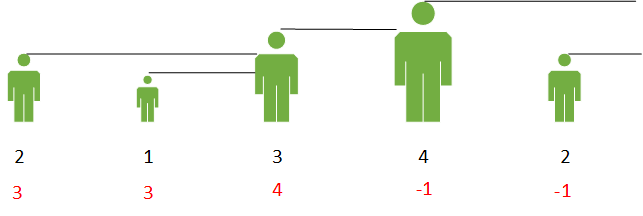
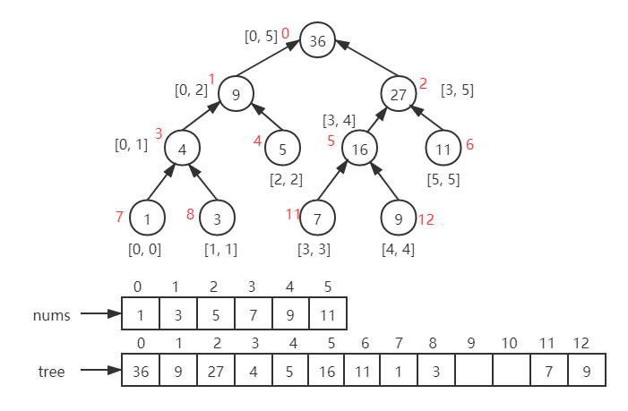
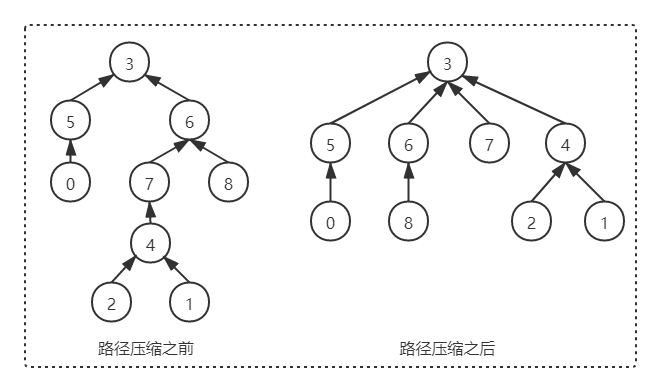
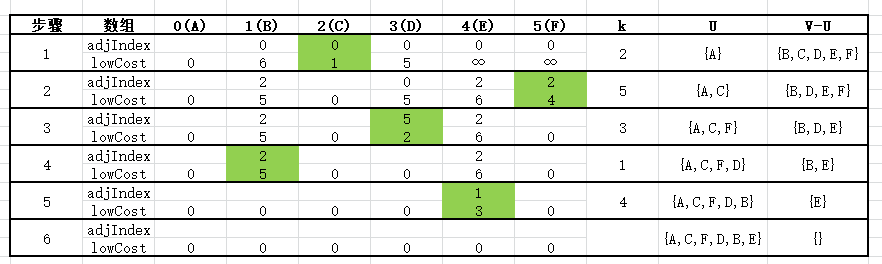

## 1. 栈

### 1.1 单调栈

介绍：栈中的元素从栈底到栈顶满足单调性。以递增栈为例，从前往后扫描（也可以从后往前扫描），如果新来元素大于（等于）栈顶元素则直接入栈，否则从栈顶开始依次将比新来元素大的元素出栈，以此来保证单调性。它常用的场景是：

* 查找前一个/后一个**更大元素**：使用**单调递减栈**
* 查找前一个/后一个**更小元素**：使用**单调递增栈**

比如，求下一个更大元素，可以把数组元素想象成并列站立的人，元素大小为身高。以 3 为例，他后面可见的第一个人是 4，也就是它的下一个更大元素。4 后面的 2 由于比 4 小，所以它会被 4 屏蔽。



应用：[496. 下一个更大元素 I](https://leetcode-cn.com/problems/next-greater-element-i/)、[503. 下一个更大元素 II](https://leetcode-cn.com/problems/next-greater-element-ii/)、[739. 每日温度](https://leetcode-cn.com/problems/daily-temperatures/)、[42.接雨水](https://leetcode-cn.com/problems/trapping-rain-water/)、[84.柱状图中最大的矩形](https://leetcode-cn.com/problems/largest-rectangle-in-histogram/)、[85.最大矩形](https://leetcode-cn.com/problems/maximal-rectangle/)

参考：[知乎](https://zhuanlan.zhihu.com/p/26465701)

```java
public class MonotonyStack {
    // 739. 每日温度：时间复杂度O(n)
    public int[] dailyTemperatures(int[] T) {
        int[] result = new int[T.length];
        // 使用单调递减栈，从前往后扫描
        Stack<Integer> stack = new Stack<>();
        
        for (int i = 0; i < T.length; i++) {
            while (!stack.isEmpty() && T[stack.peek()] < T[i]) {
                int index = stack.pop();
                result[index] = i - index;
            }
            // 由于数组具有随机访问特性，所以通常都是让数组下标入栈
            stack.push(i);
        }

        // 注意此时栈可能不为空，栈中剩余元素表示找不到下一个更大元素
        // 需要将栈内元素出栈并记录为0，由于result数组元素默认为0，所以可以不做处理
        return result;
    }
    
    // 503. 下一个更大元素II：时间复杂度O(n)
    public int[] nextGreaterElements(int[] nums) {
        int[] result = new int[nums.length];
        // 为了避免最后处理栈内剩余元素，首先进行初始化
        Arrays.fill(result, -1);

        // 使用单调递减栈，从前往后扫描
        Stack<Integer> stack = new Stack<>();
        // 由于是循环比较，所以让数组翻倍再比较
        for (int i = 0; i < nums.length * 2; i++) {
            // 取模运算是为了防止第二遍扫描时下标越界
            int current = nums[i % nums.length];
            while (!stack.isEmpty() && nums[stack.peek()] < current) {
                result[stack.pop()] = current;
            }
            // 只在第一遍扫描时，让数组下标入栈
            if (i < nums.length) {
                stack.push(i);
            }
        }

        return result;
    }
    
    // 84. 柱状图中最大的矩形：时间复杂度O(n)
    public static int largestRectangleArea4Stack(int[] heights) {
        int maxArea = 0;    // 最大矩形面积
        Stack<Integer> stack = new Stack<>();
        // 数组最后添加元素0，保证将最后一个矩形面积算上
        heights = Arrays.copyOf(heights, heights.length + 1);

        for (int i = 0; i < heights.length; i++) {
            // 当前元素 <= 栈顶元素时，计算当前元素“之前”递增元素围成的矩形面积
            while (!stack.isEmpty() && heights[stack.peek()] >= heights[i]) {
                int height = heights[stack.pop()];
                // i是右边界，stack.peek()是左边界（若栈为空，-1是左边界，此时width = i-(-1)-1 = i）
                int width = stack.isEmpty() ? i : i - stack.peek() - 1;
                maxArea = Math.max(maxArea, height * width);
            }
            stack.push(i);  // 数组下标入栈
        }

        return maxArea;
    }
}
```


## 2. 队列

### 2.1 单调队列

介绍：与单调栈类似，单调队列中的元素从头到尾满足单调性。以递增队列为例，如果新来元素大于（等于）队尾元素则直接入队，否则从队尾开始依次将比新来元素大的元素出队，以此来保证单调性。与优先队列不同，单调队列是线性结构，靠删除元素来保持单调性；而优先队列（二叉堆）是树形结构，相当于自动排序。它常用的场景是：**滑动窗口/区间的最值问题**。

应用：[239.滑动窗口最大值](https://leetcode-cn.com/problems/sliding-window-maximum/)

```java
	// 239. 滑动窗口最大值
    public static int[] maxSlidingWindow(int[] nums, int k) {
        int[] result = new int[nums.length - k + 1];
        ArrayDeque<Integer> deque = new ArrayDeque<>();

        for (int i = 0, j = 0; i < nums.length; i++) {
            // 维护窗口，向右移动时，如果左侧超出窗口，则移除队首
            // i表示窗口的最右端，i - k + 1表示窗口的最左端
            if (!deque.isEmpty() && deque.getFirst() < i - k + 1) {
                deque.removeFirst();
            }

            // 保证窗口内的值是递减的，小于新加入的值全部弹出
            while (!deque.isEmpty() && nums[deque.getLast()] < nums[i]) {
                deque.removeLast();
            }

            // 序号加入双端队列
            deque.addLast(i);
            // 获取队首最大值
            if (i >= k - 1) {
                result[j++] = nums[deque.getFirst()];
            }
        }

        return result;
    }
```


## 3. 链表

### 3.1 快慢指针

介绍：无法高效获取长度，无法根据偏移快速访问元素，是链表的两个劣势。然而面试的时候经常碰见诸如获取倒数第k个元素，获取中间位置的元素，判断链表是否存在环，判断环的长度等和长度与位置有关的问题。这些问题都可以通过灵活运用**双指针或快慢指针**来解决。

应用：[141. 环形链表]([141. 环形链表](https://leetcode-cn.com/problems/linked-list-cycle/))、[142. 环形链表 II](https://leetcode-cn.com/problems/linked-list-cycle-ii/)、[202. 快乐数](https://leetcode-cn.com/problems/happy-number/)、[面试题 02.02. 返回倒数第 k 个节点](https://leetcode-cn.com/problems/kth-node-from-end-of-list-lcci/)、[19. 删除链表的倒数第N个节点](https://leetcode-cn.com/problems/remove-nth-node-from-end-of-list/)、[876. 链表的中间结点](https://leetcode-cn.com/problems/middle-of-the-linked-list/)、[109. 有序链表转换二叉搜索树](https://leetcode-cn.com/problems/convert-sorted-list-to-binary-search-tree/)、[234. 回文链表](https://leetcode-cn.com/problems/palindrome-linked-list/)、[287. 寻找重复数](https://leetcode-cn.com/problems/find-the-duplicate-number/)

参考：[leetcode](https://leetcode-cn.com/problems/linked-list-cycle/solution/yi-wen-gao-ding-chang-jian-de-lian-biao-wen-ti-h-2/)、[环形链表II示意图](https://leetcode-cn.com/problems/linked-list-cycle-ii/solution/xiang-xi-tu-jie-ken-ding-kan-de-ming-bai-by-xixili/)


```java
public class FastSlowPointer {
    // 141. 环形链表：快慢指针破链表循环，时间复杂度O(n)，类似应用 202.快乐数
    // 思路：慢指针每次移动一步，而快指针每次移动两步
    // (1) 如果链表中不存在环，最终快指针将会最先到达尾部
    // (2) 如果链表中存在环，最终快慢指针会相遇/重合（追及问题）
    public boolean hasCycle(ListNode head) {
        ListNode slow = head;   // 慢指针
        ListNode fast = head;  // 快指针

        while (fast != null && fast.next != null) {
            slow = slow.next;
            fast = fast.next.next;
            if (slow == fast) {
                return true;
            }
        }

        return false;
    }

    // 142. 环形链表 II：给定一个链表，返回链表开始入环的第一个节点。如果链表无环，则返回 null
    // 如何查找环起始点参考上图解析。实际上当环很小时，可能会出现第一次相遇时，fast 比 slow 不止多走一圈
    // 即2(x+y) = x+y+n(z+y)，化简得x = (n-1)(z+y) + z，其中n=1,2,...。所以做法是一样的
    // 类似应用 287. 寻找重复数
    public ListNode detectCycle(ListNode head) {
        ListNode slow = head;   // 慢指针
        ListNode fast = head;  // 快指针

        while (fast != null && fast.next != null) {
            slow = slow.next;
            fast = fast.next.next;
            if (slow == fast) {
                slow = head; // 重置慢指针查找入环起始点
                while (slow != fast) {
                    slow = slow.next;
                    fast = fast.next;
                }
                return fast;
            }
        }

        return null;
    }

    // 面试题 02.02. 返回倒数第 k (k从1开始)个节点：时间复杂度O(n)
    // 思路：首先，让 fast 沿着 next 移动 k 次，使得两个指针的距离为 k
    // 然后同时移动，直到 fast 指向空，此时 slow 即指向倒数第 k 个结点
    public ListNode getKthFromEnd(ListNode head, int k) {
        ListNode fast = head;
        ListNode slow = head;
		 
        while (k > 0) {
            fast = fast.next;
            k--;
        }
		 
        while (fast != null) {
            fast = fast.next;
            slow = slow.next;
        }

        return slow;
    }

    // 876. 链表的中间结点：时间复杂度O(n)
    // 思路：快慢指针同时移动，fast 每次向后走两次，slow 每次向后走一次
    // 因此 fast 走过的距离是 slow 走过的距离的 2 倍，当 fast 走到末尾时，slow 恰号在中间
    // 当 n 为奇数时，slow 恰好指向中间结点，当 n 为偶数时，slow 恰好指向中间两个结点的靠后一个
    public ListNode getMiddleNode(ListNode head) {
        ListNode fast = head;
        ListNode slow = head;

        while (fast != null && fast.next != null) {
            slow = slow.next;
            fast = fast.next.next;
        }

        return slow;
    }
}
```

### 3.2 反转链表

```java
public class ReverseList {
    // 206. 反转链表（基础且常用）
    //  递归实现
    public ListNode reverseList4Recursion(ListNode head) {
        if (head == null || head.next == null) {
            return head;
        }

        ListNode node = reverseList4Recursion(head.next);
        // 关键，在某一时刻：1 -> 2 -> 3 -> 4 <- 5，其中3为head，4 -> null
        head.next.next = head;
        head.next = null;
        return node;
    }

    // 迭代实现
    public ListNode reverseList4Iterator(ListNode head) {
        // 哨兵节点，方便处理头结点
        ListNode dummy = new ListNode(-1);
        dummy.next = null;
        ListNode temp;

        while (head != null) {
            temp = head.next;
            head.next = dummy.next;
            dummy.next = head;
            head = temp;
        }

        return dummy.next;
    }
}
```


## 4. 数组

### 4.1 数组排序

介绍：数组排序是最常见的操作，根据算法的思想，可大致分为如下几类：

1. **交换排序**：对无序区中记录的关键字两两进行比较，若逆序则进行交换，直到关键字之间不存在逆序为止。包括**冒泡排序（了解）、快速排序（重要）**；
2. **选择排序**：在无序区中选出关键字最小的记录，置于有序区的最后，直到全部记录有序。包括**简单选择排序（了解）、堆排序（重要）**；
3. **插入排序**：将无序区中的一个记录插入至有序区，使得有序区的长度加1，直到全部记录有序。包括**直接插入排序（重要）、希尔排序（了解）**；
4. **归并排序（重要）**：使用分治思想，不断将两个或两个以上有序区合并成一个有序区，直到全部记录有序；
5. **非比较排序（了解）**：使用哈希的思想，由数值映射地址，即一个数该放在哪里，是由这个数本身的大小决定的，它不需要经过比较，包括**计数排序、基数排序、桶排序**。适用场景不多，因为**要保证输入数组的每个元素都在一个合理的范围内**。

参考：[leetcode](https://leetcode-cn.com/problems/sort-an-array/solution/fu-xi-ji-chu-pai-xu-suan-fa-java-by-liweiwei1419/)


#### 4.1.1 冒泡排序

```java
	// 冒泡排序：时间复杂度O(n^2)，空间复杂度O(1)
    public static void bubbleSort(int[] nums) {
        for (int i = nums.length - 1; i > 0; i--) {
            // 本趟冒泡是否发生交换，加快排序
            boolean isSwap = false;
            for (int j = 0; j < i; j++) {
                // 相邻数进行比较，小数上浮，大数沉底
                if (nums[j] > nums[j + 1]) {
                    int temp = nums[j];
                    nums[j] = nums[j + 1];
                    nums[j + 1] = temp;
                    isSwap = true;
                }
            }

            if (!isSwap) {
                break;	// 本趟未发生交换，说明已经有序
            }
        }
    }
```


#### 4.1.2 快速排序

```java
	// 快速排序:时间复杂度O(nlogn)，空间复杂度O(nlogn)
    public static void quickSort(int[] nums) {
        QSort(nums, 0, nums.length - 1);
    }

    private static void QSort(int[] nums, int start, int end) {
        if (start < end) {
            int pivotLoc = partition(nums, start, end);    // 枢纽位置已就绪
            QSort(nums, start, pivotLoc - 1);    // 对枢纽之前的子序列递归排序
            QSort(nums, pivotLoc + 1, end);  // 对枢纽之后的子序列递归排序
        }
    }

    // 对子序列nums[low..high]进行一次划分，并返回枢轴所处的位置
    // 使得枢纽之前的数字均不大于枢纽值，枢纽之后的数字均不小于枢纽值
    private static int partition(int[] nums, int low, int high) {
        int pivot = nums[low];    // 枢纽选择第一个值

        while (low < high) {    // 从两端交替向中间移动
            while (low < high && nums[high] >= pivot) high--;
            nums[low] = nums[high];
            while (low < high && nums[low] <= pivot) low++;
            nums[high] = nums[low];
        }

        nums[low] = pivot;  //枢纽返回正确位置
        return low; // 返回枢纽位置
    }
```


#### 4.1.3 选择排序

```java
	// 选择排序：时间复杂度O(n^2)，空间复杂度O(1)
    public static void selectSort(int[] nums) {
        for (int i = 0; i < nums.length - 1; i++) {
            int minIndex = i;
            for (int j = i + 1; j < nums.length; j++) {
                if (nums[j] < nums[minIndex]) {
                    minIndex = j;
                }
            }

            int temp = nums[i];
            nums[i] = nums[minIndex];
            nums[minIndex] = temp;
        }
    }
```


#### 4.1.4 堆排序

```java
	// 堆排序：时间复杂度O(nlogn)，空间复杂度O(1)
    public static void heapSort(int[] nums) {
        makeHeap(nums);
        for (int i = nums.length - 1; i >= 1; ) {
            swap(nums, 0, i);
            i--;    // 逐步减少堆有序的部分
            shiftDown(nums, 0, i);
        }
    }

    // 建堆：时间复杂度O(n)
    private static void makeHeap(int[] nums) {
        int len = nums.length;
        for (int i = (len - 1) / 2; i >= 0; i--) {
            shiftDown(nums, i, len - 1);
        }
    }

    // 对以pos为根的子树调整为子堆，其中堆有效部分为[0, n]
    private static void shiftDown(int[] nums, int pos, int n) {
        while (2 * pos + 1 <= n) {  // 若pos为叶子节点，循环结束
            int leftChild = 2 * pos + 1;    // 左孩子位置
            int rightChild = 2 * pos + 2;   // 右孩子位置
            if (rightChild <= n && nums[rightChild] > nums[leftChild]) {
                leftChild = rightChild; // 比较左右孩子中较优者
            }
            if (nums[leftChild] <= nums[pos]) {
                return; // 若pos节点优先，则筛选结束
            }
            swap(nums, leftChild, pos); // 否则与最优者交换位置
            pos = leftChild;    // 继续向下调整
        }
    }

    // 交换堆中第i节点和第j节点
    private static void swap(int[] nums, int i, int j) {
        int temp = nums[i];
        nums[i] = nums[j];
        nums[j] = temp;
    }
```


#### 4.1.5 插入排序

```java
	// 插入排序：时间复杂度O(n^2)，空间复杂度O(1)
    public static void insertSort(int[] nums) {
        for (int i = 1; i < nums.length; i++) {
            int temp = nums[i]; // 暂存该元素
            int j = i;
            while (j > 0 && nums[j - 1] > temp) {
                nums[j] = nums[j - 1];  // 记录后移
                j--;
            }
            nums[j] = temp; // 插入
        }
    }
```


#### 4.1.6 希尔排序

```java
	// 希尔排序：时间复杂度O(nlogn)，空间复杂度O(1)
    public static void shellSort(int[] nums) {
        int dk = 1; // dk为增量
        // 使用Knuth增量序列，找增量的最大值
        while (3 * dk + 1 < nums.length) {
            dk = 3 * dk + 1;
        }

        while (dk >= 1) {
            shellInsert(nums, dk);
            dk /= 3;
        }
    }

    // 一趟希尔排序，增量dk，与直接插入排序类似
    private static void shellInsert(int[] nums, int dk) {
        for (int i = 0; i < nums.length - dk; i++) {
            int temp = nums[i + dk]; // 暂存该元素
            int j = i + dk;
            while (j - dk >= 0 && nums[j - dk] > temp) {
                nums[j] = nums[j - dk];  // 记录后移
                j -= dk;
            }
            nums[j] = temp; // 插入
        }
    }
```


#### 4.1.7 归并排序

```java
	// 归并排序（分治思想）：时间复杂度O(nlogn)，空间复杂度O(n)
    public static void mergeSort(int[] nums) {
        int[] temp = new int[nums.length];  // 辅助空间
        MSort(nums, temp, 0, nums.length - 1, 0);
    }

    // 若step为奇数，则排序后记录存入temp，否则仍存入nums
    private static void MSort(int[] nums, int[] temp, int start, int end, int step) {
        // 求解子问题
        if (start == end) {
            if (step % 2 == 1) {
                temp[start] = nums[start];
            }
        } else {
            // 分解子问题
            int middle = (start + end) / 2;
            MSort(nums, temp, start, middle, step + 1);
            MSort(nums, temp, middle + 1, end, step + 1);
            // 合并子问题
            if (step % 2 == 1) {  // 将nums合并，结果存入temp
                Merge(nums, temp, start, middle, end);
            } else { // 将temp合并，结果存入nums
                Merge(temp, nums, start, middle, end);
            }
        }
    }

    // 将相邻的有序区间nums[start...middle]和nums[middle+1...end]合并为有序的temp[start...end]
    private static void Merge(int[] src, int[] dest, int start, int middle, int end) {
        int i = start, j = middle + 1, k = start;

        while (i <= middle && j <= end) {
            if (src[i] <= src[j]) {
                dest[k++] = src[i++];
            } else {
                dest[k++] = src[j++];
            }
        }

        while (i <= middle) {
            dest[k++] = src[i++];
        }
        while (j <= end) {
            dest[k++] = src[j++];
        }
    }
```


#### 4.1.8 计数排序


```java
	// 计数排序：时间复杂度O(n+k)，空间复杂度O(k)
    public static void countingSort(int[] nums) {
        // 计算数组中的最大值和最小值，若事先已明确，可直接赋值
        int max = Integer.MIN_VALUE;
        int min = Integer.MAX_VALUE;
        for (int num : nums) {
            max = Math.max(max, num);
            min = Math.min(min, num);
        }

        // 根据数值范围确定中间数组的长度，默认初始化为0
        int[] count = new int[max - min + 1];
        // 统计原始数组中元素出现的频率，放入中间数组
        for (int num : nums) {
            count[num - min] += 1;
        }

        // 根据中间数组得到排序结果，i对应数值，j对应频率
        int index = 0;
        for (int i = 0; i < count.length; i++) {
            for (int j = 0; j < count[i]; j++) {
                nums[index++] = i + min;
            }
        }
    }
```


#### 4.1.9 基数排序

介绍：透过键值的部份资讯，将要排序的元素分配至某些“桶”中，藉以达到排序的作用

```java

```


#### 4.1.10 桶排序

介绍：计数排序是桶排序的一种，普通的计数排序相当于极端情况下每个桶的区间大小是 1 ，而桶排序不是这种极端情况，每个桶的区间大小相等，但依然是遍历元素对号入座（放入对应的区间里）。桶排序的重点就在于，如何规划桶区间的大小和个数，使尽可能少的桶去覆盖所有的元素。


```java
	// 桶排序：时间复杂度O(n+k)，空间复杂度O(n+k)
    public static void bucketSort(int[] nums) {
        // 计算数组中的最大值和最小值，若事先已明确，可直接赋值
        int max = Integer.MIN_VALUE;
        int min = Integer.MAX_VALUE;
        for (int num : nums) {
            max = Math.max(max, num);
            min = Math.min(min, num);
        }

        // 根据数值范围确定桶的数量，每个桶放入一定范围的数字
        int bucketNum = (max - min) / nums.length + 1;
        List<List<Integer>> buckets = new ArrayList<>(bucketNum);
        for (int i = 0; i < bucketNum; i++) {
            buckets.add(new ArrayList<>());
        }

        // 将原始数组中的元素放入对应的桶中，然后对每个桶分别排序
        for (int num : nums) {
            int index = (num - min) / nums.length;
            buckets.get(index).add(num);
        }
        for (List<Integer> bucket : buckets){
            Collections.sort(bucket);
        }

        // 根据桶得到排序结果
        int index = 0;
        for (List<Integer> bucket : buckets) {
            for (Integer integer : bucket) {
                nums[index++] = integer;
            }
        }
    }
```


### 4.2 找第 K 个最小元素

介绍：快排本身时间复杂度为 O(nlogn)，但是用于查找数组中第 K 个最小元素只需要O(n)。原因是我们是要找下标为 k 的元素，第一次切分的时候需要遍历整个数组(0 ~ n)找到了下标是 i 的元素，假如 k 比 i 小，那么我们下次切分只需要遍历数组(0~k-1)的元素，反之如果 k 比 i 大，那下次切分只需要遍历数组(k+1～n)的元素。总之可以看作每次划分遍历的元素数目都是上一次遍历的1/2，因此时间复杂度是n + n/2 + n/4 + ... + n/n = 2n，因此时间复杂度是O(n)。

应用：[215. 数组中的第K个最大元素](https://leetcode-cn.com/problems/kth-largest-element-in-an-array/)、[169. 多数元素](https://leetcode-cn.com/problems/majority-element/)

```java
	// 使用快排查找第k小（k从0开始）的元素：时间复杂度O(n)
    public int searchSmallKImprove(int[] nums, int k) {
        // 使用随机函数选取枢纽值，避免最坏情况
        Random random = new Random();
        int low = 0, high = nums.length - 1;

        while (low < high) {
            int i = low, j = high;
            // 在low和high间随机选取一个数ran，交换low和ran的数值（若不使用随机，可直接去掉下面两行）
            int ran = low + random.nextInt(high - low);
            swap(nums, low, ran);
            int t = nums[i];    // 记录枢纽值，实际上是nums[ran]

            while (i < j)    // 从两端交替向中间移动
            {
                while (i < j && nums[j] >= t) j--;
                nums[i] = nums[j];
                while (i < j && nums[i] <= t) i++;
                nums[j] = nums[i];
            }
            nums[i] = t;    // 枢纽返回正确位置

            if (i == k) {
                return nums[i];
            } else if (i < k) {
                low = i + 1;
            } else {
                high = i - 1;
            }
        }

        return nums[low];
    }

    private void swap(int[] nums, int i, int j) {
        int t = nums[i];
        nums[i] = nums[j];
        nums[j] = t;
    }
```

### 4.3 前缀和

介绍：涉及**连续子数组**的问题，我们通常有两种思路：**一是滑动窗口、二是前缀和+哈希表**。假设使用 sum[i] 表示数组 A[] 的前 i 项和，即 `sum[i] = A[0] + A[1] + ... + A[i]`。则连续子数组 **`A[i] + ... + A[j] = sum[j] - sum[i - 1],其中i >= 1`**，为了上式能满足前缀和本身的情况（即 i = 0），我们**人为规定 `sum[-1] = 0`**。特别的，当 j = i 时，数组中的某项 `A[i] = sum[i] - sum[i - 1]`。

应用：[974. 和可被 K 整除的子数组](https://leetcode-cn.com/problems/subarray-sums-divisible-by-k/)、[560. 和为K的子数组](https://leetcode-cn.com/problems/subarray-sum-equals-k/)、[1248. 统计「优美子数组」](https://leetcode-cn.com/problems/count-number-of-nice-subarrays/)

参考：[leetcode](https://leetcode-cn.com/problems/subarray-sums-divisible-by-k/solution/you-jian-qian-zhui-he-na-jiu-zai-ci-dai-ni-da-tong/)

```java
public class ContinuousSubarray {
    // 560. 和为K的子数组：时间复杂度O(n)，空间复杂度O(n)
    // 设数组前n项和为sum[n]，则对于连续子数组nums[i~j] = k = sum[j] - sum[i-1]
    // 即：sum[i-1] = sum[j] - k，于是map中每次加入sum[j]前判断是否存在sum[i-1]
    public int subarraySum(int[] nums, int k) {
        // key为前缀和，value为该前缀和出现的次数
        Map<Integer, Integer> map = new HashMap<>();
        map.put(0, 1);  // 初始化前缀和0，次数为1
        int sum = 0, result = 0;

        for (int num : nums) {
            sum += num;
            // map最初加入了一次，这里先判断后加入。如果先加入后判断，当nums={1}、k=0时不满足
            if (map.containsKey(sum - k))
                result += map.get(sum - k);
            map.put(sum, map.getOrDefault(sum, 0) + 1);
        }

        return result;
    }

    // 974. 和可被 K 整除的子数组：时间复杂度O(n)，空间复杂度O(min(n, k))
    // 如果两个数的差能被K整除，说明这两个数 mod K得到的结果相同，于是只要从余数相同的数中选2个组合即可
    public int subarraysDivByK(int[] A, int K) {
        // key为余数，value为该余数出现的次数
        HashMap<Integer, Integer> map = new HashMap<>();
        map.put(0, 1);  // 初始化，前缀和本身被K整除的情况

        int sum = 0;
        for (int num : A) {
            sum += num;
            // 注意取模的特殊性:当被除数为负数时取模结果为负数，需要纠正
            int reminder = (sum % K + K) % K;
            map.put(reminder, map.getOrDefault(reminder, 0) + 1);
        }


        int result = 0;
        // 求组合数C(n, 2) = n! / 2!(n-2)! = n(n-1) / 2
        for (Map.Entry<Integer, Integer> entry : map.entrySet()) {
            result += entry.getValue() * (entry.getValue() - 1) / 2;
        }
        return result;
    }
}
```


### 4.4 二分查找

介绍：二分查找也叫折半查找，它是一种效率较高的查找方法。但是，二分查找要求线性表必须是**顺序存储，且表中元素有序**。算法思路简单，但细节较多，比如边界判断是否应该带等号，mid 是否应该加 1，计算 mid 时的溢出问题等。

应用：[35. 搜索插入位置](https://leetcode-cn.com/problems/search-insert-position/)、[34. 在排序数组中查找元素的第一个和最后一个位置](https://leetcode-cn.com/problems/find-first-and-last-position-of-element-in-sorted-array/)、[33. 搜索旋转排序数组](https://leetcode-cn.com/problems/search-in-rotated-sorted-array/)、[81. 搜索旋转排序数组 II](https://leetcode-cn.com/problems/search-in-rotated-sorted-array-ii/)、[153. 寻找旋转排序数组中的最小值](https://leetcode-cn.com/problems/find-minimum-in-rotated-sorted-array/)、[154. 寻找旋转排序数组中的最小值 II](https://leetcode-cn.com/problems/find-minimum-in-rotated-sorted-array-ii/)、[74. 搜索二维矩阵](https://leetcode-cn.com/problems/search-a-2d-matrix/)、[240. 搜索二维矩阵 II](https://leetcode-cn.com/problems/search-a-2d-matrix-ii/)、[378. 有序矩阵中第K小的元素](https://leetcode-cn.com/problems/kth-smallest-element-in-a-sorted-matrix/)、[410. 分割数组的最大值](https://leetcode-cn.com/problems/split-array-largest-sum/)、[1011. 在 D 天内送达包裹的能力](https://leetcode-cn.com/problems/capacity-to-ship-packages-within-d-days/)、[5489. 两球之间的磁力](https://leetcode-cn.com/problems/magnetic-force-between-two-balls/)

```java
public class BinarySearch {
    // Arrays.binarySearch()源码：若key位于数组中，返回索引；否则返回-(插入位置+1)
    public int binarySearch(int[] nums, int key) {
        int low = 0, high = nums.length - 1;

        while (low <= high) {
            // 不建议使用 mid = (low + high) / 2，防止low + high溢出，超出整数范围
            // 可以使用 mid = low + (high - low) / 2，但效率比位运算低
            int mid = (low + high) >>> 1;

            if (nums[mid] < key) {
                low = mid + 1;
            } else if (nums[mid] > key) {
                high = mid - 1;
            } else {
                return mid;	// 找到key，返回索引
            }
        }

        return -(low + 1);	// 未找到key，返回-(插入位置+1)
    }
    
    // 34. 在排序数组中查找元素的第一个和最后一个位置
    // 思路：利用二分思想先找其左边界，再找其右边界即可
    // 注意找左边界的时候，由右侧逼近；找右边界的时候，由左侧逼近
    public int[] searchRange(int[] nums, int target) {
        int[] result = new int[]{-1, -1};

        int low = 0;
        int high = nums.length - 1;
        while (low <= high) {
            int mid = (low + high) >>> 1;
            if (nums[mid] < target) {
                low = mid + 1;
            } else if (nums[mid] > target) {
                high = mid - 1;
            } else {
                result[0] = mid;
                high = mid - 1;
            }
        }

        low = 0;
        high = nums.length - 1;
        while (low <= high) {
            int mid = (low + high) >>> 1;
            if (nums[mid] < target) {
                low = mid + 1;
            } else if (nums[mid] > target) {
                high = mid - 1;
            } else {
                result[1] = mid;
                low = mid + 1;
            }
        }

        return result;
    }
    
    // 81. 搜索旋转排序数组 II。类似应用33、153、154
    // 思路：将数组一分为二，其中一定有一个是有序的，另一个可能是有序，也能是无序;
    // 此时有序部分用二分查找；无序部分再一分为二，如此循环。
    // 关键是如何判断是否有序 => 若中间元素 > 最右边元素，则右边无序，左边有序（该规律可解决153、154）
    public boolean searchRotateArray(int[] nums, int target) {
        int low = 0, high = nums.length - 1;

        while (low <= high) {
            int middle = (low + high) >>> 1;
            if (nums[middle] == target) {
                return true;
            }

            if (nums[middle] > nums[high]) {
                // 中间元素 > 最右边元素，则左边有序，右边可能无序
                if (nums[low] <= target && target < nums[middle]) {
                    // 如果目标值在有序左边，则二分查找
                    high = middle - 1;
                } else {
                    // 如果目标值在无序右边，则继续一分为二
                    low = middle + 1;
                }
            } else if (nums[middle] < nums[high]) {
                // 中间元素 < 最右边元素，则右边有序，左边可能无序
                if (nums[middle] < target && target <= nums[high]) {
                    low = middle + 1;
                } else {
                    high = middle - 1;
                }
            } else {
                // 中间元素 = 最右边元素，则去除重复元素继续判断（与33题区别）
                high--;
            }
        }

        return false;
    }
    
    // 378. 有序矩阵中第K小的元素。74、240与之题目虽然类似，但是二分解法的形式各不相同
    // 思路：左上角值L最小，右下角值R最大，不断二分值M。注意这里"以值作为划分，而不是索引"（常用技巧）
    // 关键是如何确定值M与值k之间的关系 => 锯齿形计算小于等于值M的个数
    public int kthSmallest(int[][] matrix, int k) {
        int n = matrix.length;
        int left = matrix[0][0];
        int right = matrix[n - 1][n - 1];

        while (left < right) {
            int mid = (left + right) >>> 1;
            if (check(matrix, k, mid, n)) {
                right = mid;	// 这里不能减1，因为mid可能就是结果
            } else {
                left = mid + 1;
            }
        }

        return left;
    }

    // 从左下至右上锯齿形计算，判断值小于等于mid的个数 >= k。思路与240.类似
    private boolean check(int[][] matrix, int k, int mid, int n) {
        int row = n - 1, col = 0; // 左下角坐标
        int smallCount = 0; // 小于等于mid的个数
        while (row >= 0 && col < n) {
            if (matrix[row][col] <= mid) {
                smallCount += row + 1;
                col++;	// 去掉该列
            } else {
                row--;	// 去掉该行
            }
        }

        return smallCount >= k;
    }
    
    // 410. 分割数组的最大值。类似应用1011、5489
    // 关键：“使...最大值尽可能小"、“使...最小值最大"是二分搜索题目常见的问法
    // 思路：假设两个极端情况来确定left和right：
    // 当m=1,那么整个数组就是子数组，right就是数组之和；
    // 当m=n,那么每个元素作为一个子数组，left就是所有元素中的最大值。
    // 接下来“以值作为划分”，假设根据mid划分出的子数组个数为count：
    // 若count>m，说明我们划分出太多的子数组，意味着一个子数组的容量太少，需要扩大容量，即left=mid+1
    // 若count<=m，说明我们“可能”划分出太少的子数组，需要减少容量，即right=mid
    public int splitArray(int[] nums, int m) {
        // 使用long是为了防止right越界
        long left = 0, right = 0;
        long result = 0;
        for (int num : nums) {
            left = Math.max(left, num);
            right += num;
        }

        // 初始时的left和right都可以取到，因此搜索的是闭区间[left,right]
        // 如果不写等号，循环结束条件是left=right，即[right,right]，此时right位置没有搜索到
        // 加上等号之后，循环结束条件是left = right+1，即[right+1,right]，覆盖了全部区域
        while (left <= right) {
            // 贪心地使子数组和不断逼近mid
            long mid = (left + right) >>> 1;
            int count = 1;
            long subSum = 0;

            for (int num : nums) {
                if (subSum + num > mid) {
                    subSum = 0;
                    count++;
                }
                subSum += num;
            }

            if (count > m) {
                left = mid + 1; // 容量过小，mid值不可能符合，所以加1
            } else {
                result = mid;   // 容量可能刚好，使用result临时保存
                right = mid - 1;    // 容量也可能过大，继续减1尝试
            }
        }

        return (int) result;
    }
}
```


## 5. 树

### 5.1 前缀树/字典树

介绍：字典树又名前缀树、Trie（发音[traɪ]）树，是一种存储大量字符串的树形数据结构，相比于HashMap存储，在存储单词（和语种无关，任意语言都可以）的场景上，节省了大量的内存空间。

应用：搜索自动补全、拼写检查、IP路由（最长前缀匹配）、单词游戏

参考：[leetcode](https://leetcode-cn.com/problems/implement-trie-prefix-tree/solution/shi-xian-trie-qian-zhui-shu-by-leetcode/)

如下图所示，包含4个单词：code、tr、tree、trie，红色表示单词结束。


```java
// 前缀树
public class TrieTree {
    private TrieNode root;  // 根节点

    public TrieTree() {
        root = new TrieNode();
    }

    // 在前缀树中插入新单词：时间复杂度O(m),空间复杂度O(m)，m为键长
    public void insert(String word){
        TrieNode currentNode = root;    // 从根节点开始
        for(int i = 0; i < word.length(); i++){
            char ch = word.charAt(i);
            if(!currentNode.containsKey(ch)){
                // 子节点数组中不包含指定字符，则新建该字符节点
                currentNode.setTrieNode(ch, new TrieNode());
            }
            currentNode = currentNode.get(ch);  // 更新当前节点
        }
        currentNode.setEnd();  // 设置单词结束标志
    }

    // 判断指定单词是否在前缀树中：时间复杂度O(m),空间复杂度O(1)
    public boolean search(String word){
        TrieNode trieNode = searchPrefix(word);
        return trieNode != null && trieNode.isEnd();
    }

    // 判断指定前缀是否在前缀树中：时间复杂度O(m),空间复杂度O(1)
    public boolean startsWith(String prefix){
        return searchPrefix(prefix) != null;
    }

    // 在前缀中搜索前缀或整个键，并返回搜索结束时的节点
    private TrieNode searchPrefix(String word){
        TrieNode currentNode = root;
        for(int i = 0; i < word.length(); i++){
            char ch = word.charAt(i);
            if(currentNode.containsKey(ch)){
                currentNode = currentNode.get(ch);
            }else {
                return null;
            }
        }
        return currentNode;
    }
}

// 字符节点
class TrieNode {
    private final int R = 26;   // 26个英文字母
    private TrieNode[] children;    // 子节点数组
    private boolean isEnd; // 单词结束标志（不一定是叶子节点）

    public TrieNode() {
        isEnd = false;
        children = new TrieNode[R];
    }

    // 判断子节点数组中是否包含指定字符
    public boolean containsKey(char ch){
        return children[ch - 'a'] != null;
    }

    // 在子节点数组中设置新字符
    public void setTrieNode(char ch, TrieNode trieNode){
        children[ch - 'a'] = trieNode;
    }

    // 从子节点数组中获取字符
    public TrieNode get(char ch){
        return children[ch - 'a'];
    }

    // 判断当前节点是否单词结束
    public boolean isEnd() {
        return isEnd;
    }

    // 将当前节点设置为单词结束
    public void setEnd() {
        isEnd = true;
    }
}
```

### 5.2 线段树

介绍：线段树是一种二叉查找树，其作用是进行**区间快速的修改，查询**，它将一个区间划分为一些单元区间，每个单元区间对应线段树中的一个叶节点。

如下图所示，数组 nums 的线段树是一个二叉树，其中每个节点都包含数组的一个子范围 [i, j] 上的聚合信息（最小值、最大值、总和等），其左、右子节点分别包含范围 [i, (i+j)/2] 和 [(i+j)/2 + 1, j] 上的信息。



应用：[307. 区域和检索 - 数组可修改](https://leetcode-cn.com/problems/range-sum-query-mutable/)

参考：[b 站视频](https://www.bilibili.com/video/BV1cb411t7AM?from=search&seid=2498368891968792241)、[leetcode](https://leetcode-cn.com/problems/range-sum-query-mutable/solution/qu-yu-he-jian-suo-shu-zu-ke-xiu-gai-by-leetcode/)

```java
public class SegmentTree {
    private int[] tree; // 线段树数组
    private int[] nums; // 数据数组

    public SegmentTree(int[] nums) {
        this.nums = nums;
        tree = new int[nums.length * 4];    // 开辟4倍空间，空间复杂度O(n)
        buildTree(0, 0, nums.length - 1);   // 建线段树
    }

    /**
     * 建线段树：时间复杂度O(n)
     *
     * @param node  线段树数组的下标
     * @param begin 下标node代表的部分数据数组的起始位置
     * @param end   下标node代表的部分数据数组的结束位置
     */
    private void buildTree(int node, int begin, int end) {
        // 到达叶节点，线段长度为1，也就是数据数组的每个元素
        if (begin == end) {
            tree[node] = nums[begin];
            return;
        }

        int mid = (begin + end) >>> 1;
        int leftNode = 2 * node + 1;
        int rightNode = 2 * node + 2;
        // 先递归建立左右子树，然后当前节点值等于左、右子树节点值之和
        buildTree(leftNode, begin, mid);
        buildTree(rightNode, mid + 1, end);
        tree[node] = tree[leftNode] + tree[rightNode];
    }

    public void update(int idx, int val) {
        updateTree(0, 0, nums.length - 1, idx, val);
    }

    // 将数据数组下标为idx修改为val，并更新线段树数组：时间复杂度O(logn)
    private void updateTree(int node, int begin, int end, int idx, int val) {
        // 到达叶节点，同时修改数据数组和线段树数组
        if (begin == end) {
            nums[idx] = val;
            tree[node] = val;
            return;
        }

        int mid = (begin + end) >>> 1;
        int leftNode = 2 * node + 1;
        int rightNode = 2 * node + 2;
        // 先寻找下标idx对应的节点，然后逐步向上更新父结点
        if (begin <= idx && idx <= mid) {
            updateTree(leftNode, begin, mid, idx, val);
        } else {
            updateTree(rightNode, mid + 1, end, idx, val);
        }
        tree[node] = tree[leftNode] + tree[rightNode];
    }

    public int query(int L, int R) {
        return queryTree(0, 0, nums.length - 1, L, R);
    }

    // 查询数据数组[L, R]之间的总和：时间复杂度O(logn)
    private int queryTree(int node, int begin, int end, int L, int R) {
        if (R < begin || L > end) {
            return 0;   // 不在区间范围内
        }
        if (L <= begin && end <= R) {
            return tree[node];  // 在区间范围内，直接返回线段数组的值，即数据数组的部分和
        }

        int mid = (begin + end) >>> 1;
        int leftNode = 2 * node + 1;
        int rightNode = 2 * node + 2;
        // 将[L, R]一分为二，分别递归计算，然后返回两者之和
        int leftSum = queryTree(leftNode, begin, mid, L, R);
        int rightSum = queryTree(rightNode, mid + 1, end, L, R);
        return leftSum + rightSum;
    }
}
```


### 5.3 红黑树


### 5.4 二叉树的遍历

介绍：遍历是二叉树的一类最常见且重要的操作，也是二叉树其它一些操作和各种应用算法的基本框架。其中前序、中序、后序遍历类似于深度优先遍历，需要栈的辅助；而层次遍历类似于广度优先遍历，需要队列的辅助。

前序遍历应用：[100. 相同的树](https://leetcode-cn.com/problems/same-tree/)、[101. 对称二叉树](https://leetcode-cn.com/problems/symmetric-tree/)、[104. 二叉树的最大深度](https://leetcode-cn.com/problems/maximum-depth-of-binary-tree/)、[105. 从前序与中序遍历序列构造二叉树](https://leetcode-cn.com/problems/construct-binary-tree-from-preorder-and-inorder-traversal/)、[106. 从中序与后序遍历序列构造二叉树](https://leetcode-cn.com/problems/construct-binary-tree-from-inorder-and-postorder-traversal/)、[117. 填充每个节点的下一个右侧节点指针 II](https://leetcode-cn.com/problems/populating-next-right-pointers-in-each-node-ii/)

中序遍历应用：[99. 恢复二叉搜索树](https://leetcode-cn.com/problems/recover-binary-search-tree/)

后序遍历应用：[111. 二叉树的最小深度](https://leetcode-cn.com/problems/minimum-depth-of-binary-tree/)、[114. 二叉树展开为链表](https://leetcode-cn.com/problems/flatten-binary-tree-to-linked-list/)、[124. 二叉树中的最大路径和](https://leetcode-cn.com/problems/binary-tree-maximum-path-sum/)、[236. 二叉树的最近公共祖先](https://leetcode-cn.com/problems/lowest-common-ancestor-of-a-binary-tree/)

层次遍历应用：[199. 二叉树的右视图](https://leetcode-cn.com/problems/binary-tree-right-side-view/)

```java
// 前序、中序、后序遍历（递归/迭代）、层次遍历
public class TraverseTree {
    // 94. 二叉树的中序遍历（递归实现）：前序遍历、后序遍历的递归类似
    public List<Integer> inorderTraversal4Recursion(TreeNode root) {
        List<Integer> list = new LinkedList<>();
        inorder(list, root);
        return list;
    }

    private void inorder(List<Integer> list, TreeNode root) {
        if (root == null) {
            return;     // 递归出口
        }

        inorder(list, root.left);
        list.add(root.val);
        inorder(list, root.right);
    }

    // 94. 二叉树中序遍历（迭代实现）：左中右
    public List<Integer> inorderTraversal4Iterator(TreeNode root) {
        List<Integer> list = new LinkedList<>();

        Stack<TreeNode> stack = new Stack<>();
        goFarLeft(root, stack);

        while (!stack.isEmpty()) {
            // 左边节点在上一次循环中被访问
            TreeNode node = stack.pop();
            // 访问中间节点
            list.add(node.val);
            // 访问右边节点
            goFarLeft(node.right, stack);
        }

        return list;
    }

    // 从根节点出发，沿左分支走到底，沿途节点入栈
    private void goFarLeft(TreeNode root, Stack<TreeNode> stack) {
        while (root != null) {
            stack.push(root);
            root = root.left;
        }
    }

    // 144. 二叉树的前序遍历（迭代实现）：中左右
    public List<Integer> preorderTraversal(TreeNode root) {
        if (root == null) {
            return new LinkedList<>();
        }

        List<Integer> list = new LinkedList<>();
        Stack<TreeNode> stack = new Stack<>();
        stack.push(root);

        while (!stack.isEmpty()) {
            TreeNode node = stack.pop();
            list.add(node.val); // 访问中间节点
            // 先让右子树入栈，然后左子树入栈，这样出栈时左子树在前，右子树在后
            if (node.right != null) {
                stack.push(node.right);
            }
            if (node.left != null) {
                stack.push(node.left);
            }
        }

        return list;
    }


    // 145. 二叉树的后序遍历（迭代实现）：左右中
    // 思路：逆后序为：中右左，与先序遍历的区别在于调换左右子树
    public List<Integer> postorderTraversal(TreeNode root) {
        if (root == null) {
            return new LinkedList<>();
        }

        LinkedList<Integer> list = new LinkedList<>();
        Stack<TreeNode> stack = new Stack<>();
        stack.push(root);

        while (!stack.isEmpty()) {
            TreeNode node = stack.pop();
            list.addFirst(node.val); // 从集合头部加入中间节点

            // 先让左子树入栈，然后右子树入栈，这样出栈时右子树在前，左子树在后
            if (node.left != null) {
                stack.push(node.left);
            }
            if (node.right != null) {
                stack.push(node.right);
            }
        }

        return list;
    }

    // 102. 二叉树的层序遍历：使用队列
    public List<List<Integer>> levelOrder(TreeNode root) {
        if (root == null) {
            return new LinkedList<>();
        }

        List<List<Integer>> list = new LinkedList<>();
        Queue<TreeNode> queue = new LinkedList<>();
        queue.add(root);    // 根节点入队

        while (!queue.isEmpty()) {
            List<Integer> l = new LinkedList<>();
            for (int count = queue.size(); count > 0; count--) {
                TreeNode t = queue.remove();
                l.add(t.val);
                if (t.left != null) {
                    queue.add(t.left);  // 左孩子入队
                }
                if (t.right != null) {
                    queue.add(t.right); // 右孩子入队
                }
            }
            list.add(l);
        }

        return list;
    }
}
```


## 6. 堆

### 6.1 求前 K 个最大（最小）元素

介绍：堆排序本身时间复杂度为 O(nlogn)，但是用于求数组中前 K 个最大（最小）元素只需要 O(nlogk)，这里需要注意的是，**求前 K 个最大元素用小顶堆，求前 K 个最小元素用大顶堆**。假设现在要求前 K 个最大元素，如果使用大顶堆，需要将所有元素（n个）压入堆，此时前 K 个堆顶节点就是所求结果，但是这种方式不仅复杂度较高O(nlogn)，而且浪费内存，无法处理海量元素。而如果使用小顶堆，只需要维护堆的大小不超过 K 即可，每次压入堆前检查堆大小是否超过 K，如果超过则弹出堆顶，复杂度为 O(nlogk)。

应用：[347. 前 K 个高频元素](https://leetcode-cn.com/problems/top-k-frequent-elements/)、[692. 前K个高频单词](https://leetcode-cn.com/problems/top-k-frequent-words/)

```java
public class TopKElements {
    // 692. 前K个高频单词：时间复杂度O(nlogk)，空间复杂度O(n)
    public List<String> topKFrequent(String[] words, int k) {
        // 遍历一遍数组统计单词的频率，使用hashMap存储
        HashMap<String, Integer> map = new HashMap<>();
        for (String word : words) {
            map.put(word, map.getOrDefault(word, 0) + 1);
        }

        // 遍历hashMap，用"小顶堆"保存频率最大的k个单词
        PriorityQueue<String> heap = new PriorityQueue<>((s1, s2) -> {
            // 注意相同频率下，字母顺序高的在前
            if (!map.get(s1).equals(map.get(s2))) {
                return map.get(s1) - map.get(s2);
            } else {
                // String对象按字典顺序排列在参数字符串之前，结果为负
                return s2.compareTo(s1);
            }
        });
        
        for (String key : map.keySet()) {
            heap.add(key);
            if (heap.size() > k) {
                heap.poll();
            }
        }

        // 取出最小堆中的单词,逆序插入
        LinkedList<String> result = new LinkedList<>();
        while (!heap.isEmpty()) {
            result.addFirst(heap.poll());
        }
        return result;
    }
}
```


## 7. 森林

### 7.1 并查集

介绍：在集合的一些应用中，需要**将 n 个不同的元素划分为若干等价子集**。这类问题的一种解决方法是，**首先令每个元素自成一个单元素集合，然后将等价的元素所属的集合合并**，并查集适合描述这类问题。并查集还可用于**判断有向图或无向图中是否存在回路**，在克鲁斯卡尔算法中被使用。

并查集（Union Find Sets）是指由**不相交的子集**所构成的集合，每个子集选取某个元素作为其标识，称为**代表元**。约定在存储 m 个数据元素前，需要对所有元素进行 0 到 m-1 编号，并用编号表示对应的元素。并查集通常需要以下两种操作：

* **查找（Find）操作**：查找某个元素所属的子集
* **合并（Union）操作**：合并两个元素所属的子集

为了高效实现上述操作，可用森林来表示并查集，森林中的每棵树表示并查集中的一个子集，树中的每个节点表示子集中的一个元素，根节点作为代表元。为操作方便，节点应含有指向其双亲节点的位标。如下图所示，并查集 S = {S<sub>1</sub>, S<sub>2</sub>, S<sub>3</sub>} 的森林表示，其中 S<sub>1</sub> = {1, 2, 4, 7}，S<sub>2</sub> = {3, 5, 8}，S<sub>3</sub> = {0, 6}。并查集的存储采用森林的**双亲表示法**，双亲数组 parents 的下标表示元素，数组存储对应的双亲节点位序，当为 -1 时，表示树的根节点。


应用：[990. 等式方程的可满足性](https://leetcode-cn.com/problems/satisfiability-of-equality-equations/)、[547. 朋友圈](https://leetcode-cn.com/problems/friend-circles/)、[684. 冗余连接](https://leetcode-cn.com/problems/redundant-connection/)、[685. 冗余连接 II](https://leetcode-cn.com/problems/redundant-connection-ii/)

```java
public class UFSet {
    // 990. 等式方程的可满足性
    public boolean equationsPossible(String[] equations) {
        // 26个字母，每个字母自成一个元素集合
        int[] parents = new int[26];
        Arrays.fill(parents, -1);

        // 先处理等式方程，进行合并操作，此时不会有冲突
        for (String equation : equations) {
            if (equation.charAt(1) == '=') {
                int i = equation.charAt(0) - 'a';
                int j = equation.charAt(3) - 'a';
                union(parents, i, j);
            }
        }

        // 再处理不等于方程，进行查找操作，判断是否冲突
        for (String equation : equations) {
            if (equation.charAt(1) == '!') {
                int i = equation.charAt(0) - 'a';
                int j = equation.charAt(3) - 'a';
                if (find(parents, i) == find(parents, j)) {
                    return false;
                }
            }
        }

        return true;
    }

    // 查找操作：查找元素i在并查集中所属的子集，返回其代表元
    private int find(int[] parents, int i) {
        // 沿双亲位标链找到根节点
        while (parents[i] >= 0) {
            i = parents[i];
        }
        return i;
    }

    // 合并操作：合并并查集中元素i和j所属的两个子集
    private boolean union(int[] parents, int i, int j) {
        // 查找元素i和j所在树的根节点
        int pi = find(parents, i);
        int pj = find(parents, j);
        // i和j属于同一子集，无需合并，若合并会更改已有双亲节点，导致出错
        if (pi == pj) {
            return false;
        }
        // 把根节点pi的双亲节点值置为pj，实现合并
        parents[pi] = pj;
        return true;
    }
}
```

**补充**：合并操作所需时间主要取决于查找长度，即树的高度。有两种改进方法可降低树的高度：**加权合并规则法（weighted union rule）**和**路径压缩法(path compression)**。相比之下，路径压缩法更为高效，它在查找节点所在树的根节点的过程中，置查找路径上的每个节点的双亲位标值都为根节点。如下图所示，在查找元素 4 所在树的根节点，查找路径为 4 -> 7 -> 6 -> 3。查找结束后，4、7、6 的双亲位标值都等于3。



```java
    // 采用路径压缩法的查找操作
    private int findPC(int[] parents, int i) {
        // 找到根节点
        if (parents[i] < 0) {
            return i;
        }
        // i的双亲节点置为根节点
        parents[i] = findPC(parents, parents[i]);
        return parents[i];
    }
```


## 8. 图

### 8.1 DFS 与 BFS

介绍：图的遍历从某一顶点出发，访问图中所有顶点，且使每一顶点仅被访问一次。与树的遍历不同，图的遍历需要处理两种特殊情况：一是**非连通图**，即从某一顶点出发进行遍历时，可能访问不到所有其它顶点；二是**存在回路**，必须保证遍历过程不能因为回路陷入死循环。

图的遍历是解决图的许多应用的基础，有两种基本方法：深度优先遍历（DFS）类似于树的先序遍历；广度优先遍历（BFS）类似于树的层次遍历。

应用：[130. 被围绕的区域](https://leetcode-cn.com/problems/surrounded-regions/)、[133. 克隆图](https://leetcode-cn.com/problems/clone-graph/)、[785. 判断二分图](https://leetcode-cn.com/problems/is-graph-bipartite/)、[886. 可能的二分法](https://leetcode-cn.com/problems/possible-bipartition/solution/ran-se-fa-er-fen-tu-886-ke-neng-de-er-fen-fa-by-fe/)

```java
public class IsBipartite {
    // 785. 判断二分图（BFS、DFS、并查集）
    // 方法1：DFS+染色法，时间复杂度O(n+e)
    public boolean dfsTraverse(int[][] graph) {
        // 访问（染色）数组：0表示未染色；-1、1表示染不同颜色
        int[] visited = new int[graph.length];

        // 依次遍历每一个节点（解决非连通图）
        for (int i = 0; i < graph.length; i++) {
            // 已染色则跳过，未染色尝试进行染色
            if (visited[i] == 0 && !dfs(graph, visited, i, -1)) {
                return false;   // 染色失败
            }
        }

        return true;
    }

    // 返回第index个节点是否可以成功染为color（-1/1）色
    private boolean dfs(int[][] graph, int[] visited, int index, int color) {
        // 第index个节点已染色（递归出口）
        if (visited[index] != 0) {
            return visited[index] == color;
        }

        // 对第index个节点染色，并将相邻节点染为与其不同的颜色
        visited[index] = color;
        for (int neighbor : graph[index]) {
            if (!dfs(graph, visited, neighbor, -color)) {
                return false;
            }
        }

        return true;
    }

    
    // 方法2：BFS+染色法，时间复杂度O(n+e)
    public boolean bfs(int[][] graph) {
        int[] visited = new int[graph.length];
        Queue<Integer> queue = new LinkedList<>();

        // 依次遍历每一个节点（解决非连通图）
        for (int i = 0; i < graph.length; i++) {
            // 已染色则跳过，未染色尝试进行染色
            if (visited[i] == 0) {
                visited[i] = -1;    // 染色
                queue.add(i);       // 加入队列

                while (!queue.isEmpty()) {
                    int node = queue.remove();
                    int color = -visited[node];	// 相邻节点需要染的颜色
                    for (int neighbor : graph[node]) {
                        if (visited[neighbor] == 0) {
                            visited[neighbor] = color;
                            queue.add(neighbor);
                        } else if (visited[neighbor] != color) {
                            return false;
                        }
                    }
                }
            }
        }

        return true;
    }
}
```


### 8.2 拓扑排序

介绍：为一组任务制定进度计划，比如课程或建筑任务，**任务之间通常存在一定的次序关系**，必须在一些任务完成之后才能开始另一些任务，那么对于整个任务，**如何以某种线性的顺序组织这些任务**。这类问题适合使用有向无环图建模，**有向无环图（DAG）**是指不存在回路的有向图。在 DAG 中，将所有顶点在不违反前后次序关系的前提下排成的序列称为**拓扑序列**，构造拓扑序列的过程称为**拓扑排序**。

因此**拓扑排序可解决有向图的回路问题，如果是无向图，可以使用并查集来解决**。对于任一一个有向图，其拓扑排序过程为：

1. 在图中任意选取一个入度为 0 的顶点，并输出；
2. 删除该顶点及其所引出的边；
3. 重复上述两步，直到图中不存在入度为 0 的顶点。此时若图中所有顶点均已输出，则输出序列为拓扑序列；否则图中存在回路，拓扑排序失败。

应用：[207. 课程表](https://leetcode-cn.com/problems/course-schedule/)、[210. 课程表 II](https://leetcode-cn.com/problems/course-schedule-ii/)

```java
public class TopologicalSort {
    // 210. 课程表 II：时间复杂度O(n+e)
    public int[] findOrder(int numCourses, int[][] prerequisites) {
        // 1.根据边的关系来构造图（使用HashMap表示邻接表）
        Map<Integer, List<Integer>> graph = new HashMap<>();
        for (int i = 0; i < numCourses; i++) {
            graph.put(i, new ArrayList<>());
        }
        // 2.创建入度表
        int[] inDegree = new int[numCourses];
        for (int[] p : prerequisites) {
            inDegree[p[0]]++;
            graph.get(p[1]).add(p[0]);
        }

        // 3.入度为0的节点入队
        Queue<Integer> queue = new LinkedList<>();
        for (int i = 0; i < numCourses; i++) {
            if (inDegree[i] == 0) {
                queue.offer(i);
            }
        }

        // 4.bfs求解
        int i = 0;
        int[] result = new int[numCourses];
        while (!queue.isEmpty()) {
            int ele = queue.poll();
            result[i++] = ele;
            numCourses--;
            for (int num : graph.get(ele)) {
                if (--inDegree[num] == 0) {
                    queue.offer(num);
                }
            }
        }

        return numCourses == 0 ? result : new int[0];
    }
}
```


### 8.3 最小生成树

介绍：在n个城市之间假设通信网络，如何实现成本最小化？显然可用连通带权图 G 建模，其中顶点表示城市，边表示线路的成本。图 G 可能存在多棵不同的生成树，其中一定存在一棵总成本最小的生成树，即该生成树上各边的权值之和最小，称为**最小生成树**。常用的最小生成树的构造算法有两种：**普里姆算法（加点法）和克鲁斯卡尔算法（加边法）**。

应用：[5513. 连接所有点的最小费用](https://leetcode-cn.com/problems/min-cost-to-connect-all-points/)

参考：[b站视频演示](https://www.bilibili.com/video/BV1Eb41177d1?from=search&seid=7164881349444783158)

#### 8.3.1 普里姆算法

介绍：假设对连通带权图 G = (V, E) 构造的最小生成树为子图 T。普里姆（prim）算法的基本步骤是：

1. 若从 G 的顶点 v<sub>i</sub> 开始构造最小生成树，则 T 初始为只包含顶点 v<sub>i</sub> 且无边的图，即 T = ( {v<sub>i</sub>}, {} )
2. 找到集合 U（已入选生成树的顶点集）和集合 V - U（未入选生成树的顶点集）之间权值最小的边 (u<sub>j</sub>, v<sub>k</sub>)，其中u<sub>j</sub> ∈ U，v<sub>k</sub> ∈ V - U，简称最小边。将此边加入 T 中，并将改变附在 V - U 的顶点 v<sub>k </sub>移入U
3. 重复步骤 2，直到 U = V 为止，T 为所求的最小生成树


用普里姆算法构造上述带权图的最小生成树时，lowCost 和 adjIndex 数组和集合的变化过程如下：



```java
	// 5513. 连接所有点的最小费用
    public int minCostConnectPoints(int[][] points) {
        int n = points.length;
        int[][] weight = new int[n][n];
        // 初始化无向带权图的边，对角线对称
        for (int i = 0; i < n; i++) {
            for (int j = i; j < n; j++) {
                if (j == i) {
                    weight[i][j] = Integer.MAX_VALUE;
                } else {
                    int dist = Math.abs(points[i][0] - points[j][0]) +
                            Math.abs(points[i][1] - points[j][1]);
                    weight[i][j] = dist;
                    weight[j][i] = dist;
                }
            }
        }

        return prim(n, weight);
    }

    // 普里姆算法构造最小生成树，图采用邻接数组结构，适合稠密图，时间复杂度O(n^2)
    // n为顶点数，weight为边权值，返回最小生成树的权值，若不存在最小生成树，返回-1
    private int prim(int n, int[][] weight) {
        int[] lowCost = new int[n];     // V-U中顶点到U中顶点的最小权值
        int[] adjIndex = new int[n];    // 最小权值对应的U中顶点的位序，记录最小生成树的边
        int count = 0;      // U中顶点的个数，即lowCost数组中为0的个数
        int minWeight = 0;  // 最小生成树的权值

        // 默认从顶点0开始构造最小生成树
        lowCost[0] = 0; // 权值为0表示加入集合U，省略定义一个visited数组
        count++;
        // 初始化lowCost和adjIndex数组
        for (int i = 1; i < n; i++) {
            lowCost[i] = weight[0][i];
            adjIndex[i] = 0;
        }

        // 选择其余n-1个顶点
        for (int i = 1; i < n; i++) {
            int k = 0;
            int min = Integer.MAX_VALUE;

            // 按lowCost域找最小值adjIndex[k]
            for (int j = 1; j < n; j++) {
                if (lowCost[j] < min && lowCost[j] != 0) {
                    k = j;
                    min = lowCost[j];
                }
            }

            if (min == Integer.MAX_VALUE) {
                break;  // 无边可选，退出循环
            }

            lowCost[k] = 0; // 表示加入集合U中
            count++;        // U中顶点数加1
            minWeight += min;   // 增加最小生成树权值

            // 更新lowCost和adjIndex数组
            for (int j = 1; j < n; j++) {
                if (weight[k][j] < lowCost[j] && lowCost[j] != 0) {
                    lowCost[j] = weight[k][j];
                    adjIndex[j] = k;
                }
            }
        }

        if (count == n) {
            return minWeight;
        } else {
            return -1;
        }
    }
```

#### 8.3.2 克鲁斯卡尔算法

介绍：假设对连通带权图 G = (V, E) 构造的最小生成树为子图 T。克鲁斯卡尔（Kruskal）算法的基本步骤是：

1. 图 T 初始为只包含所有顶点且无边的非连通图 T = ( V, {} )
2. 从 E 中选取当前未被标记且权值最小的边 e，标记边 e，并判断边 e 加入 T 后是否产生回路，如果不产生，则将边 e 加入 T
3. 重复步骤 2，直到 n-1 条边入选 T，T 为所求的最小生成树


```java
	public int minCostConnectPoints(int[][] points) {
        int n = points.length;
        List<Edge> list = new ArrayList<>();
        // 初始化无向带权图的边，对角线对称
        for (int i = 0; i < n; i++) {
            for (int j = i + 1; j < n; j++) {
                int dist = Math.abs(points[i][0] - points[j][0]) +
                        Math.abs(points[i][1] - points[j][1]);
                list.add(new Edge(i, j, dist));
            }
        }

        return kruskal(n, list);
    }

    // 克鲁斯卡尔算法构造最小生成树，图采用邻接表结构，适合稀疏图，时间复杂度O(eloge)
    // n为顶点数，edges为边的信息，返回最小生成树的权值，若不存在最小生成树，返回-1
    private int kruskal(int n, List<Edge> edges) {
        int count = 0;      // T中边的个数
        int minWeight = 0;  // 最小生成树的权值

        Collections.sort(edges);    // 边按照权值进行排序
        int[] parents = new int[n]; // 使用并查集判断是否存在回路
        Arrays.fill(parents, -1);   // 初始每个点自成一个元素集合
        for (Edge edge : edges) {
            if (union(parents, edge.begin, edge.end)) {
                count++;
                minWeight += edge.weight;
            }
        }

        if (count == n - 1) {
            return minWeight;
        } else {
            return -1;
        }
    }

    // 查找操作：查找元素i在并查集中所属的子集，返回其代表元
    private int find(int[] parents, int i) {
        // 沿双亲位标链找到根节点
        while (parents[i] >= 0) {
            i = parents[i];
        }
        return i;
    }

    // 合并操作：合并并查集中元素i和j所属的两个子集
    private boolean union(int[] parents, int i, int j) {
        // 查找元素i和j所在树的根节点
        int pi = find(parents, i);
        int pj = find(parents, j);
        // i和j属于同一子集，无需合并，若合并会更改已有双亲节点，导致出错
        if (pi == pj) {
            return false;
        }
        // 把根节点pi的双亲节点值置为pj，实现合并
        parents[pi] = pj;
        return true;
    }

    static class Edge implements Comparable<Edge> {
        int begin;    // 边的起点
        int end;      // 边的终点
        int weight;   // 边的权值

        public Edge(int begin, int end, int weight) {
            this.begin = begin;
            this.end = end;
            this.weight = weight;
        }

        @Override
        public int compareTo(Edge o) {
            return this.weight - o.weight;
        }
    }
```


### 8.4 最短路径

介绍：在带权图中，路径长度为路径上各边的权值之和，**最短路径**是指路径长度最小的路径。常见的最短路径问题有两种：单源点最短路径和顶点之间的最短路径。**单源点最短路径**问题是求从源点到其它所有顶点的最短路径，迪杰斯特拉算法是解决这一问题的经典算法；而**顶点之间的最短路径**问题是求图中每一对顶点之间的最短路径，对每个顶点执行迪杰斯特拉算法即可，也可直接利用弗洛伊德算法。

应用：[743. 网络延迟时间](https://leetcode-cn.com/problems/network-delay-time/)、[1514. 概率最大的路径](https://leetcode-cn.com/problems/path-with-maximum-probability/)

参考：[b站-弗洛伊德视频演示](https://www.bilibili.com/video/BV1LE411R7CS?from=search&seid=5898319808974356982)、[leetcode-最短路径的四种算法](https://leetcode-cn.com/problems/network-delay-time/solution/java-shi-xian-dijkstra-floyd-bellman-ford-spfa-by-/)

#### 8.4.1 迪杰斯特拉算法

介绍：迪杰斯特拉（Dijkstra）算法与普里姆算法类似，代码实现也基本相同，主要的区别是更新最短路径数组稍有不同。注意迪杰斯特拉算法不能处理带负权值的图。

```java
	// 743. 网络延迟时间
    public int networkDelayTime(int[][] times, int N, int K) {
        int[][] weight = new int[N][N];
        // 初始化有向带权图的边，顶点位序改为从0开始
        for (int i = 0; i < N; i++) {
            Arrays.fill(weight[i], 0x3f3f3f3f);
        }
        for (int[] time : times) {
            weight[time[0] - 1][time[1] - 1] = time[2];
        }

        int[] lowCost = dijkstra(N, K - 1, weight);
        int result = 0;
        for (int cost : lowCost) {
            if (cost == 0x3f3f3f3f) {
                return -1;
            }
            result = Math.max(result, cost);
        }
        return result;
    }

    // 迪杰斯特拉算法求单源最短路径，图采用邻接数组结构，适合稠密图，时间复杂度O(n^2)
    // n为顶点数，weight为边权值，求从顶点i到其它顶点的单源最短路径，并返回最短路径的权值数组
    private int[] dijkstra(int n, int i, int[][] weight) {
        int[] lowCost = new int[n];     // V-U中顶点到U中顶点的最小权值，记录最短路径的权值
        int[] preIndex = new int[n];    // 最小权值对应的U中顶点的位序，记录最短路径经过的点
        boolean[] visited = new boolean[n]; // true表示位于U中，false表示位于V-U中

        lowCost[i] = 0;     // 源点i到自身最短路径为0
        preIndex[i] = -1;   // 源点i最短路径没有前一个点，标记为-1
        visited[i] = true;  // 初始集合U仅含源点i
        // 初始化lowCost和preIndex数组
        for (int j = 0; j < n; j++) {
            if (j != i) {
                lowCost[j] = weight[i][j];
                preIndex[j] = i;
            }
        }

        // 按路径长度升序，依次求源点到其它顶点的最短路径
        for (int m = 1; m < n; m++) {
            int k = 0;
            int min = 0x3f3f3f3f;   // 使用Integer.MAX_VALUE在更新权值时容易溢出

            // 按lowCost域找最小值preIndex[k]
            for (int j = 0; j < n; j++) {
                if (lowCost[j] < min && !visited[j]) {
                    k = j;
                    min = lowCost[j];
                }
            }

            visited[k] = true;  // 将顶点k加入集合U
            // 更新lowCost和preIndex数组
            for (int j = 0; j < n; j++) {
                // 若j位于集合V-U中，且经过k再到达j的路径长度小于直接到达j的路径长度，则更新
                if (lowCost[k] + weight[k][j] < lowCost[j] && !visited[j]) {
                    lowCost[j] = lowCost[k] + weight[k][j];
                    preIndex[j] = k;
                }
            }
        }

        return lowCost;
    }
```

#### 8.4.2 弗洛伊德算法

介绍：弗洛伊德（Floyd）算法是一种动态规划算法，稠密图效果最佳，边权可正可负。算法的基本步骤是：

1. 状态初始化：从任意一条单边路径开始，所有两点之间的距离是边的权，如果两点之间没有边相连，则权为无穷大。
2. 状态转移：对于每一对顶点 i 和 j，看看是否存在一个顶点 k 使得从 i 到 k 再到 j 比已知的路径更短，如果是更新它。对应的状态转移方程为：`len[i,j] = min{len[i,k] + len[k,j], len[i,j]}`。

```java
	public int networkDelayTime(int[][] times, int N, int K) {
        int[][] weight = new int[N][N];
        // 初始化有向带权图的边，顶点位序改为从0开始，要求对角线为0而不是无穷
        for (int i = 0; i < N; i++) {
            for (int j = 0; j < N; j++) {
                weight[i][j] = i == j ? 0 : 0x3f3f3f3f;
            }
        }
        for (int[] time : times) {
            weight[time[0] - 1][time[1] - 1] = time[2];
        }

        int result = 0;
        int[][] len = floyd(N, weight);
        for (int j = 0; j < N; j++) {
            if (len[K - 1][j] == 0x3f3f3f3f) {
                return -1;
            }
            result = Math.max(result, len[K - 1][j]);
        }
        return result;
    }

    // 弗洛伊德算法求顶点之间的最短路径，图采用邻接数组结构，适合稠密图，时间复杂度O(n^3)
    // n为顶点数，weight为边权值，返回最短路径的二维权值数组
    private int[][] floyd(int n, int[][] weight) {
        // 1.状态定义
        int[][] len = new int[n][n];    // 记录最短路径的权值
        int[][] path = new int[n][n];   // 记录最短路径经过的点

        // 2.状态初始化
        for (int i = 0; i < n; i++) {
            for (int j = 0; j < n; j++) {
                len[i][j] = weight[i][j];
                path[i][j] = -1;
            }
        }

        // 3.状态转移：遍历所有节点，使用顶点k进行松弛，注意k是最外层循环
        for (int k = 0; k < n; k++) {
            for (int i = 0; i < n; i++) {
                for (int j = 0; j < n; j++) {
                    // i,j两点之间存在另一点k，使i->k + k->j < i->j 
                    if (len[i][k] + len[k][j] < len[i][j]) {
                        len[i][j] = len[i][k] + len[k][j];  // 记录新的最短路径
                        path[i][j] = k;     // 记录对应的前驱顶点
                    }
                }
            }
        }

        return len;
    }
```


