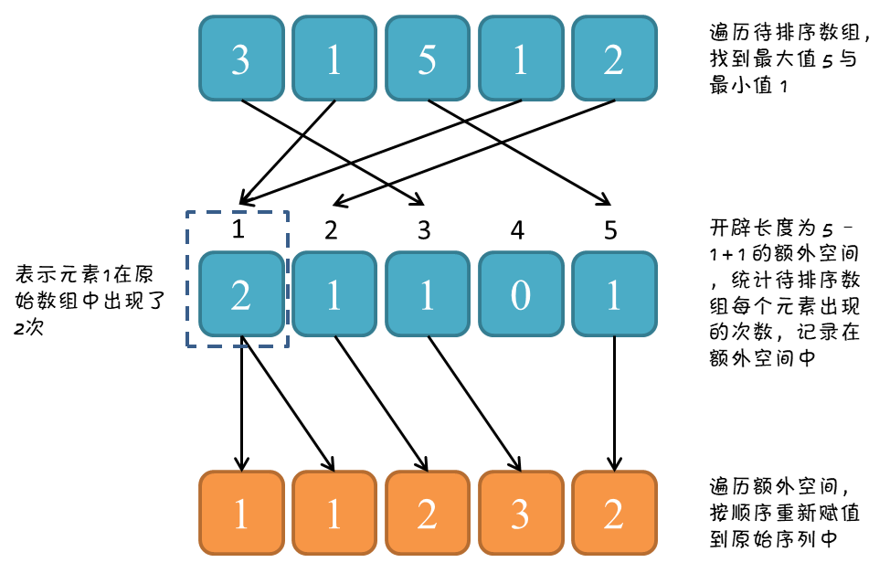
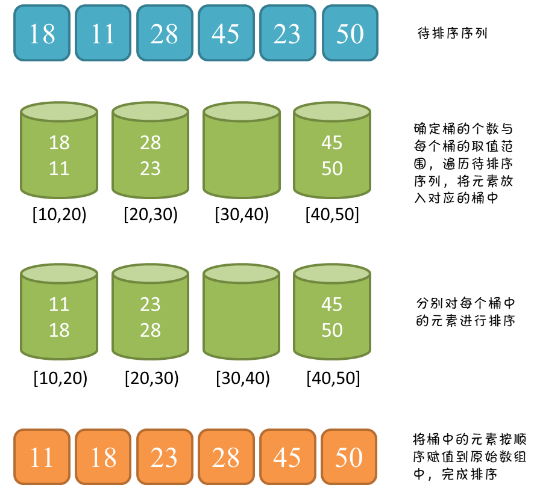
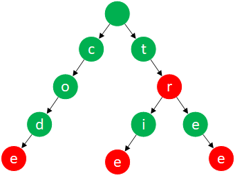

## 1. 栈

### 1.1 单调栈

介绍：栈中的元素从栈底到栈顶满足单调性。以递增栈为例，从前往后扫描（也可以从后往前扫描），如果新来元素大于（等于）栈顶元素则直接入栈，否则从栈顶开始依次将比新来元素大的元素出栈，以此来保证单调性。它常用的场景是：

* 查找前一个/后一个**更大元素**：使用**单调递减栈**
* 查找前一个/后一个**更小元素**：使用**单调递增栈**

比如，求下一个更大元素，可以把数组元素想象成并列站立的人，元素大小为身高。以 3 为例，他后面可见的第一个人是 4，也就是它的下一个更大元素。4 后面的 2 由于比 4 小，所以它会被 4 屏蔽。


应用：[496. 下一个更大元素 I](https://leetcode-cn.com/problems/next-greater-element-i/)、[503. 下一个更大元素 II](https://leetcode-cn.com/problems/next-greater-element-ii/)、[739. 每日温度](https://leetcode-cn.com/problems/daily-temperatures/)、[42.接雨水](https://leetcode-cn.com/problems/trapping-rain-water/)、[84.柱状图中最大的矩形](https://leetcode-cn.com/problems/largest-rectangle-in-histogram/)、[85.最大矩形](https://leetcode-cn.com/problems/maximal-rectangle/)

参考：[知乎](https://zhuanlan.zhihu.com/p/26465701)

```java
public class MonotonyStack {
    // 739. 每日温度：时间复杂度O(n)
    public int[] dailyTemperatures(int[] T) {
        int[] result = new int[T.length];
        // 使用单调递减栈，从前往后扫描
        Stack<Integer> stack = new Stack<>();
        
        for (int i = 0; i < T.length; i++) {
            while (!stack.isEmpty() && T[stack.peek()] < T[i]) {
                int index = stack.pop();
                result[index] = i - index;
            }
            // 由于数组具有随机访问特性，所以通常都是让数组下标入栈
            stack.push(i);
        }

        // 注意此时栈可能不为空，栈中剩余元素表示找不到下一个更大元素
        // 需要将栈内元素出栈并记录为0，由于result数组元素默认为0，所以可以不做处理
        return result;
    }
    
    // 503. 下一个更大元素II：时间复杂度O(n)
    public int[] nextGreaterElements(int[] nums) {
        int[] result = new int[nums.length];
        // 为了避免最后处理栈内剩余元素，首先进行初始化
        Arrays.fill(result, -1);

        // 使用单调递减栈，从前往后扫描
        Stack<Integer> stack = new Stack<>();
        // 由于是循环比较，所以让数组翻倍再比较
        for (int i = 0; i < nums.length * 2; i++) {
            // 取模运算是为了防止第二遍扫描时下标越界
            int current = nums[i % nums.length];
            while (!stack.isEmpty() && nums[stack.peek()] < current) {
                result[stack.pop()] = current;
            }
            // 只在第一遍扫描时，让数组下标入栈
            if (i < nums.length) {
                stack.push(i);
            }
        }

        return result;
    }
    
    // 84. 柱状图中最大的矩形：时间复杂度O(n)
    public static int largestRectangleArea4Stack(int[] heights) {
        int maxArea = 0;    // 最大矩形面积
        Stack<Integer> stack = new Stack<>();
        // 数组最后添加元素0，保证将最后一个矩形面积算上
        heights = Arrays.copyOf(heights, heights.length + 1);

        for (int i = 0; i < heights.length; i++) {
            // 当前元素 <= 栈顶元素时，计算当前元素“之前”递增元素围成的矩形面积
            while (!stack.isEmpty() && heights[stack.peek()] >= heights[i]) {
                int height = heights[stack.pop()];
                // i是右边界，stack.peek()是左边界（若栈为空，-1是左边界，此时width = i-(-1)-1 = i）
                int width = stack.isEmpty() ? i : i - stack.peek() - 1;
                maxArea = Math.max(maxArea, height * width);
            }
            stack.push(i);  // 数组下标入栈
        }

        return maxArea;
    }
}
```


## 2. 队列

### 2.1 单调队列

介绍：与单调栈类似，单调队列中的元素从头到尾满足单调性。以递增队列为例，如果新来元素大于（等于）队尾元素则直接入队，否则从队尾开始依次将比新来元素大的元素出队，以此来保证单调性。与优先队列不同，单调队列是线性结构，靠删除元素来保持单调性；而优先队列（二叉堆）是树形结构，相当于自动排序。它常用的场景是：**滑动窗口/区间的最值问题**。

应用：[239.滑动窗口最大值](https://leetcode-cn.com/problems/sliding-window-maximum/)

```java
	// 239. 滑动窗口最大值
    public static int[] maxSlidingWindow(int[] nums, int k) {
        int[] result = new int[nums.length - k + 1];
        ArrayDeque<Integer> deque = new ArrayDeque<>();

        for (int i = 0, j = 0; i < nums.length; i++) {
            // 维护窗口，向右移动时，如果左侧超出窗口，则移除队首
            // i表示窗口的最右端，i - k + 1表示窗口的最左端
            if (!deque.isEmpty() && deque.getFirst() < i - k + 1) {
                deque.removeFirst();
            }

            // 保证窗口内的值是递减的，小于新加入的值全部弹出
            while (!deque.isEmpty() && nums[deque.getLast()] < nums[i]) {
                deque.removeLast();
            }

            // 序号加入双端队列
            deque.addLast(i);
            // 获取队首最大值
            if (i >= k - 1) {
                result[j++] = nums[deque.getFirst()];
            }
        }

        return result;
    }
```


## 3. 链表

### 3.1 快慢指针

介绍：无法高效获取长度，无法根据偏移快速访问元素，是链表的两个劣势。然而面试的时候经常碰见诸如获取倒数第k个元素，获取中间位置的元素，判断链表是否存在环，判断环的长度等和长度与位置有关的问题。这些问题都可以通过灵活运用**双指针或快慢指针**来解决。

应用：[141. 环形链表]([141. 环形链表](https://leetcode-cn.com/problems/linked-list-cycle/))、[142. 环形链表 II](https://leetcode-cn.com/problems/linked-list-cycle-ii/)、[202. 快乐数](https://leetcode-cn.com/problems/happy-number/)、[面试题 02.02. 返回倒数第 k 个节点](https://leetcode-cn.com/problems/kth-node-from-end-of-list-lcci/)、[19. 删除链表的倒数第N个节点](https://leetcode-cn.com/problems/remove-nth-node-from-end-of-list/)、[876. 链表的中间结点](https://leetcode-cn.com/problems/middle-of-the-linked-list/)、[109. 有序链表转换二叉搜索树](https://leetcode-cn.com/problems/convert-sorted-list-to-binary-search-tree/)、[234. 回文链表](https://leetcode-cn.com/problems/palindrome-linked-list/)、[287. 寻找重复数](https://leetcode-cn.com/problems/find-the-duplicate-number/)

参考：[leetcode](https://leetcode-cn.com/problems/linked-list-cycle/solution/yi-wen-gao-ding-chang-jian-de-lian-biao-wen-ti-h-2/)、[环形链表II示意图](https://leetcode-cn.com/problems/linked-list-cycle-ii/solution/xiang-xi-tu-jie-ken-ding-kan-de-ming-bai-by-xixili/)


```java
public class FastSlowPointer {
    // 141. 环形链表：快慢指针破链表循环，时间复杂度O(n)，类似应用 202.快乐数
    // 思路：慢指针每次移动一步，而快指针每次移动两步
    // (1) 如果链表中不存在环，最终快指针将会最先到达尾部
    // (2) 如果链表中存在环，最终快慢指针会相遇/重合（追及问题）
    public boolean hasCycle(ListNode head) {
        ListNode slow = head;   // 慢指针
        ListNode fast = head;  // 快指针

        while (fast != null && fast.next != null) {
            slow = slow.next;
            fast = fast.next.next;
            if (slow == fast) {
                return true;
            }
        }

        return false;
    }

    // 142. 环形链表 II：给定一个链表，返回链表开始入环的第一个节点。如果链表无环，则返回 null
    // 如何查找环起始点参考上图解析。实际上当环很小时，可能会出现第一次相遇时，fast 比 slow 不止多走一圈
    // 即2(x+y) = x+y+n(z+y)，化简得x = (n-1)(z+y) + z，其中n=1,2,...。所以做法是一样的
    // 类似应用 287. 寻找重复数
    public ListNode detectCycle(ListNode head) {
        ListNode slow = head;   // 慢指针
        ListNode fast = head;  // 快指针

        while (fast != null && fast.next != null) {
            slow = slow.next;
            fast = fast.next.next;
            if (slow == fast) {
                slow = head; // 重置慢指针查找入环起始点
                while (slow != fast) {
                    slow = slow.next;
                    fast = fast.next;
                }
                return fast;
            }
        }

        return null;
    }

    // 面试题 02.02. 返回倒数第 k (k从1开始)个节点：时间复杂度O(n)
    // 思路：首先，让 fast 沿着 next 移动 k 次，使得两个指针的距离为 k
    // 然后同时移动，直到 fast 指向空，此时 slow 即指向倒数第 k 个结点
    public ListNode getKthFromEnd(ListNode head, int k) {
        ListNode fast = head;
        ListNode slow = head;
		 
        while (k > 0) {
            fast = fast.next;
            k--;
        }
		 
        while (fast != null) {
            fast = fast.next;
            slow = slow.next;
        }

        return slow;
    }

    // 876. 链表的中间结点：时间复杂度O(n)
    // 思路：快慢指针同时移动，fast 每次向后走两次，slow 每次向后走一次
    // 因此 fast 走过的距离是 slow 走过的距离的 2 倍，当 fast 走到末尾时，slow 恰号在中间
    // 当 n 为奇数时，slow 恰好指向中间结点，当 n 为偶数时，slow 恰好指向中间两个结点的靠后一个
    public ListNode getMiddleNode(ListNode head) {
        ListNode fast = head;
        ListNode slow = head;

        while (fast != null && fast.next != null) {
            slow = slow.next;
            fast = fast.next.next;
        }

        return slow;
    }
}
```

### 3.2 反转链表

```java
public class ReverseList {
    // 206. 反转链表（基础且常用）
    //  递归实现
    public ListNode reverseList4Recursion(ListNode head) {
        if (head == null || head.next == null) {
            return head;
        }

        ListNode node = reverseList4Recursion(head.next);
        // 关键，在某一时刻：1 -> 2 -> 3 -> 4 <- 5，其中3为head，4 -> null
        head.next.next = head;
        head.next = null;
        return node;
    }

    // 迭代实现
    public ListNode reverseList4Iterator(ListNode head) {
        // 哨兵节点，方便处理头结点
        ListNode dummy = new ListNode(-1);
        dummy.next = null;
        ListNode temp;

        while (head != null) {
            temp = head.next;
            head.next = dummy.next;
            dummy.next = head;
            head = temp;
        }

        return dummy.next;
    }
}
```


## 4. 数组

### 4.1 数组排序

介绍：数组排序是最常见的操作，根据算法的思想，可大致分为如下几类：

1. **交换排序**：对无序区中记录的关键字两两进行比较，若逆序则进行交换，直到关键字之间不存在逆序为止。包括**冒泡排序（了解）、快速排序（重要）**；
2. **选择排序**：在无序区中选出关键字最小的记录，置于有序区的最后，直到全部记录有序。包括**简单选择排序（了解）、堆排序（重要）**；
3. **插入排序**：将无序区中的一个记录插入至有序区，使得有序区的长度加1，直到全部记录有序。包括**直接插入排序（重要）、希尔排序（了解）**；
4. **归并排序（重要）**：使用分治思想，不断将两个或两个以上有序区合并成一个有序区，直到全部记录有序；
5. **非比较排序（了解）**：使用哈希的思想，由数值映射地址，即一个数该放在哪里，是由这个数本身的大小决定的，它不需要经过比较，包括**计数排序、基数排序、桶排序**。适用场景不多，因为**要保证输入数组的每个元素都在一个合理的范围内**。

参考：[leetcode](https://leetcode-cn.com/problems/sort-an-array/solution/fu-xi-ji-chu-pai-xu-suan-fa-java-by-liweiwei1419/)


#### 4.1.1 冒泡排序

```java
	// 冒泡排序：时间复杂度O(n^2)，空间复杂度O(1)
    public static void bubbleSort(int[] nums) {
        for (int i = nums.length - 1; i > 0; i--) {
            // 本趟冒泡是否发生交换，加快排序
            boolean isSwap = false;
            for (int j = 0; j < i; j++) {
                // 相邻数进行比较，小数上浮，大数沉底
                if (nums[j] > nums[j + 1]) {
                    int temp = nums[j];
                    nums[j] = nums[j + 1];
                    nums[j + 1] = temp;
                    isSwap = true;
                }
            }

            if (!isSwap) {
                break;	// 本趟未发生交换，说明已经有序
            }
        }
    }
```


#### 4.1.2 快速排序

```java
	// 快速排序:时间复杂度O(nlogn)，空间复杂度O(nlogn)
    public static void quickSort(int[] nums) {
        QSort(nums, 0, nums.length - 1);
    }

    private static void QSort(int[] nums, int start, int end) {
        if (start < end) {
            int pivotLoc = partition(nums, start, end);    // 枢纽位置已就绪
            QSort(nums, start, pivotLoc - 1);    // 对枢纽之前的子序列递归排序
            QSort(nums, pivotLoc + 1, end);  // 对枢纽之后的子序列递归排序
        }
    }

    // 对子序列nums[low..high]进行一次划分，并返回枢轴所处的位置
    // 使得枢纽之前的数字均不大于枢纽值，枢纽之后的数字均不小于枢纽值
    private static int partition(int[] nums, int low, int high) {
        int pivot = nums[low];    // 枢纽选择第一个值

        while (low < high) {    // 从两端交替向中间移动
            while (low < high && nums[high] >= pivot) high--;
            nums[low] = nums[high];
            while (low < high && nums[low] <= pivot) low++;
            nums[high] = nums[low];
        }

        nums[low] = pivot;  //枢纽返回正确位置
        return low; // 返回枢纽位置
    }
```


#### 4.1.3 选择排序

```java
	// 选择排序：时间复杂度O(n^2)，空间复杂度O(1)
    public static void selectSort(int[] nums) {
        for (int i = 0; i < nums.length - 1; i++) {
            int minIndex = i;
            for (int j = i + 1; j < nums.length; j++) {
                if (nums[j] < nums[minIndex]) {
                    minIndex = j;
                }
            }

            int temp = nums[i];
            nums[i] = nums[minIndex];
            nums[minIndex] = temp;
        }
    }
```


#### 4.1.4 堆排序


#### 4.1.5 插入排序

```java
	// 插入排序：时间复杂度O(n^2)，空间复杂度O(1)
    public static void insertSort(int[] nums) {
        for (int i = 1; i < nums.length; i++) {
            int temp = nums[i]; // 暂存该元素
            int j = i;
            while (j > 0 && nums[j - 1] > temp) {
                nums[j] = nums[j - 1];  // 记录后移
                j--;
            }
            nums[j] = temp; // 插入
        }
    }
```


#### 4.1.6 希尔排序

```java
	// 希尔排序：时间复杂度O(nlogn)，空间复杂度O(1)
    public static void shellSort(int[] nums) {
        int dk = 1; // dk为增量
        // 使用Knuth增量序列，找增量的最大值
        while (3 * dk + 1 < nums.length) {
            dk = 3 * dk + 1;
        }

        while (dk >= 1) {
            shellInsert(nums, dk);
            dk /= 3;
        }
    }

    // 一趟希尔排序，增量dk，与直接插入排序类似
    private static void shellInsert(int[] nums, int dk) {
        for (int i = 0; i < nums.length - dk; i++) {
            int temp = nums[i + dk]; // 暂存该元素
            int j = i + dk;
            while (j - dk >= 0 && nums[j - dk] > temp) {
                nums[j] = nums[j - dk];  // 记录后移
                j -= dk;
            }
            nums[j] = temp; // 插入
        }
    }
```


#### 4.1.7 归并排序

```java
	// 归并排序（分治思想）：时间复杂度O(nlogn)，空间复杂度O(n)
    public static void mergeSort(int[] nums) {
        int[] temp = new int[nums.length];  // 辅助空间
        MSort(nums, temp, 0, nums.length - 1, 0);
    }

    // 若step为奇数，则排序后记录存入temp，否则仍存入nums
    private static void MSort(int[] nums, int[] temp, int start, int end, int step) {
        // 求解子问题
        if (start == end) {
            if (step % 2 == 1) {
                temp[start] = nums[start];
            }
        } else {
            // 分解子问题
            int middle = (start + end) / 2;
            MSort(nums, temp, start, middle, step + 1);
            MSort(nums, temp, middle + 1, end, step + 1);
            // 合并子问题
            if (step % 2 == 1) {  // 将nums合并，结果存入temp
                Merge(nums, temp, start, middle, end);
            } else { // 将temp合并，结果存入nums
                Merge(temp, nums, start, middle, end);
            }
        }
    }

    // 将相邻的有序区间nums[start...middle]和nums[middle+1...end]合并为有序的temp[start...end]
    private static void Merge(int[] src, int[] dest, int start, int middle, int end) {
        int i = start, j = middle + 1, k = start;

        while (i <= middle && j <= end) {
            if (src[i] <= src[j]) {
                dest[k++] = src[i++];
            } else {
                dest[k++] = src[j++];
            }
        }

        while (i <= middle) {
            dest[k++] = src[i++];
        }
        while (j <= end) {
            dest[k++] = src[j++];
        }
    }
```


#### 4.1.8 计数排序



```java
	// 计数排序：时间复杂度O(n+k)，空间复杂度O(k)
    public static void countingSort(int[] nums) {
        // 计算数组中的最大值和最小值，若事先已明确，可直接赋值
        int max = Integer.MIN_VALUE;
        int min = Integer.MAX_VALUE;
        for (int num : nums) {
            max = Math.max(max, num);
            min = Math.min(min, num);
        }

        // 根据数值范围确定中间数组的长度，默认初始化为0
        int[] count = new int[max - min + 1];
        // 统计原始数组中元素出现的频率，放入中间数组
        for (int num : nums) {
            count[num - min] += 1;
        }

        // 根据中间数组得到排序结果，i对应数值，j对应频率
        int index = 0;
        for (int i = 0; i < count.length; i++) {
            for (int j = 0; j < count[i]; j++) {
                nums[index++] = i + min;
            }
        }
    }
```


#### 4.1.9 基数排序

介绍：透过键值的部份资讯，将要排序的元素分配至某些“桶”中，藉以达到排序的作用

```java

```


#### 4.1.10 桶排序

介绍：计数排序是桶排序的一种，普通的计数排序相当于极端情况下每个桶的区间大小是 1 ，而桶排序不是这种极端情况，每个桶的区间大小相等，但依然是遍历元素对号入座（放入对应的区间里）。桶排序的重点就在于，如何规划桶区间的大小和个数，使尽可能少的桶去覆盖所有的元素。



```java
	// 桶排序：时间复杂度O(n+k)，空间复杂度O(n+k)
    public static void bucketSort(int[] nums) {
        // 计算数组中的最大值和最小值，若事先已明确，可直接赋值
        int max = Integer.MIN_VALUE;
        int min = Integer.MAX_VALUE;
        for (int num : nums) {
            max = Math.max(max, num);
            min = Math.min(min, num);
        }

        // 根据数值范围确定桶的数量，每个桶放入一定范围的数字
        int bucketNum = (max - min) / nums.length + 1;
        List<List<Integer>> buckets = new ArrayList<>(bucketNum);
        for (int i = 0; i < bucketNum; i++) {
            buckets.add(new ArrayList<>());
        }

        // 将原始数组中的元素放入对应的桶中，然后对每个桶分别排序
        for (int num : nums) {
            int index = (num - min) / nums.length;
            buckets.get(index).add(num);
        }
        for (List<Integer> bucket : buckets){
            Collections.sort(bucket);
        }

        // 根据桶得到排序结果
        int index = 0;
        for (List<Integer> bucket : buckets) {
            for (Integer integer : bucket) {
                nums[index++] = integer;
            }
        }
    }
```


### 4.2 找第 K 个最小元素

介绍：快排本身时间复杂度为 O(nlogn)，但是用于查找数组中第 K 个最小元素只需要O(n)。原因是我们是要找下标为 k 的元素，第一次切分的时候需要遍历整个数组(0 ~ n)找到了下标是 i 的元素，假如 k 比 i 小，那么我们下次切分只需要遍历数组(0~k-1)的元素，反之如果 k 比 i 大，那下次切分只需要遍历数组(k+1～n)的元素。总之可以看作每次划分遍历的元素数目都是上一次遍历的1/2，因此时间复杂度是n + n/2 + n/4 + ... + n/n = 2n，因此时间复杂度是O(n)。

应用：[215. 数组中的第K个最大元素](https://leetcode-cn.com/problems/kth-largest-element-in-an-array/)、[169. 多数元素](https://leetcode-cn.com/problems/majority-element/)

```java
	// 使用快排查找第k小（k从0开始）的元素：时间复杂度O(n)
    public int searchSmallKImprove(int[] nums, int k) {
        // 使用随机函数选取枢纽值，避免最坏情况
        Random random = new Random();
        int low = 0, high = nums.length - 1;

        while (low < high) {
            int i = low, j = high;
            // 在low和high间随机选取一个数ran，交换low和ran的数值（若不使用随机，可直接去掉下面两行）
            int ran = low + random.nextInt(high - low);
            swap(nums, low, ran);
            int t = nums[i];    // 记录枢纽值，实际上是nums[ran]

            while (i < j)    // 从两端交替向中间移动
            {
                while (i < j && nums[j] >= t) j--;
                nums[i] = nums[j];
                while (i < j && nums[i] <= t) i++;
                nums[j] = nums[i];
            }
            nums[i] = t;    // 枢纽返回正确位置

            if (i == k) {
                return nums[i];
            } else if (i < k) {
                low = i + 1;
            } else {
                high = i - 1;
            }
        }

        return nums[low];
    }

    private void swap(int[] nums, int i, int j) {
        int t = nums[i];
        nums[i] = nums[j];
        nums[j] = t;
    }
```

### 4.3 前缀和

介绍：涉及**连续子数组**的问题，我们通常有两种思路：**一是滑动窗口、二是前缀和+哈希表**。假设使用 sum[i] 表示数组 A[] 的前 i 项和，即 `sum[i] = A[0] + A[1] + ... + A[i]`。则连续子数组 **`A[i] + ... + A[j] = sum[j] - sum[i - 1],其中i >= 1`**，为了上式能满足前缀和本身的情况（即 i = 0），我们**人为规定 `sum[-1] = 0`**。特别的，当 j = i 时，数组中的某项 `A[i] = sum[i] - sum[i - 1]`。

应用：[974. 和可被 K 整除的子数组](https://leetcode-cn.com/problems/subarray-sums-divisible-by-k/)、[560. 和为K的子数组](https://leetcode-cn.com/problems/subarray-sum-equals-k/)、[1248. 统计「优美子数组」](https://leetcode-cn.com/problems/count-number-of-nice-subarrays/)

参考：[leetcode](https://leetcode-cn.com/problems/subarray-sums-divisible-by-k/solution/you-jian-qian-zhui-he-na-jiu-zai-ci-dai-ni-da-tong/)

```java
public class ContinuousSubarray {
    // 560. 和为K的子数组：时间复杂度O(n)，空间复杂度O(n)
    // 设数组前n项和为sum[n]，则对于连续子数组nums[i~j] = k = sum[j] - sum[i-1]
    // 即：sum[i-1] = sum[j] - k，于是map中每次加入sum[j]前判断是否存在sum[i-1]
    public int subarraySum(int[] nums, int k) {
        // key为前缀和，value为该前缀和出现的次数
        Map<Integer, Integer> map = new HashMap<>();
        map.put(0, 1);  // 初始化前缀和0，次数为1
        int sum = 0, result = 0;

        for (int num : nums) {
            sum += num;
            // map最初加入了一次，这里先判断后加入。如果先加入后判断，当nums={1}、k=0时不满足
            if (map.containsKey(sum - k))
                result += map.get(sum - k);
            map.put(sum, map.getOrDefault(sum, 0) + 1);
        }

        return result;
    }

    // 974. 和可被 K 整除的子数组：时间复杂度O(n)，空间复杂度O(min(n, k))
    // 如果两个数的差能被K整除，说明这两个数 mod K得到的结果相同，于是只要从余数相同的数中选2个组合即可
    public int subarraysDivByK(int[] A, int K) {
        // key为余数，value为该余数出现的次数
        HashMap<Integer, Integer> map = new HashMap<>();
        map.put(0, 1);  // 初始化，前缀和本身被K整除的情况

        int sum = 0;
        for (int num : A) {
            sum += num;
            // 注意取模的特殊性:当被除数为负数时取模结果为负数，需要纠正
            int reminder = (sum % K + K) % K;
            map.put(reminder, map.getOrDefault(reminder, 0) + 1);
        }


        int result = 0;
        // 求组合数C(n, 2) = n! / 2!(n-2)! = n(n-1) / 2
        for (Map.Entry<Integer, Integer> entry : map.entrySet()) {
            result += entry.getValue() * (entry.getValue() - 1) / 2;
        }
        return result;
    }
}
```


### 4.4 二分查找


## 5. 树

### 5.1 前缀树/字典树

介绍：字典树又名前缀树、Trie（发音[traɪ]）树，是一种存储大量字符串的树形数据结构，相比于HashMap存储，在存储单词（和语种无关，任意语言都可以）的场景上，节省了大量的内存空间。

应用：搜索自动补全、拼写检查、IP路由（最长前缀匹配）、单词游戏

参考：[leetcode](https://leetcode-cn.com/problems/implement-trie-prefix-tree/solution/shi-xian-trie-qian-zhui-shu-by-leetcode/)

如下图所示，包含4个单词：code、tr、tree、trie，红色表示单词结束。



```java
// 前缀树
public class TrieTree {
    private TrieNode root;  // 根节点

    public TrieTree() {
        root = new TrieNode();
    }

    // 在前缀树中插入新单词：时间复杂度O(m),空间复杂度O(m)，m为键长
    public void insert(String word){
        TrieNode currentNode = root;    // 从根节点开始
        for(int i = 0; i < word.length(); i++){
            char ch = word.charAt(i);
            if(!currentNode.containsKey(ch)){
                // 子节点数组中不包含指定字符，则新建该字符节点
                currentNode.setTrieNode(ch, new TrieNode());
            }
            currentNode = currentNode.get(ch);  // 更新当前节点
        }
        currentNode.setEnd();  // 设置单词结束标志
    }

    // 判断指定单词是否在前缀树中：时间复杂度O(m),空间复杂度O(1)
    public boolean search(String word){
        TrieNode trieNode = searchPrefix(word);
        return trieNode != null && trieNode.isEnd();
    }

    // 判断指定前缀是否在前缀树中：时间复杂度O(m),空间复杂度O(1)
    public boolean startsWith(String prefix){
        return searchPrefix(prefix) != null;
    }

    // 在前缀中搜索前缀或整个键，并返回搜索结束时的节点
    private TrieNode searchPrefix(String word){
        TrieNode currentNode = root;
        for(int i = 0; i < word.length(); i++){
            char ch = word.charAt(i);
            if(currentNode.containsKey(ch)){
                currentNode = currentNode.get(ch);
            }else {
                return null;
            }
        }
        return currentNode;
    }
}

// 字符节点
class TrieNode {
    private final int R = 26;   // 26个英文字母
    private TrieNode[] children;    // 子节点数组
    private boolean isEnd; // 单词结束标志（不一定是叶子节点）

    public TrieNode() {
        isEnd = false;
        children = new TrieNode[R];
    }

    // 判断子节点数组中是否包含指定字符
    public boolean containsKey(char ch){
        return children[ch - 'a'] != null;
    }

    // 在子节点数组中设置新字符
    public void setTrieNode(char ch, TrieNode trieNode){
        children[ch - 'a'] = trieNode;
    }

    // 从子节点数组中获取字符
    public TrieNode get(char ch){
        return children[ch - 'a'];
    }

    // 判断当前节点是否单词结束
    public boolean isEnd() {
        return isEnd;
    }

    // 将当前节点设置为单词结束
    public void setEnd() {
        isEnd = true;
    }
}
```

### 5.2 线段树


### 5.3 红黑树


### 5.4 二叉树的遍历

介绍：遍历是二叉树的一类最常见且重要的操作，也是二叉树其它一些操作和各种应用算法的基本框架。其中前序、中序、后序遍历类似于深度优先遍历，需要栈的辅助；而层次遍历类似于广度优先遍历，需要队列的辅助。

```java
// 前序、中序、后序遍历（递归/迭代）、层次遍历
public class TraverseTree {
    // 94. 二叉树的中序遍历（递归实现）：前序遍历、后序遍历的递归类似
    public List<Integer> inorderTraversal4Recursion(TreeNode root) {
        List<Integer> list = new LinkedList<>();
        inorder(list, root);
        return list;
    }

    private void inorder(List<Integer> list, TreeNode root) {
        if (root == null) {
            return;     // 递归出口
        }

        inorder(list, root.left);
        list.add(root.val);
        inorder(list, root.right);
    }

    // 94. 二叉树中序遍历（迭代实现）：左中右
    public List<Integer> inorderTraversal4Iterator(TreeNode root) {
        List<Integer> list = new LinkedList<>();

        Stack<TreeNode> stack = new Stack<>();
        goFarLeft(root, stack);

        while (!stack.isEmpty()) {
            // 左边节点在上一次循环中被访问
            TreeNode node = stack.pop();
            // 访问中间节点
            list.add(node.val);
            // 访问右边节点
            goFarLeft(node.right, stack);
        }

        return list;
    }

    // 从根节点出发，沿左分支走到底，沿途节点入栈
    private void goFarLeft(TreeNode root, Stack<TreeNode> stack) {
        while (root != null) {
            stack.push(root);
            root = root.left;
        }
    }

    // 144. 二叉树的前序遍历（迭代实现）：中左右
    public List<Integer> preorderTraversal(TreeNode root) {
        if (root == null) {
            return new LinkedList<>();
        }

        List<Integer> list = new LinkedList<>();
        Stack<TreeNode> stack = new Stack<>();
        stack.push(root);

        while (!stack.isEmpty()) {
            TreeNode node = stack.pop();
            list.add(node.val); // 访问中间节点
            // 先让右子树入栈，然后左子树入栈，这样出栈时左子树在前，右子树在后
            if (node.right != null) {
                stack.push(node.right);
            }
            if (node.left != null) {
                stack.push(node.left);
            }
        }

        return list;
    }


    // 145. 二叉树的后序遍历（迭代实现）：左右中
    // 思路：逆后序为：中右左，与先序遍历的区别在于调换左右子树
    public List<Integer> postorderTraversal(TreeNode root) {
        if (root == null) {
            return new LinkedList<>();
        }

        LinkedList<Integer> list = new LinkedList<>();
        Stack<TreeNode> stack = new Stack<>();
        stack.push(root);

        while (!stack.isEmpty()) {
            TreeNode node = stack.pop();
            list.addFirst(node.val); // 从集合头部加入中间节点

            // 先让左子树入栈，然后右子树入栈，这样出栈时右子树在前，左子树在后
            if (node.left != null) {
                stack.push(node.left);
            }
            if (node.right != null) {
                stack.push(node.right);
            }
        }

        return list;
    }

    // 102. 二叉树的层序遍历：使用队列
    public List<Integer> levelOrderTraversal(TreeNode root) {
        if (root == null) {
            return new LinkedList<>();
        }

        List<Integer> list = new LinkedList<>();
        Queue<TreeNode> queue = new LinkedList<>();
        queue.add(root);    // 根节点入队

        while (!queue.isEmpty()) {
            TreeNode t = queue.remove();
            list.add(t.val);
            if (t.left != null) {
                queue.add(t.left);  // 左孩子入队
            }
            if (t.right != null) {
                queue.add(t.right); // 右孩子入队
            }
        }

        return list;
    }
}
```


## 6. 堆

### 6.1 求前 K 个最大（最小）元素

介绍：堆排序本身时间复杂度为 O(nlogn)，但是用于求数组中前 K 个最大（最小）元素只需要 O(nlogk)，这里需要注意的是，**求前 K 个最大元素用小顶堆，求前 K 个最小元素用大顶堆**。假设现在要求前 K 个最大元素，如果使用大顶堆，需要将所有元素（n个）压入堆，此时前 K 个堆顶节点就是所求结果，但是这种方式不仅复杂度较高O(nlogn)，而且浪费内存，无法处理海量元素。而如果使用小顶堆，只需要维护堆的大小不超过 K 即可，每次压入堆前检查堆大小是否超过 K，如果超过则弹出堆顶，复杂度为 O(nlogk)。

应用：[347. 前 K 个高频元素](https://leetcode-cn.com/problems/top-k-frequent-elements/)、[692. 前K个高频单词](https://leetcode-cn.com/problems/top-k-frequent-words/)

```java
public class TopKElements {
    // 692. 前K个高频单词：时间复杂度O(nlogk)，空间复杂度O(n)
    public List<String> topKFrequent(String[] words, int k) {
        // 遍历一遍数组统计单词的频率，使用hashMap存储
        HashMap<String, Integer> map = new HashMap<>();
        for (String word : words) {
            map.put(word, map.getOrDefault(word, 0) + 1);
        }

        // 遍历hashMap，用"小顶堆"保存频率最大的k个单词
        PriorityQueue<String> heap = new PriorityQueue<>((s1, s2) -> {
            // 注意相同频率下，字母顺序高的在前
            if (!map.get(s1).equals(map.get(s2))) {
                return map.get(s1) - map.get(s2);
            } else {
                // String对象按字典顺序排列在参数字符串之前，结果为负
                return s2.compareTo(s1);
            }
        });
        
        for (String key : map.keySet()) {
            heap.add(key);
            if (heap.size() > k) {
                heap.poll();
            }
        }

        // 取出最小堆中的单词,逆序插入
        LinkedList<String> result = new LinkedList<>();
        while (!heap.isEmpty()) {
            result.addFirst(heap.poll());
        }
        return result;
    }
}
```


## 7. 森林

### 7.1 并查集

介绍：在集合的一些应用中，需要**将 n 个不同的元素划分为若干等价子集**。这类问题的一种解决方法是，**首先令每个元素自成一个单元素集合，然后将等价的元素所属的集合合并**，并查集适合描述这类问题。

并查集（Union Find Sets）是指由**不相交的子集**所构成的集合，每个子集选取某个元素作为其标识，称为**代表元**。约定在存储 m 个数据元素前，需要对所有元素进行 0 到 m-1 编号，并用编号表示对应的元素。并查集通常需要以下两种操作：

* **查找（Find）操作**：查找某个元素所属的子集
* **合并（Union）操作**：合并两个元素所属的子集

为了高效实现上述操作，可用森林来表示并查集，森林中的每棵树表示并查集中的一个子集，树中的每个节点表示子集中的一个元素，根节点作为代表元。为操作方便，节点应含有指向其双亲节点的位标。如下图所示，并查集 S = {S<sub>1</sub>, S<sub>2</sub>, S<sub>3</sub>} 的森林表示，其中 S<sub>1</sub> = {1, 2, 4, 7}，S<sub>2</sub> = {3, 5, 8}，S<sub>3</sub> = {0, 6}。并查集的存储采用森林的**双亲表示法**，双亲数组 parents 的下标表示元素，数组存储对应的双亲节点位序，当为 -1 时，表示树的根节点。


应用：[990. 等式方程的可满足性](https://leetcode-cn.com/problems/satisfiability-of-equality-equations/)、[547. 朋友圈](https://leetcode-cn.com/problems/friend-circles/)、[684. 冗余连接](https://leetcode-cn.com/problems/redundant-connection/)、[685. 冗余连接 II](https://leetcode-cn.com/problems/redundant-connection-ii/)

```java
public class UFSet {
    // 990. 等式方程的可满足性
    public boolean equationsPossible(String[] equations) {
        // 26个字母，每个字母自成一个元素集合
        int[] parents = new int[26];
        Arrays.fill(parents, -1);

        // 先处理等式方程，进行合并操作，此时不会有冲突
        for (String equation : equations) {
            if (equation.charAt(1) == '=') {
                int i = equation.charAt(0) - 'a';
                int j = equation.charAt(3) - 'a';
                union(parents, i, j);
            }
        }

        // 再处理不等于方程，进行查找操作，判断是否冲突
        for (String equation : equations) {
            if (equation.charAt(1) == '!') {
                int i = equation.charAt(0) - 'a';
                int j = equation.charAt(3) - 'a';
                if (find(parents, i) == find(parents, j)) {
                    return false;
                }
            }
        }

        return true;
    }

    // 查找操作：查找元素i在并查集中所属的子集，返回其代表元
    private int find(int[] parents, int i) {
        // 沿双亲位标链找到根节点
        while (parents[i] >= 0) {
            i = parents[i];
        }
        return i;
    }

    // 合并操作：合并并查集中元素i和j所属的两个子集
    private boolean union(int[] parents, int i, int j) {
        // 查找元素i和j所在树的根节点
        int pi = find(parents, i);
        int pj = find(parents, j);
        // i和j属于同一子集，无需合并，若合并会更改已有双亲节点，导致出错
        if (pi == pj) {
            return false;
        }
        // 把根节点pi的双亲节点值置为pj，实现合并
        parents[pi] = pj;
        return true;
    }
}
```

**补充**：合并操作所需时间主要取决于查找长度，即树的高度。有两种改进方法可降低树的高度：**加权合并规则法（weighted union rule）**和**路径压缩法(path compression)**。相比之下，路径压缩法更为高效，它在查找节点所在树的根节点的过程中，置查找路径上的每个节点的双亲位标值都为根节点。如下图所示，在查找元素 4 所在树的根节点，查找路径为 4 -> 7 -> 6 -> 3。查找结束后，4、7、6 的双亲位标值都等于3。


```java
    // 采用路径压缩法的查找操作
    private int findPC(int[] parents, int i) {
        // 找到根节点
        if (parents[i] < 0) {
            return i;
        }
        // i的双亲节点置为根节点
        parents[i] = findPC(parents, parents[i]);
        return parents[i];
    }
```


## 8. 图

### 8.1 BFS 与 DFS


### 8.2 拓扑排序

介绍：为一组任务制定进度计划，比如课程或建筑任务，**任务之间通常存在一定的次序关系**，必须在一些任务完成之后才能开始另一些任务，那么对于整个任务，**如何以某种线性的顺序组织这些任务**。这类问题适合使用有向无环图建模，**有向无环图（DAG）**是指不存在回路的有向图。在 DAG 中，将所有顶点在不违反前后次序关系的前提下排成的序列称为**拓扑序列**，构造拓扑序列的过程称为**拓扑排序**。

因此**拓扑排序可解决有向图的回路问题，如果是无向图，可以使用并查集来解决**。对于任一一个有向图，其拓扑排序过程为：

1. 在图中任意选取一个入度为 0 的顶点，并输出；
2. 删除该顶点及其所引出的边；
3. 重复上述两步，直到图中不存在入度为 0 的顶点。此时若图中所有顶点均已输出，则输出序列为拓扑序列；否则图中存在回路，拓扑排序失败。

应用：[207. 课程表](https://leetcode-cn.com/problems/course-schedule/)、[210. 课程表 II](https://leetcode-cn.com/problems/course-schedule-ii/)

```java
public class TopologicalSort {
    // 210. 课程表 II：时间复杂度O(n+e)
    public int[] findOrder(int numCourses, int[][] prerequisites) {
        // 1.根据边的关系来构造图（邻接表结构）
        List<Integer>[] graph = new ArrayList[numCourses];
        // 不能使用Arrays.fill(graph, new ArrayList<>());
        // 查看源码可知，只会生成一个ArrayList对象，然后所有graph[i]都指向同一个list
        for (int i = 0; i < numCourses; i++) {
            graph[i] = new ArrayList<>();
        }
        // 2.创建入度表
        int[] inDegree = new int[numCourses];
        // 初始化邻接表和入度表
        for (int[] p : prerequisites) {
            inDegree[p[0]]++;
            graph[p[1]].add(p[0]);
        }

        // 3.入度为0的节点入队
        Queue<Integer> queue = new LinkedList<>();
        for (int i = 0; i < numCourses; i++) {
            if (inDegree[i] == 0) {
                queue.offer(i);
            }
        }

        // 4.bfs求解
        int i = 0;
        int[] result = new int[numCourses];
        while (!queue.isEmpty()) {
            int element = queue.poll();
            result[i++] = element;
            numCourses--;
            // 将element相邻的顶点入度减1，若入度为0则入队
            for (int num : graph[element]) {
                if (--inDegree[num] == 0) {
                    queue.offer(num);
                }
            }
        }

        return numCourses == 0 ? result : new int[0];
    }
}
```


