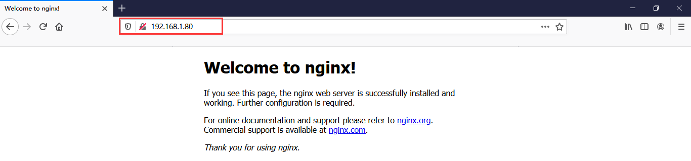
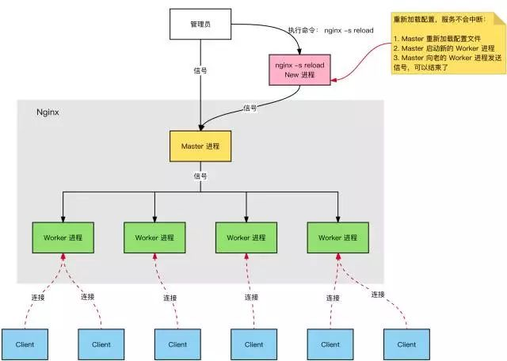
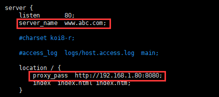
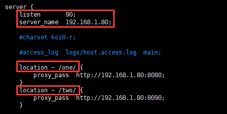
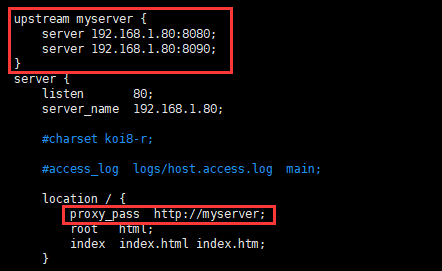
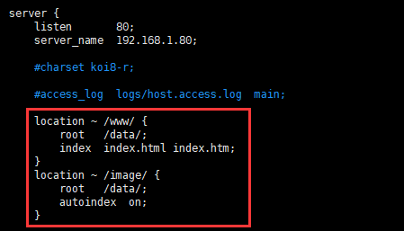
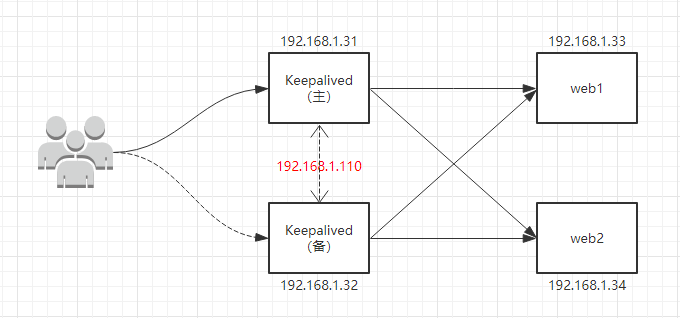
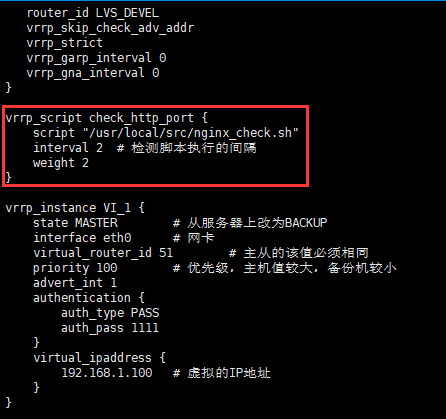

## 1. Nginx 简介与安装

### 1.1 Nginx 简介

Nginx 是一个高性能的 HTTP 和反向代理服务器，特点是占用内存少，并发能力强。在高连接并发的情况下，Nginx 是 Apache 服务器不错的替代品。

### 1.2 Nginx 安装

1. **安装依赖**

   * `yum -y install gcc pcre-devel zlib zlib-devel openssl openssl-devel`

2. **安装 Nginx**

   * `wget -c http://nginx.org/download/nginx-1.19.1.tar.gz`：具体版本可以访问[官网](http://nginx.org/)获取链接
   * `tar -xzvf nginx-1.19.1.tar.gz`
   * `cd nginx-1.19.1`
   * `./configure`
   * `make && make install`

3. **开放80端口**

   * `firewall-cmd --add-por=80/tcp --permanent`
   * `firewall-cmd --reload`
   * `firewall-cmd --list-port`

4. **启动测试**

   * `cd /usr/local/nginx/sbin`
   * `./nginx`：启动nginx命令
   
   > `./nginx -s stop`：关闭命令
   >
   > `./nginx -s reload`：重启命令
   
   * 浏览器访问：IP地址
   
   

   

### 1.3 Nginx 配置文件

Nginx 默认配置文件都位于 conf 目录下，主配置文件 nginx.conf 也在其中，去掉注释后内容精简如下。我们将其分为 3 部分：**全局块、events 块、http 块**。

1. **全局块**：主要设置一些影响 Nginx 服务器整体运行的配置指令，包括配置运行 Nginx 服务器的用户(组)，允许生成的 worker process 数，进程 PID 存放路径，日志存放路径和类型以及配置文件的引入等。

2. **events 块**：主要设置一些影响 Nginx 服务器与用户的网络连接，包括是否开启对多 work process下的网络连接进行序列化，是否允许同时接收多个网络连接，选取哪种事件驱动模型来处理连接请求，每个 word process 可以同时支持的最大连接数等。
3. **http 块**：配置最频繁的部分，代理、 缓存和日志定义等绝大多数功能和第三方模块的配置都在这里。它又包括 http 全局块、server 块。
   * http 全局块：包括文件引入、MIME-TYPE 定义、日志自定义、连接超时时间、单链接请求数上限等。
   * server 块：每个 http 块可以包括多个 server 块，而每个 server 块就相当于一个虚拟主机。

```shell
# 全局块
worker_processes  1;	# 该值越大，支持的并发处理量就越多，但会受到软硬件等设备的制约

# events块
events {
    worker_connections  1024;	# 每个work支持最大连接数为1024
}

# http块
http {
	# http全局块
    include       mime.types;
    default_type  application/octet-stream;
    sendfile        on;
    keepalive_timeout  65;

	# server块
    server {
    	# 最常见的配置：IP和端口配置
        listen       80;
        server_name  localhost;

		# 一个server可以配置多个location块
		# 用于对特定的请求进行处理：地址定向、数据缓存和应答控制等
        location / {
            root   html;
            index  index.html index.htm;
        }

        error_page   500 502 503 504  /50x.html;
        location = /50x.html {
            root   html;
        }
    }
}
```

### 1.4 Nginx 工作原理

Nginx 的进程模型采用 Master/Worker 形式：当 Nginx 启动时，会先创建一个 Master 进程，Master 进程会 fork 出若干个 Worker 子进程（具体是多少个子进程可以在 Nginx 的配置文件中来配置）。

* Master 进程的作用：接收外界信号（如重载配置等），传递给 Worker 进程；监听 Worker 进程的运行状态，负责 Worker 进程的创建和销毁；

* Worker进程的作用：处理 Master 进程传递过来的信号；处理网络事件，比如客户端请求。



一个 Master 进程管理多个 Worker 进程的好处：

* 可以使用 `./nginx -s reload` 进行 Nginx 的热部署操作
* 每个 Worker 是独立的进程，如果有其中的一个出现问题，其他 Worker 会继续进行争抢，实现请求过程，不会造成服务中断

Worker 数和服务器的 CPU 数相等是最为适宜的。当客户端发送请求时，会占用了 Worker 的2个（静态请求）或4个（动态请求）连接数。


## 2. Nginx 反向代理

### 2.1 正向代理与反向代理

**正向代理**类似一个跳板机，代理访问外部资源。比如我们国内访问谷歌，直接访问访问不到，我们可以通过一个正向代理服务器，请求发到代理服，代理服务器能够访问谷歌，这样由代理去谷歌取到返回数据，再返回给我们，这样我们就能访问谷歌了。

**正向代理的作用**：访问原来无法访问的资源，如google；可以做缓存，加速访问资源；对客户端访问授权，上网进行认证；代理可以记录用户访问记录（上网行为管理），对外隐藏用户信息。


**反向代理**不需要客户端进行任何配置（无感知的），它的运行方式是以代理服务器来接受 internet 上的连接请求，然后将请求转发给内部网络上的服务器，并将从服务器上得到的结果返回给 internet 上请求连接的客户端。此时**代理服务器和目标服务器对外就表现为一个服务器**，暴露的是代理服务器地址，隐藏了真实服务器的地址。

**反向代理的作用**：保证内网的安全，阻止 web 攻击，大型网站通常将反向代理作为公网访问地址，Web服务器是内网；负载均衡，通过反向代理服务器来优化网站的负载。


**总结：正向代理即是客户端代理，代理客户端，服务端不知道实际发起请求的客户端；反向代理即是服务端代理，代理服务端，客户端不知道实际提供服务的服务端。**

### 2.2 反向代理实例一

**实现效果**

打开浏览器，在浏览器地址栏中输入：www.abc.com，跳转到 Linux 系统的 Tomcat 主页面中。

**实现过程**

1. **安装 Tomcat**

   * `yum install -y java-1.8.0-openjdk-devel.x86\_64`：下载 JDK

   * `java -version`：查看 JDK 版本

   * `cd /usr/local/`

   * `mkdir tomcat && cd tomcat`

   * `wget -c https://mirrors.bfsu.edu.cn/apache/tomcat/tomcat-8/v8.5.56/bin/apache-tomcat-8.5.56.tar.gz`：下载 Tomcat

   * `tar -xzvf apache-tomcat-8.5.56.tar.gz`：解压

   * `cd /etc/init.d/`

   * `vim tomcat`：配置 Tomcat 以 service 方式启动

     ```shell
     #!/bin/bash
     # 描述: 配置Tomcat以service方式启动
     # 注意：JAVA_HOME和CATALINA_HOME修改为对应版本的目录
     JAVA_HOME=/usr/lib/jvm/java-1.8.0-openjdk-1.8.0.252.b09-2.el7_8.x86_64
     export JAVA_HOME
     PATH=$JAVA_HOME/bin:$PATH
     export PATH
     CATALINA_HOME=/usr/local/tomcat/apache-tomcat-8.5.56
     
     case $1 in
     start)
     sh $CATALINA_HOME/bin/startup.sh
     ;;
     stop)
     sh $CATALINA_HOME/bin/shutdown.sh
     ;;
     restart)
     sh $CATALINA_HOME/bin/shutdown.sh
     sh $CATALINA_HOME/bin/startup.sh
     ;;
     esac
     exit 0
     ```

   * `chmod 755 tomcat`：修改脚本权限

   * `service tomcat start`：启动 Tomcat

   * 浏览器中地址栏中输入：192.168.1.80:8080，查看是否已经成功安装 Tomcat（注意开放8080端口）

2. **修改本地 hosts 文件**

   * hosts 文件默认位于 `C:\Windows\System32\drivers\etc`，修改该文件，将 www.abc.com 映射到 192.168.1.80

   > Hosts 是一个没有扩展名的系统文件，可以用记事本等工具打开，其作用就是**将一些常用的网址域名与其对应的 IP 地址建立一个关联“数据库”**，当用户在浏览器中输入一个需要登录的网址时，系统会首先自动从 Hosts 文件中寻找对应的 IP 地址，一旦找到，系统会立即打开对应网页，如果没有找到，则系统会再将网址提交 DNS 域名解析服务器进行 IP 地址的解析。
   >
   > 需要注意的是，Hosts 文件配置的映射是静态的，如果网络上的计算机更改了请及时更新IP地址，否则将不能访问。

3. **配置 Nginx**

   * 修改 nginx.conf 如下所示：

   

**实例测试**

在浏览器地址栏中输入：www.abc.com，测试结果如下所示：


### 2.3反向代理实例二

**实现效果**

使用 Nginx 反向代理，监听端口90，根据访问的路径跳转到不同端口的服务中。浏览器访问 192.168.1.80:90/one/ 直接跳转到 127.0.0.1:8080；访问 192.168.1.80:90/two/ 直接跳转到 127.0.0.1:8090。

**实现过程**

1. **准备 2 台 Tomcat**

   * `mkdir one && cd one`：切换到 Tomcat 的 webapps 目录下执行
   * `vim index.html`：创建测试页面，然后重启 Tomcat

   ```html
   <h1>8080</h1>
   ```

   * 准备另外一台 Tomcat，可以重新下载另外一个版本，也可以直接拷贝当前 Tomcat 目录并重命名
   * `vim server.xml`：在 conf 目录下修改配置文件，将端口修改为8090，其它端口也都加10，避免冲突
   * `mkdir two && cd two`：切换到 Tomcat 的 webapps 目录下执行
   * `vim index.html`：创建测试页面

   ```html
   <h1>8090</h1>
   ```

   * `./startup.sh`：在 bin 目录下启动第2台 Tomcat（注意开放8090端口）

2. **配置 Nginx**

   * 修改 nginx.conf 如下所示（注意重启Nginx，并开放90端口）：

   

3. **补充：location 指令说明**

   location 指令用于匹配 URI，语法如下：如果 URI 包含正则表达式，则必须要有 ~ 或者 ~* 标识。

   ```
   location [ = | ~ | ~* | ^~] URI {
   	###
   }
   ```

   * = ：用于不含正则表达式的 URI 前，要求请求的字符串与 URI 严格匹配，如果匹配成功，就停止继续向下搜索并立即处理该请求。
   * ~ ：用于表示 URI 包含正则表达式，并且区分大小写。
   * ~* ：用于表示 URI 包含正则表达式，并且不区分大小写。
   * ^~ ：用于不含正则表达式的 URI 前，要求 Nginx 服务器找到标识 URI 和请求字符串匹配度最高的 location 后，立即使用此 location 处理请求，而不再使用 location 块中的正则 URI 和请求字符串做匹配。

**实例测试**

在浏览器地址栏中分别输入：http://192.168.1.80:90/one/ 和 http://192.168.1.80:90/two/ ，测试结果如下所示：


## 3. Nginx 负载均衡

### 3.1 负载均衡

为了提高系统并发处理的能力，我们增加服务器的数量。**负载均衡**就是将原先请求集中到单个服务器上的情况改为将请求分发到多个服务器上，将负载分发到不同的服务器。


### 3.2 负载均衡实例

**实现效果**

在浏览器地址栏中输入：192.168.1.80/one/index.html ，实现负载均衡效果，即平均跳转到 8080 和 8090 端口中。

**实现过程**

1. **修改第 2 台 Tomcat**

   * `mv two one`：目录重命名，然后重启

2. **配置 Nginx**

   * 修改 nginx.conf 如下所示：

   

3. **补充：Nginx 分配服务器策略**

   * **轮询(默认)**：每个请求按时间顺序逐一分配到不同的后端服务器，如果后端服务器宕机，能自动剔除
   * **weight**：weight 代表权重，默认为1，权重越高被分配的客户端越多，用于后端服务器性能不均的情况

   ```
   	upstream myserver {
   		# iphash;
           server 192.168.1.80:8080 weight=1;
           server 192.168.1.80:8090 weight=2;
           # fair;
       }
   ```

   * **ip_hash**：每个请求按访问 ip 的哈希结果分配，这样每个访客固定访问一个后端服务器，可以解决 session 的问题
   * **fair**：按后端服务器的响应时间来分配请求，响应时间短的优先分配

**实例测试**

在浏览器地址栏中输入：192.168.1.80/one/index.html ，测试结果如下所示：点击刷新按钮，页面将在8080与8090之间来回切换显示。


## 4. Nginx 动静分离

### 4.1 动静分离

**动静分离**就是把动态页面和静态页面由不同的服务器来解析，进而加快网站的解析速度，降低原来单个服务器的压力。动态资源指的是 jsp、servlet、php 等；静态资源指的是 html、css、js、图片等。


### 4.2 动静分离实例

**实现效果**

前面已经处理了动态请求，这里仅演示处理静态请求，此时**不需要 Tomcat 服务器**。在浏览器地址栏中输入：192.168.1.80/www/index.html，可以访问静态 html 资源；输入192.168.1.80/image/test.jpg，可以访问静态图片资源。

**实现过程**

1. **准备静态资源**

   * `mkdir data && cd data`：在根目录下创建
   * `mkdir www && cd www`
   * `vim index.html`
   * `mkdir image && cd image`：切换到 data 目录下执行，并在该目录下准备一张图片

2. **配置 Nginx**

   - 修改 nginx.conf 如下所示：

   

**实例测试**

在浏览器地址栏中分别输入：192.168.1.80/www/index.html 和 192.168.1.80/image/test.jpg ，测试结果如下所示：


## 5. Nginx 高可用集群

### 5.1 高可用集群

现在很多网站都把 Nginx 作为网关入口来统一调度分配后端资源，但是如果 Nginx 宕机了，就会导致整个后台服务无法使用；或者当并发量真的非常大时，达到十万级别时，一台 Nginx 还是有极限的，所以这个时候就需要针对 Nginx 进行**主从备份保证服务高可用**、**集群来分担并发压力**。




### 5.2 高可用集群实例

**实现效果**

实现主从模式，在浏览器地址栏中输入：192.168.1.100（**虚拟IP**），可以访问 Nginx 主页面；关闭主Nginx服务器，服务仍可用。

**实现过程**

1. **准备两台 Nginx 服务器**
   
   * `yum -y install keepalived`：安装 keepalived
   * 在第 2 台机器（192.168.1.109）上安装 Niginx 与 keepalived
   
2. **主从配置**

   * `vim /etc/keepalived/keepalived.conf`：修改主服务器的 keppalived 配置文件

   

   * `vim nginx_check.sh`：在 /usr/local/src/ 目录下添加检测脚本

   ```shell
   #!/bin/bash
   A=`ps -C nginx –no-header |wc -l`
   if [ $A -eq 0 ];then
       /usr/local/nginx/sbin/nginx
       sleep 2
       if [ `ps -C nginx --no-header |wc -l` -eq 0 ];then
           killall keepalived
       fi
   fi
   ```

   * 同理在从服务器中配置 keppalived，以及添加检测脚本
   * `systemctl start keepalived`：启动两台服务器的 keepalived，并重启 Nginx

**实例测试**

在浏览器地址栏中输入虚拟 IP 地址：192.168.1.100，测试结果如下所示。然后把主服务器的 Nginx 和 keepalived 停止，刷新页面，页面无变化。


## 参考

1. [b 站视频 - Nginx 教程](https://www.bilibili.com/video/BV1zJ411w7SV?from=search&seid=1986656838071682990)

